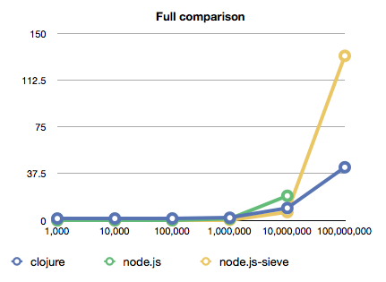
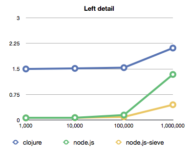

For the longest of whiles I've been working on a speed comparison between Node.js and Clojure. Today I had some time in a place with unreliable internets and finally gave it a whirl since there was nothing better to do, I certainly wasn't going to merely enjoy the sun.

The comparison I chose to go for is hard computation - namely calculating a list of primes up to a certain number. Why this test? Because primes are awesome!

I did my best to implement the same algorithm in both. It creates a list of numbers from 3 to N, then filters it of anything that isn't a prime. Through a bit of trial and error this turned out to be the quickest approach, possibly because it means we can run prime-ness tests in parallel on several numbers.

For node.js I also implemented a bit different algorithm that builds a list of known primes and iterates through that instead of everything under the square root of the target. It can't run in parallel, but turns out it's faster ... couldn't figure out how to implement it in clojure to be fast as you can see from my post on [prime searching in clojure](http://swizec.com/blog/checking-for-primes-dumber-algorithm-is-faster-algorithm/swizec/1580).

As far as initial observations go there were a few interesting things I discovered:

1. Node is super fast for heavy but small calculations and seems to break down for large datasets.
2. Clojure really benefits from native implementations of filter and such. I suspect that they are running in parallel because it is consistently burning 15+ threads.
3. Jacking up the max N to 100,000,000 caused a memory allocation error in the classic node.js algorithm, but worked fine with the cutesier one.
4. Both Node and Clojure were burning around 600 megs of RAM when doing the 1M test

The computer I was testing on is my trusty MBP with 4gigs of RAM and a 2.4gig core2duo. To avoid as much artefacts as possible each test was run five times and the average runtime was calculated. Just in case it's relevant, the computer was running on battery at the time, there's a slight chance this means the CPU was clocked down.

## The code

This is the basic implementation in node.js, the more cutesy algorithm just uses a global array of known primes and iterates over those, but otherwise the code is the same so it'd be silly to post it twice.

```
var async = require('async');

var isPrime = function (n, callback) {
    if (n%2 == 0) {
	callback(false);
	return;
    }else{
	var root = Math.sqrt(n);
	for (var i=3; i<=root; i += 2) {
	    if (n%i == 0) {
		callback(false);
		return;
	    }
	}
    }
    callback(true);
}

var primes = function (n, callback) {
    var acc = new Array();

    for (var i=2; i    async.filter(acc, isPrime, function(results){
	results.unshift(2);
	callback(results);
    });
}

primes(process.argv[2], function (result) {
});
```

This is practically the same code in clojure:

```
(defn prime? [n]
  (if (even? n) false
      (let [root (num (int (Math/sqrt n)))]
	(loop [i 3]
	  (if (> i root) true
	      (if (zero? (mod n i)) false
		  (recur (+ i 2))))))))

(defn primes [n]
  (let [nums (loop [i 2 acc []]
	       (if (> i n) acc
		   (recur (inc i) (cons i acc))))]
    (concat (filter prime? nums) [2])))

(primes (Integer/parseInt (first *command-line-args*)))
```

Immediately we can see that the clojure code is much more concise; which code is more readable is a bit harder to say. Personally I'd lean towards javascript for readability, but there is a certain level of elegance in lisp.

This is the code I used to run the tests. You can see for each run a process is spawned and the cleanest possible time is measured. This helps us avoid any memory leaking issues that could slow down the code, but introduces a small penalty for spawning processes. I'm assuming this penalty is constant.

```
var spawn = require('child_process').spawn;

var N = 100000000;

var runs = function (n, i, avg) {
    var i = i || 0;
    var avg = avg || 0;

    var before = (new Date()).getTime();
    var child = spawn('node', ['many-primes.js', N], {cwd: __dirname});
    //var child = spawn('clj', ['many-primes.clj', N], {cwd: __dirname});

    child.on("exit", function (code) {
	var time = ((new Date()).getTime()-before)/1000;

	console.log(time);
	if (i < n) {
	    runs(n, i+1, avg+time);
	}else{
	    console.log(avg/n);
	}
    });
}

runs(5)
```

## The results

\[caption id="" align="alignnone" width="595" caption="Raw data shows that runtimes for anything under 1M are pretty reasonable."]\[/caption]

\[caption id="" align="alignnone" width="431" caption="In the first graph we can see how horribly exponential my solution is."]\[/caption]

\[caption id="" align="alignnone" width="389" caption="Here we can notice the initial penalty of compiling clojure"]\[/caption]

As you can see, looking for primes is a bit of an exponential problem. However, if you have a linear solution I would absolutely love to see it.

The more interesting part is how differently exponential it is with the same algorithm in different runtime environments. I have no idea what's going on with node.js on those large datasets. Both algorithms seem to be running on a nice exponential curve and then BAM, shoots through the roof and even dies completely. Whereas Clojure's biggest problem with the small datasets is apparently the run-up time itself and then it continues growing on a predictable exponential curve.

## Conclusion

My conclusion from all this is that despite everything, despite all the awesome optimiziations the V8 engine does, clojure is simply more appropriate when you're doing serious calculation on serious datasets. Go ahead and use node.js for everything nice and small, it's absolutely magnificent there.

The next relevant test would probably input/output since that is supposedly node's strongpoint, but something tells me the story will be similar. Node better for small bursts of activity and clojure better for more sustained hardcore work.

Let me know what you think, where did I fuck up this test?


PS: I know clojure has type hinting, they proved to slow down the code.