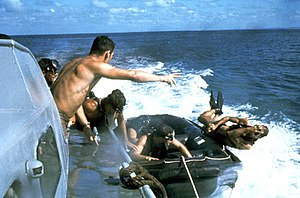

\[caption id="" align="alignright" width="300" caption="Image via Wikipedia"]\[/caption]

[HackerNews](http://news.ycombinator.com/ "Hacker News") was aflutter today with [talk about how you should be a quiet professional](http://news.ycombinator.com/item?id=2512901), do whatever it takes and don't even complain, take any and all ill that comes your way like a stoic shaolin monk, show no fear, show no emotion, robotically and efficiently perform any task on your path, go face-first through a granite wall without even blinking and just get it the fuck done. _tl;dr --> bitching gives you teamwork, understanding, focus and appreciation_ The original article discussed on HN was apparently written by one [Kyle Tress](http://www.kyletress.com/blog/view/be_a_quiet_professional), but apparently the even more original real original story was on [CNN](http://www.cnn.com/ "CNN") ... something about The Quiet Professionals navy seals brutally assassinating a political figure on foreign soil. Being a quiet professional is a load of bollocks! And so is the whole "stiff upper lip". In reality what you'll notice is that _bitching just works._ The more you bitch about your problems, the more they get solved and the less of them you have. Of course it can turn out to be a bit annoying to the people around you, but that doesn't really matter. You're trying to help yourself remember? Solve your own problems. You can worry about theirs later. It also helps if you bitch to more than one person and a general [rule of thumb](http://en.wikipedia.org/wiki/Rule_of_thumb "Rule of thumb") you should likely follow is to bitch about stuff to people that can actually help. Let me outline four great things that can come out of bitching and you be the judge:

1. **Teamwork** - sharing encourages people to help
2. **Understanding** - it's hard to do anything until you understand it, you don't understand until you can explain
3. **Focus** - talking about crap forces you to think about crap, you can only do/solve what you think about
4. **Appreciation** - mums are the most underappreciated people in the world, it's because nobody knows what it is exactly that they do

There's bound to be more, I just can't think of them right now. Talk to anyone who has to manage developers and ask them whether they prefer the guys who buckle down at their desk and don't say a word until a task is finished let it take an hour or a month ... or the guy who keeps giving them progress reports, explains the pain points and so on? Hell, take good looking girls. Are most of them going home from parties with blabbermouths or that quiet guy who seems kinda cool, but not really all that human? If you're a fan of [House MD](http://www.myspace.com/everything/house "House"). Consider Chase and Foreman. The former gets all the girls, the latter is a robot everyone makes fun of for never showing any emotion. If you're not a vampire, being all dark and brooding doesn't work for picking up chicks. Now I'm not advocating being one of those people who just bitch and moan and never do anything about it, that's just being an annoying 13 year old girl. But you should really consider using bitching and moaning as a tool to better understanding the core issue at hand and finding a solution. Protip: you don't even need a listener, just get it out there (twitter is great for this, nobody will care)

###### Related articles

- [Navy SEAL Osama kill team told to stay quiet](http://www.theglobeandmail.com/news/world/americas/navy-seal-osama-kill-team-told-to-stay-quiet/article2008168/) (theglobeandmail.com)
- [Navy SEALs, the 'quiet professionals,' got bin Laden](http://ac360.blogs.cnn.com/2011/05/03/navy-seals-the-quiet-professionals-got-bin-laden/) (ac360.blogs.cnn.com)

