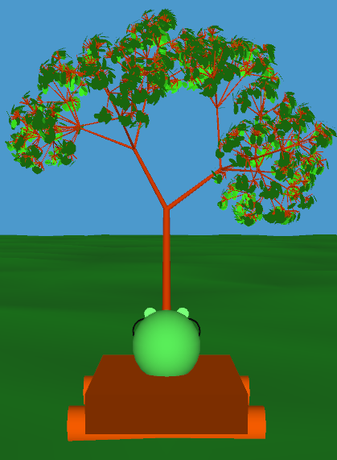
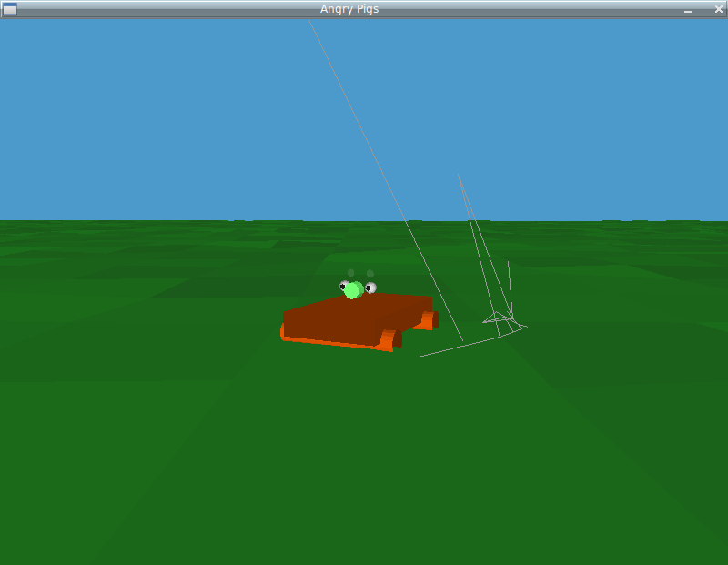
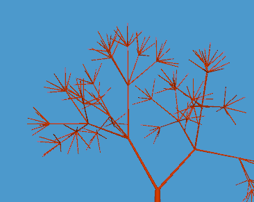
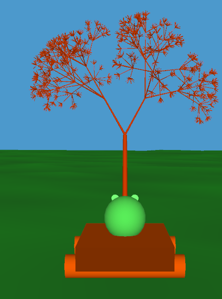
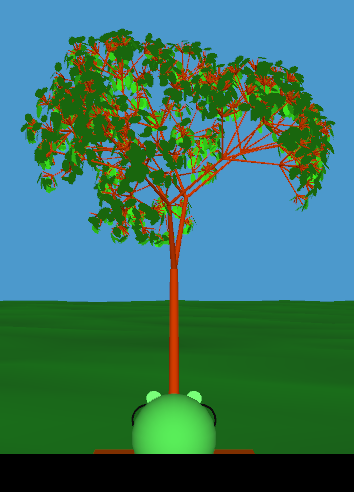
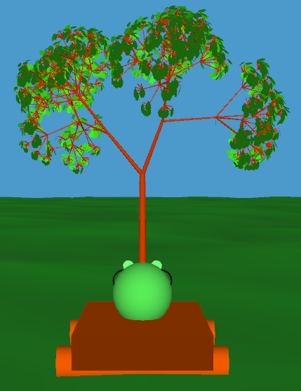
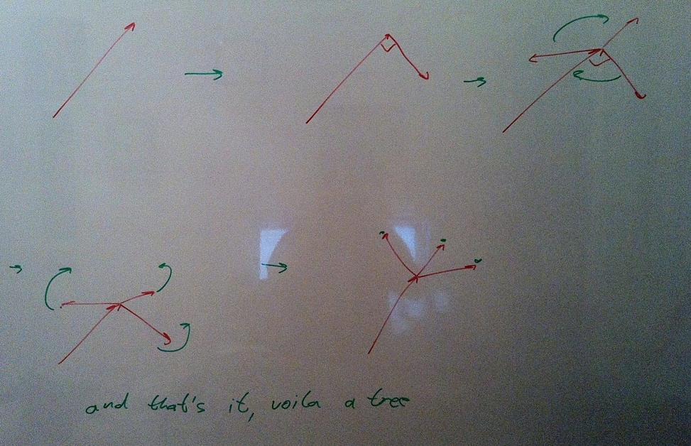

Have you ever tried to generate a natural-ish looking tree? I did it for a coursework assignment and turns out it's both incredibly simple while being full of strange little twists. \[caption id="" align="alignright" width="251" caption="The resulting pretty tree"]\[/caption] Generally the assignment was about manipulating 3D objects in [OpenGL](http://www.opengl.org/ "OpenGL") through user action. Otherwise known as: make a game, if it isn't a game, you're likely doing it wrong. Since we had the whole semester to work on it, I spent nearly all of it on a little piece of the whole puzzle that seemed the most interesting - Generating [trees](http://en.wikipedia.org/wiki/Tree "Tree"). Of course me and my partner both being avid dislikers of [Java](http://www.oracle.com/technetwork/java/ "Java (programming language)") and Java sort of being what the class is taught in ... well we decided both to pick our favourite dialect of a [functional language](http://en.wikipedia.org/wiki/Functional_programming "Functional programming") running on a [JVM](http://en.wikipedia.org/wiki/Java_Virtual_Machine "Java Virtual Machine"). Scala and [Clojure](http://clojure.org "Clojure"). Fun ensued, but we actually _did_ get it working and now half the project is in one language, half is in another and neither of us can read the other's code. While [@hairyfotr](http://twitter.com/hairyfotr)took care of pretty much anything, I took it upon myself to generate the data for having pretty trees that are a bit random, but always manage to look like a beautiful beautiful tree. A night of hacking or three later, we had this: \[caption id="" align="alignnone" width="480" caption="Not \_exactly\_ a tree"]\[/caption] As you can see, it wasn't so much a tree as a bunch of weird random looking lines without any sort of order to them. Turns out not only was I calculating the tree all wrong and possibly even providing the incorrect data structure, @hairyfotr wasn't very adept at drawing what I did manage to generate either. But eventually after quite a bit of hacking, it got better. I learned a lot about [linear algebra](http://en.wikipedia.org/wiki/Linear_algebra "Linear algebra") and not being an idiot, @hairyfotr learned how to traverse a [tree data structure](http://en.wikipedia.org/wiki/Tree_%28data_structure%29 "Tree (data structure)"). In the end, everyone is happier and this is what the final trees look like ... I reckon they're pretty damn shiny.

## The generator

In general the idea on how to generate trees is pretty simple. You take a vector representing the direction of a branch and its length. Then you move to the end of the branch, make N new directional vectors and give them a length. Then you simply repeat the process on every branch. Simple right? PS: lest your eyes glaze over, there's a sketch explaining all of this at the bottom It is. But it gets a bit complicated when you want this bunch of vectors to actually resemble something. The first concern is spacing child branches out evenly. You can think of this as a problem of evenly dividing a half sphere into N chunks. My first approach to this failed spectacularly. I tried to take the current branch as a normal to a plane, then drawing a vector between the end of the current branch and the made up point. This would give me a [perpendicular vector](http://en.wikipedia.org/wiki/Surface_normal "Surface normal") to the original branch. Then all you need to do is rotate this perpendicular vector around X times, using the original branch as the [rotation axis](http://en.wikipedia.org/wiki/Rotation "Rotation"). This gives you an evenly sliced plane perched on top of the current branch. Then all you have to do is slant each new branch upwards by a certain angle and you're done. Since upwards can mean anything, you take it to mean the direction the original branch was pointing in. Turns out this approach is brilliant, except for that calculating a plane and points and such. That is just way too concrete and not abstract enough. It doesn't really work ... to make it work you'd need data outside of the "direction of current branch" scope. So what you do instead is this: take the current branch and _make up_ a vector. It doesn't really matter what it is, as long as it's different from the branch. Then you calculate the cross product between the branch and the made up vector and voila. You have your first perpendicular child branch. Then you just do the whole rotation bit. This approach works surprisingly well. But it only ever gives you one tree and that doesn't do. So in order to get random trees that still look like trees I made use of a very simple trick. When choosing the angle by which to turn a branch upwards, just make the angle be chosen by some sort of weighted random choice. A bit of twiddling around and everything was nice and shiny. When everything conspires just right, you even get those long branches with others splitting off of them ... even though the tree itself thinks on every level all the branches split. It's just bloody elegant I tell you! And when doing the rotations around the original branch I add a little noise to the angles, just a few degrees so the spacing isn't always perfectly even. But, here comes the real beauty. When choosing how many new branches to create on every level, I just follow the progression of prime numbers. So, on the first level there are two branches, then three, then five and so on. I use a similar progression for calculating the length of every next branch. There it's actually 1-0.prime. It works marvelously. But this is quite a bit of text that probably doesn't make any sense to anyone. So here's a quick whiteboard sketch of what's going on: \[caption id="" align="alignnone" width="681" caption="Excuse my sucky perspective drawing"]\[/caption] Next step in making it even awesomer is probably applying some randomness to branch lengths. You can also see the source for this [on github](https://github.com/HairyFotr/AngryPigs/blob/master/src/AngryPigs/gen-tree.clj).

