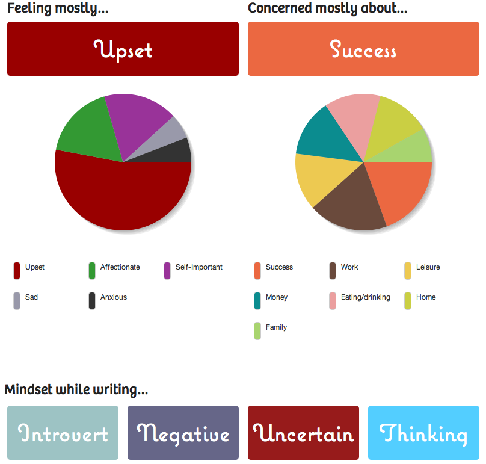

Beginning of May I came across a pretty interesting website, [75owords.com](http://750words.com). The general idea of the website is that you write [750 words](http://750words.com "750 Words") every day. About anything. Unedited. Unhindered. Completely free. Just write about whatever comes to mind in whichever way it decides to come. When you're done you simply tuck it away somewhere never to be seen again. \[caption id="" align="alignright" width="388" caption="Analysis of today's 750words"]\[/caption] Why would you do that? Why write sooooo much text so nobody will ever read it. First thing you have to understand is this isn't even all that much text. If you do it in handwriting that's just about three pages and when typing, well hey, anyone who spends a lot of time on the internet is capable of pumping out text like a mad machine. Just count all your tweets, go on. Counted? You can get 27 average [English](http://en.wikipedia.org/wiki/English_language "English language") [words](http://en.wikipedia.org/wiki/Word "Word") into a tweet. But yours probably aren't all that very long so let's say 750 words translates only to about 60 tweets. Personally that's about two or three days of [tweeting](http://twitter.com "Twitter"). Your mileage may vary. Right, so it isn't a lot of work and if you're at all capable of blabbing on and on about something, or even simply just to write out your train of thought, then writing 750 words shouldn't take more than 20 minutes. But question remains, why the hell would you do it? Turns out it's really really good [exercise](http://en.wikipedia.org/wiki/Physical_exercise "Physical exercise") for the brain. You know how everybody advises you have a good morning routine that you follow every morning? And that this routine should include some form of exercise to wake you up, get the blood pumping and just generally prime you up for the day much better than caffeine ever could? Now think about where between breakfast, shower and exercise does kickstarting your brain come in? That's right. Writing 750 words! Since I've been doing it daily I've noticed a pretty major effect on my productivity. When I get to work I'm usually already at my productive peak or thereabouts, because I had time to think about anything that's ailing me or causing me problems ... that's out of the way and already processed. When I feel like it's going to be a stressful long day ... the 750words helps me plan it out mentally beforehand and so on. Hell, it's even a good morning-after-party tool to help remember everything that transpired the previous night and make sure I didn't do anything too stupid; since it's generally easier to reconstruct a sequence of events if you try writing it down like a story. Oh and 750words also does one pretty cool thing. It analyzes everything you've written and provides a very plastic view of things that are troubling you. It's a bit rudimentary so it doesn't always get it perfectly (it thought I was concerned about death when I wrote about how awesome [Shutter Island](http://www.shutterisland.com/ "Shutter Island (film)") was) ... hell, this part of hte website is so awesome I'm thinking about making some sort of plugin and always displaying the charts in the footer of this blog. Seriously, go, write 750 words _right now_.

###### Related articles

- [Kickstart Your Creativity By Writing 750 Words a Day](http://www.lifehack.org/articles/productivity/kickstart-your-creativity-by-writing-750-words-a-day.html) (lifehack.org)
- [750 words, 100 push-ups in 10 hours, 8 billable hours + morning devotions](http://robinmonks.com/2011/04/02/750-words-100-push-ups-in-10-hours-8-billable-hours-morning-devotions/) (robinmonks.com)
- [Great Website: 750words.com!](http://doingthewritething.wordpress.com/2011/02/24/great-website-750words-com/) (doingthewritething.wordpress.com)
- [750 Words Freakout - Reconsidered](http://inspirationlocation.com/2011/03/06/750-words-freakout-reconsidered/) (inspirationlocation.com)
- [Morning Pages](http://ketik06.wordpress.com/2011/03/11/morning-pages/) (ketik06.wordpress.com)
- [Ridiculous Competitions to Boost your Creativity/Time Management/Tiredness](http://awesomestudy.wordpress.com/2011/03/14/ridiculous-competitions-to-boost-your-creativitytime-managementtiredness/) (awesomestudy.wordpress.com)
- [750 Words.](http://asstochair.wordpress.com/2011/04/20/750-words/) (asstochair.wordpress.com)

