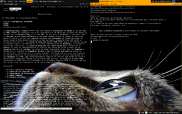
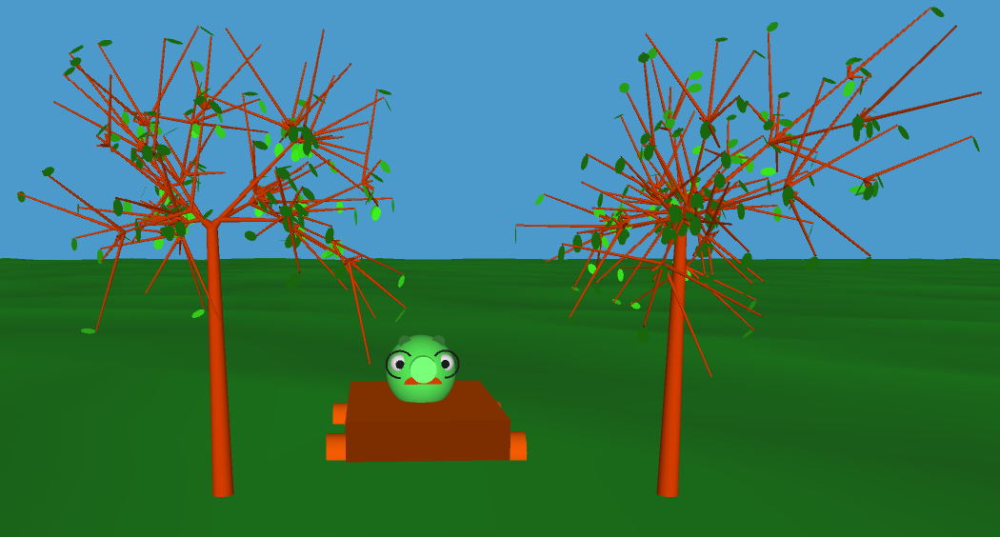
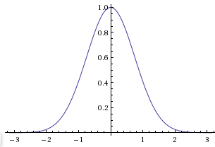

A while ago I wrote about my school project that involves [generating pretty trees](http://swizec.com/blog/using-prime-numbers-to-generate-pretty-trees/swizec/1705 "Using prime numbers to generate pretty trees") and concluded the post with the idea that I now have to implement some way for the branch lengths to be a bit [random](http://en.wikipedia.org/wiki/Randomness "Randomness") to add more variability.


\[caption id="" align="alignright" width="300" caption="Image via Wikipedia"][](http://commons.wikipedia.org/wiki/File:Awesome-pantallazo.png)\[/caption]


There is an easy and an awesome way to doing this. The easy way involves doing everything as usual and then simply adding a small random buzz, fuzz or whatever you could call it to the length of a branch. Obviously this approach would work and the branches wouldn't be of uniform length anymore ... but there's just no fun in that. The results it produces also aren't quite that awesome.


So I chose a different way.


First a little background on how branch lengths were calculated originally. Every time a branch is needed the basic brench length is multiplied with a factor chosen based on how deep inside the tree we are. So for example, if the trunk is of length 5 and we are on the third level of the tree the length would be 5\*0.25, or a quarter of the trunk's length.


I wanted to expand on that by randomly selecting a multiplier from the list for every branch I'm looking at. As you can probably expect, this produced rather funny looking trees.


\[caption id="" align="alignnone" width="735" caption="Random random branch lengths"]\[/caption]


What's needed is a way to randomly choose the length of a branch, but [probabilistically](http://en.wikipedia.org/wiki/Probability "Probability") making sure that branches on deeper levels of the tree are shorter than the ones before them. This leads us to the idea of needing a weighed random that has a slightly higher probability of returning a certain length over others.


After a bunch of googling on how such a thing might be achieved I settled on a pretty simple solution. Basically produce a list of possible indexes, tweaked so there's more of those that need a higher probability, and then simply picking a random one. Something like so:

```
(nth choices
       (rand-nth (0 0 0 0 0 0 0 0 0 0 1 1 1 1 1 1 1 1 2 2 2 2 2 2 3 3 3 4))
```

This, however, isn't very elegant or even pretty to look at. Changing it so the maximum of the [probability distribution](http://en.wikipedia.org/wiki/Probability_distribution "Probability distribution") moves down the choices depending on how deep inside the tree we are would be painful.


My next step was changing the weighed random choice so it would generate such a horrible list on its own and use a provided function to calculated the weights for every specific index. This gives us a way to neatly define the probability distribution we want every time we make a random choice from a list.


Here's what the final function looks like

```
(defn weighed-random-choice [choices weight]
  (defn indexes []
    (flatten (map #(replicate (weight %1) %1)
                  (take (count choices)
                        (iterate inc 0)))))

  (nth choices
       (rand-nth (indexes))))
```

\[caption id="" align="alignright" width="305" caption="Current probability distribution"]\[/caption]


To be honest I still haven't quite figured out a good probability distribution to get perfectly looking trees, but here's my current [weight function](http://en.wikipedia.org/wiki/Weight_function "Weight function"). I like to think of it as mathematically somewhat elegant, but it might be a bit slow to calculate at times ... seems to have quite an impact on generating trees when the maximum depth is big-ish. And I need it to have a bigger drop off on the left side where the longer branches are.

```
  (defn weight [x pivot]
  ; cos(x + sin(x)*0.9)*0.5+0.5
    (let [x (* x (/ Math/PI (count lengths)))
	  pivot (* pivot (/ Math/PI (count lengths)))]
      (int (Math/floor (* 10
			  (+ 0.5 (* 0.5
				    (Math/cos (+ (- x pivot)
						 (* 0.9 (Math/sin (- x pivot))))))))))))
```

Pivot is where the highest probability density needs to be and usually denotes the current depth we are at. If you see anything wrong with my approach go ahead and tell me :)

###### Related articles

- [Exploiting Randomness](http://ignoranceanduncertainty.wordpress.com/2011/03/21/exploiting-randomness/) (ignoranceanduncertainty.wordpress.com)
- [How to transform random variables from a non-normal distribution to a normal distribution?](http://ask.metafilter.com/182181/How-to-transform-random-variables-from-a-nonnormal-distribution-to-a-normal-distribution) (ask.metafilter.com)

[](http://www.zemanta.com/ "Enhanced by Zemanta")