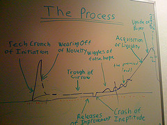
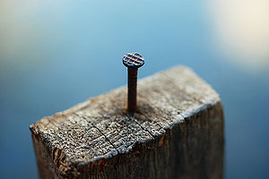

\[caption id="" align="alignright" width="240" caption="Image by Bas Lammers via Flickr"]\[/caption]

This post has been brewing for the past few months. I decided to finally write it to psyche myself up for the onslaught of the exam season starting next week.

A little background; a few months ago I crashed and burned doing a big swing for the fences, a startup I had been working on practically full-time for a year and a half that evolved from a project I had been working on for a year before even that. We did the whole thing, tried to get funding, went to a Mini [Seedcamp](http://www.seedcamp.com "Seedcamp"), got to the interview stages of [Seedcamp Week](http://www.seedcamp.com/pages/weeks_program "Seedcamp Week"), we even applied to [YCombinator](http://www.ycombinator.com "Y Combinator") and got some one-on-one meetings with actual VC's. You could say it was going pretty well until it stopped going at all well and the co-founder and I split up, or I was kicked out depending on how you look at it ... truth be told I was getting pretty bummed out about everything anyway.

_tl;dr -> Confronting the vast vastness of everything you don't know and can never hope to understand will leave you a better man (or woman)._

But the crash and split up isn't what I want to talk about today, that story still isn't something I'm quite ready to put into writing. Perhaps I'll be "over it" when I financially recuperate ... anyway ...

What I came online to say today is that through all of it, the thick and the thin, the ups and the downs, I _**never dropped out of uni.**_ The thought crossed my mind, it crossed my mind a _**lot**_.

<!--more-->

But I didn't do it. I think that was the best decision I have ever made.

You see, when I started working on [Twitulater](http://twitulater.com/ "Twitulater"), the project eventually leading to Preona and LazyReadr ... I was a brat. A total and utter brat. I was the sort of person who was too cool for school, too cool for advice, too cool for everything, I was king of the world and I _knew_ I could do anything and was better than everyone. Simply because I had put up a couple of websites.

Oh yes, I knew it all and I was best of the best. Fuck professors and fuck anyone trying to tell _me_ how to code something. I know better. Didn't you hear? I've got two pretty cool websites under my belt and I totally did them under conditions of utter cushiness and at no risk on my part at all. They weren't even my websites per se, I was just paid to make them.

\[caption id="" align="alignright" width="240" caption="Image by neil conway via Flickr"]\[/caption]

Back then I **knew** there was nothing a [university education](http://en.wikipedia.org/wiki/Higher_education "Higher education") could provide for me. What does such an arcane institution know about how the real modern world works anyway? There's nothing they can teach me. Somehow, through sheer dumb luck, I didn't drop out. Probably because I was kind of intrigued by what the higher classes might bring, but mostly because life as a student is simply cheaper and cushier for various reasons.

I don't think I'm that person anymore.

Those 17 months of being a startup were the single most transformative experience of my life. Something about being on the line for everything and anything, trying to act the role of both CEO and CTO (however badly), being allowed to play in the Smart Kids (tm) sandbox ... it fundamentally changed me.

What I've come to realize is that there is just this fundamental difference in thinking that exists between people who have done the whole university schtick and those that dropped out. Obviously there are exceptions, but I think that there is something much more that a university education provides, far beyond any interesting facts and theories you can learn on wikipedia any day of the week.

It gives you better frameworks for thinking.

It teaches you to better question everything, not to question for the sake of questioning, but for the sake of proving to yourself and others that what you're doing, that what somebody else is doing, is really the way it should be done. It also gives you a much wider berth of existing theories and hypotheses that you can use to create new knowledge from.

\[caption id="" align="alignleft" width="300" caption="Image via Wikipedia"]\[/caption]

As a very smart man once said "When all you have is a hammer, everything looks like a nail".

While this may be true even after spending several years at uni, when all you have is a hammer, everything still looks like a nail, but suddenly you start questioning whether what you have in your hand is really **_just_** a hammer and whether that nail might be more than a nail. And besides, there's this hacksaw in your backpack now, maybe you don't need the nail and hammer after all and what you really want is to make two planks from one?

This reformed way of thinking that can only come from learning strikingly opposite theories and explanations of the same phenomena (something high schools simply don't seem to do), also has a profound effect on your inner douchebag. Suddenly you aren't the smartest in the world anymore, your horizons are expanded and you can accept the fact that there are many explanations for the same thing that can make sense and be perfectly valid.

Being around smart people, confronted with the vast vastness of everything you don't know and can never hope to understand is simply humbling and I fully believe it will leave you a better man (or woman).

PS: I think a big part of the startup+school combo that made it work so well is that I had a hard enough job so I could instantly apply the stuff I was learning at school instead of learning all these awesome "useless" things at class and then spending my days setting up a better web form.

###### Related articles

- [We Never Give Up (we were accepted to Seedcamp!)](http://screditcrunch.com/2011/04/26/we-never-give-up/) (screditcrunch.com)
- [Going East again - Seedcamp Ljubljana](http://blog.seedcamp.com/2011/05/going-east-again-seedcamp-ljubljana_25.html) (seedcamp.com)
- [Crunching some data after 3.5 years of Seedcamp](http://eu.techcrunch.com/2011/05/23/crunching-some-data-after-3-5-years-of-seedcamp/) (eu.techcrunch.com)

