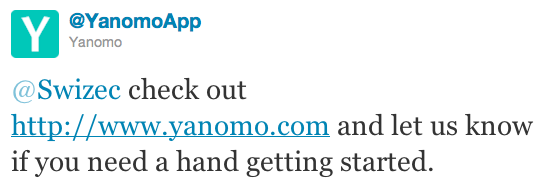
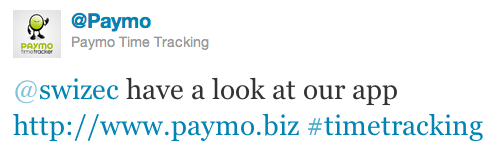
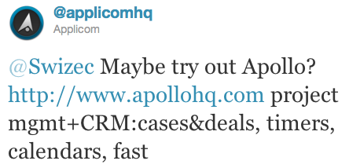
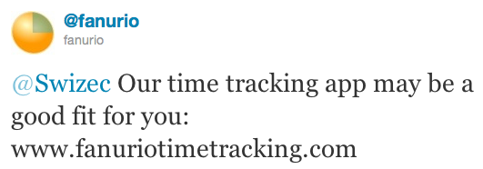
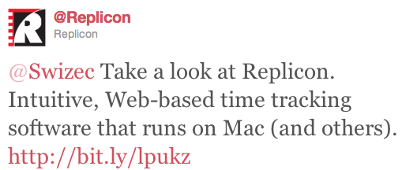

A couple of days ago I decided it might be time to upgrade my time tracking software a little bit. I've been using [Klok](http://klok.mcgraphix.com/klok/index.htm "Klok"), an AIR based desktop thingy, for quite a while now and it's getting a bit lame. Development has stopped some insanely long time ago and certain features are simply missing ... like for example syncing between devices. Naturally as any good twitter addict would do, my first reaction upon deciding this was to open the nearest twitter client and [ask](http://twitter.com/#!/Swizec/status/77348484377878528) for the best time tracking software. I expected the usual; most people ignoring me like I don't exist, one or two retweeting the question and perhaps a few people telling me their personal favourite or at least someone trolling me that I'm an idiot and why would I need something like that. What happened was a lot stranger. Instead of the usual random people telling me their opinions, I got five tweets from businesses telling me to give their solution a try. \[caption id="" align="alignnone" width="546" caption="Yanomo was first"]\[/caption] \[caption id="" align="alignnone" width="501" caption="Paymo was soon after"]\[/caption] \[caption id="" align="alignnone" width="458" caption="I still read Apollo's tweet"]\[/caption] \[caption id="" align="alignnone" width="531" caption="Fanurio was so late it just felt like spam"]\[/caption] \[caption id="" align="alignnone" width="509" caption="Replicon was so hopelessly late I didn't even notice the tweet"]\[/caption] Being a spoiled twitter user that I am, I clicked the first two links that got to me. And I even researched both products. I signed up for Yanomo and it looked pretty damn good, almost perfect, but it didn't have a key feature I wanted - a timer to time when I'm working on things. It needs to have times inserted manually. By the time Paymo came along my mind still quite wasn't made up because of the missing feature, so they got me to click their link, check out the product and take a few very hard moments of consideration. Their problem was that everything I read, everything I saw, was immediately compared to Yanomo whereas Yanomo only had to compare against the old solution I was trying to ditch. The other guys came in a bit late, the latest was even a whole three days late and that's just obscenely too much. By that time my mind had already been made up and I was giving Yanomo a real test to see if it pans out for me or I'm going to have to search for something else. In fact, most of the other responses felt like spam. Upon seeing them my mind instantly filtered them out because all I could see was that somebody was pitching a product to me, it didn't even cross my mind that but 40 hours earlier I was asking about the very same thing! It just didn't. In the end I chose Yanomo, which I'll be using henceforth to track my billable hours and stuff ... I'll still be using Klok the same way I'm using it now - to track every productive-ish hour of my life, but which isn't exactly billable. There are two main reasons why I made the choice that I did:

1.  A very friendly and very quick tweet
2.  The product just looks and feels easy to use

So there you have it, getting to your end user quickly and with something pretty, may well mean they'll choose you over the competition even if you're missing the single most important feature.

###### Related articles

-   [Are you spittering (=spamming) or truly engaging on Twitter?](http://socialb2p.com/2011/06/05/are-you-spittering-spamming-or-truly-engaging-on-twitter/) (socialb2p.com)
-   [My Ideal Twitter Client](http://dorai.wordpress.com/2011/06/08/my-ideal-twitter-client/) (dorai.wordpress.com)
-   [Free Time Tracking Software - Klok Free and Klok Pro](http://www.getklok.com/) (getklok.com)

