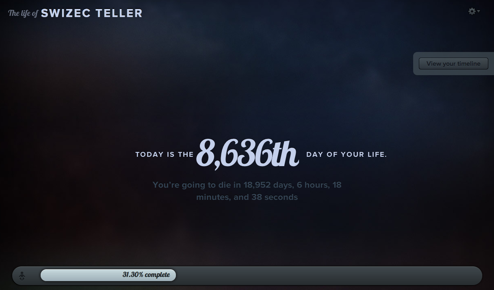
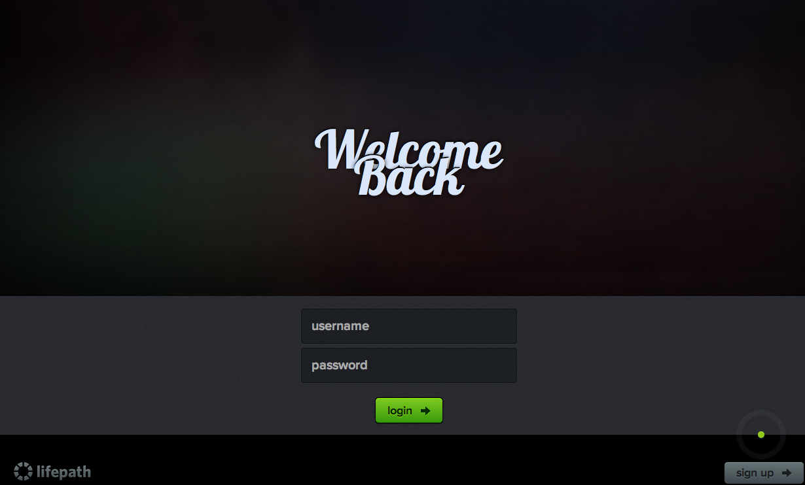
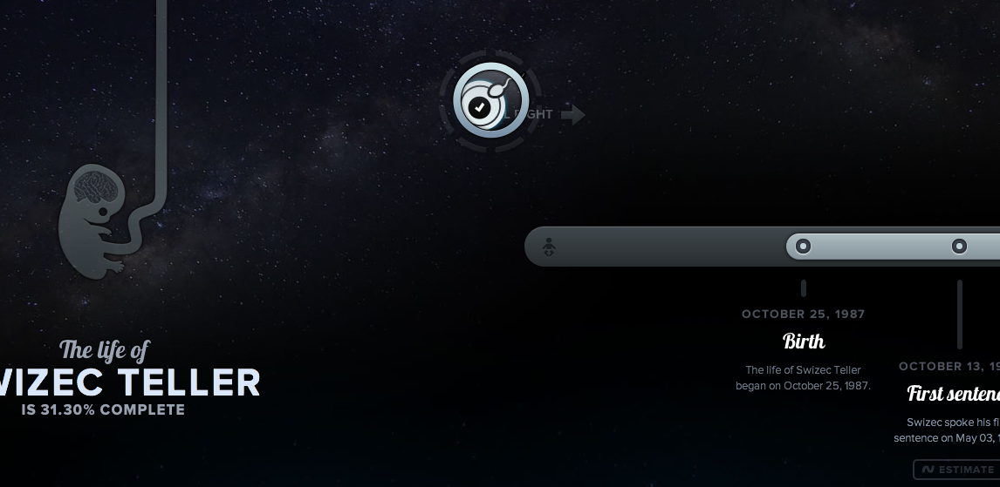
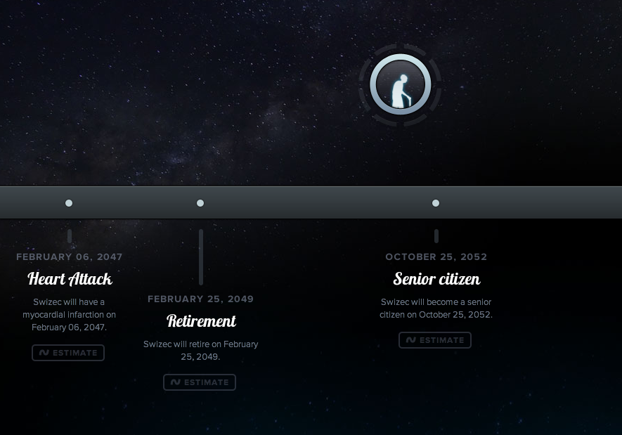

[Lifepath.me](http://lifepath.me/swizec) is a very simple service that gives your life a progress bar. Nothing too spectacular there, at its core, it's really just a visualisation of some statistics data from around the world about the sort of life expectancy people have in your neck of the woods and such. I found the service by accident when I was [making my shiny footer](http://swizec.com/blog/my-footer-gives-you-a-glimpse-into-my-life/swizec/1840 "My new footer gives you a glimpse into my life")and was looking at [Dustin Curtis](http://dustincurtis.com/ "Dustin Curtis")' blog for inspiration. His latest post right about then was about some american president or another and it was displaying the lifepath.me embed. As soon as I saw the website I wanted an account, possibly because I was already looking for a way to display all that info on my site, or maybe because it was just so shiny. Well the thing is invite only and the only, but you can buy an account by entering your credit card info.

<!-- more -->

Because entering credit card info into random web forms is against my policy my knee jerk reaction was to start begging around the internets trying to find someone who can give me an invite. Why I didn't just think of sending @dcurtis an email ... well it didn't occur to me. Luckily I finally found someone with an invite on HackerNews' Convore channel - It was @dcurtis himself. Getting the invite was cause for jubilation. But going through the registration spiel ... my, it was just the most beautiful thing ever. I have never felt such joy at the filling out of some web forms and divulging my information. Unfortunately I can't show you what the process looks like anymore, but I can show you this ... the login form.

\[caption id="" align="aligncenter" width="738" caption="Shiny login form is shiny"]\[/caption] You just know a service that says Welcome Back on its login form knows what it's doing. But you know what, I should stop talking, here are some more shiny pictures. \[caption id="" align="alignnone" width="730" caption="Right after login"]\[/caption] \[caption id="" align="alignnone" width="688" caption="The start of my path"]\[/caption] \[caption id="" align="alignnone" width="531" caption="Near the end I will be old"]\[/caption] Although I think lifepath.me does serve a good reason beyond just being shiny. It's facing you with the fact that such and such percentage of your life is already behind you and that maybe you should ask yourself whether you're spending this time being as awesome as you can be.

###### Related articles

-   [My new footer gives you a glimpse into my life](http://swizec.com/blog/my-footer-gives-you-a-glimpse-into-my-life/swizec/1840) (swizec.com)
-   [4 Best Practices for Web Forms](http://www.aweber.com/blog/email-marketing/4-best-practices-for-web-forms.htm) (aweber.com)
-   [The Maui Path, a lifepath to Happiness](http://pathleader.wordpress.com/2010/04/10/the-maui-path-a-lifepath-to-happiness/) (pathleader.wordpress.com)

