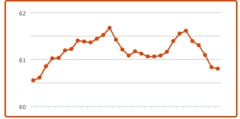

The past couple of weeks I've been living my life at 25 minute increments.

\[caption id="" align="alignright" width="300" caption="Image via Wikipedia"]\[/caption]

It's a new [productivity](http://en.wikipedia.org/wiki/Productivity "Productivity") hack I've been trying out ... you've probably heard of it - pomodoro? The idea is that you should make an effort for absolute focus when you're working. That means no twitter, no browsing random websites, just take a task, focus on it 100% and plow right through until you're done. Obviously you can't do this for 8 hours a day unless you're some sort of robot. Most people aren't robots. Yet. _tl;dr --> Pomodoro is great for productivity, bad for Klout scores_ Therefore pomodoro demands that you take a short break every 25 minutes, and a longer one every two hours. Apparently this is just enough to keep your brain fresh for plowing through tasks like a boss and _getting shit done_. I have to say I was a bit skeptical of the whole premise. I can't work like that! I have a scatterbrain's mind. My mind thinks in parallels rather than linearly. The internet has ruined my ability to focus! I don't have 25 minutes of [attention span](http://en.wikipedia.org/wiki/Attention_span "Attention span"), are you fucking kidding me? But then I got busy. Workloads started piling up and my scattered approach just wasn't working anymore. Even though it tends to work pretty well when you only have a project or two going on, it tended to fall apart when I had five projects I was working on in parallel. Thoughts started overflowing and my mind was just overloaded.

<!--more-->

So I started trying out setting limits for myself. Rather than saying "I will work on this until it gets done, then I will work on that other thing" I just set up timeslots. Two hours for this, then no matter whether it's done or not, the other thing for two hours. And so on ad infinitum. It worked pretty well, but I could notice myself getting burned out. Holding sufficient levels of focus for two hours is _hard_. Then I remembered this so called [Pomodoro](http://en.wikipedia.org/wiki/Pomodoro_Technique "Pomodoro Technique") technique @gandalfar mentioned in passing one day. It seemed an awful lot like what I was doing was some sort of pomodoro anyway. Next step was to download a loud ticking pomodoro clock for my iPhone and start trying it out. It felt weird as hell! But I noticed a couple of things:

1. The loud ticking acts as a milfy hot angry grade school teacher, tapping her ruler and looking at you going "Get to work maggot! Stop staring at my rack! WORK!"
2. Taking short breaks when you're in the flow is surprisingly hard
3. The scheduled long breaks are pure _awesome_
4. Forcing yourself to take a break pays dividends at 2am when you're still fresh as a rose and able to focus

At this point I would like to admit that I sometimes don't follow the ticking tomato as rigorously as I should. I often skip the short break because I'm on the verge of getting something done, and sometimes I take a break a couple of minutes early because I had just plowed through two pomodoro's without taking a break. Also, the last pomodoro in a batch is usually starting to get a bit haywire and isn't absolutely focused. However, despite all my flaws in following the technique, the past couple of weeks have been particularly good to me productivity-wise. I have:

- finished two pretty large school projects with fantastic grades
- passed several exams with decent enough grades
- started and launched [GithubFriends](http://githubfriends.swizec.com)
- watched 132 episodes of How I Met Your Mother
- had the most fruitful freelancing month ever
- had an actual social life all throughout

Although, all the focus during pomodoros has had one very awful side-effect. My Klout score is experiencing massive drops: \[caption id="" align="alignnone" width="480" caption="Fluctuating like a boss"]\[/caption]

###### Related articles

- [Pomodoro Technique Improves Focus with a Timer](http://linearfix.wordpress.com/2011/04/07/pomodoro-technique-improves-focus-with-a-timer/) (linearfix.wordpress.com)
- [Work Practices " Alec the Geek](http://alecthegeek.wordpress.com/category/work-practices/) (alecthegeek.wordpress.com)
- [The Pomodoro Technique: A GTD Alternative?: Online Collaboration "](http://gigaom.com/collaboration/the-pomodoro-technique-another-option-for-getting-things-done-and-staying-focused/) (gigaom.com)
- [The Pomodoro Technique!](http://sse4m.wordpress.com/2011/05/14/the-pomodoro-technique/) (sse4m.wordpress.com)

