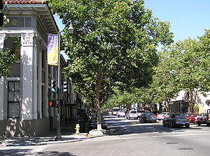

Last year when I was still working on [my first real startup](http://swizec.com/blog/doing-a-startup-taught-me-the-value-of-staying-in-school/swizec/1819 "Doing a startup taught me the value of staying in school") we tried to get into [YCombinator](http://www.ycombinator.com "Y Combinator") because it seemed like a natural

\[caption id="" align="alignright" width="300" caption="Image via Wikipedia"]\[/caption]

thing to do at the time. We wanted to get into the US pretty much any way possible and what better approach than going through the awesomest incubator around? Sure seems easier than trying to do it without the big leg up. We didn't get in. _tl;dr --> if you're in Palo Alto and you're awesome, I want to meet you for coffee_ Ok, no biggie, you live and you learn. This year I applied again, with [HipsterVision](http://hipstervision.org/) - a project that was only a couple of weeks old at the time and showing some promise of being awesome. I wrote a pretty decent application, likely better than the one I wrote last year. I didn't get in. Honestly, I shot myself in the foot both times. Looking back at both applications I'd say I was triggering pretty much every warning flag you can think of for not funding a startup. The fate of both projects also seems to indicate they made the right decision not to fund. Preona has become some sort of freelancing business, with a hint of a side project or two, in the hands of my cofounder; HipsterVision is sort of lingering on the sidelines with my not having enough time to give it the attention it needs and deserves. Real life sort of gets in the way and the truth is that a 20-something who intends to finish university simply has the odds stacked against him when it comes to starting and maintaining a business. Let alone a proper startup ... especially when real money has to be made. Not stocks, not options, not valuations, not even wealth. Cold hard cash. Turns out it's the only thing that puts food on the table. So in lieu of having a startup in YC right now, I did pretty much the next best thing. I joined an awesome team that got in! Right now I'm in [Palo Alto](<http://maps.google.com/maps?ll=37.4291666667,-122.138055556&spn=0.1,0.1&q=37.4291666667,-122.138055556 (Palo%20Alto%2C%20California)&t=h> "Palo Alto, California"), writing this from the living room of a house that's just three houses down from [Paul Graham](http://paulgraham.com "Paul Graham (computer programmer)"). It feels two parts awesome and five parts simply surreal. And I'm going to be here until the end of August! mind=blown! Literally. \[it's actually figuratively] Although that could just be the jetlag talking. Been waking up at insanely early hours ever since I got here on Wednesday. Sure hope it goes away soon because it just feels silly ... Anyhow, here I am! The server-side javascript ninja of the team, learning as much as I can about running a successful startup (I already know how to run an unsuccessful one :P), and not having to worry about a single thing. It's the best of both worlds! And what do you know, maybe in a year or two I'll have the chops to get into YC on my own. Right now I'm just enjoying the liberating feeling of only having to focus on solving technical stuff. That said, anyone from the HackerNews/YCombinator crowd wanna grab a cup of coffee? I'd love to meet you guys in person.

###### Related articles

- [Y Combinator's latest partners are also alums](http://venturebeat.com/2011/06/13/y-combinator-partners-alums/) (venturebeat.com)
- [Y Combinator Brings On Alumni To Be "Part Time Partners"](http://techcrunch.com/2011/06/13/ycombinator-brings-on-alumni-to-be-part-time-partners/) (techcrunch.com)
- [WakeMate (YC S09) on building their business and their Y Combinator experience](http://thestartupfoundry.com/2011/04/11/wakemate-yc-s09-on-building-their-business-and-their-ycombinator-experience/) (thestartupfoundry.com)
- [Y Combinator's Paul Graham: We're Looking For People Like Us](http://techcrunch.com/2011/05/24/y-combinators-paul-graham-were-looking-for-people-like-us/) (techcrunch.com)

