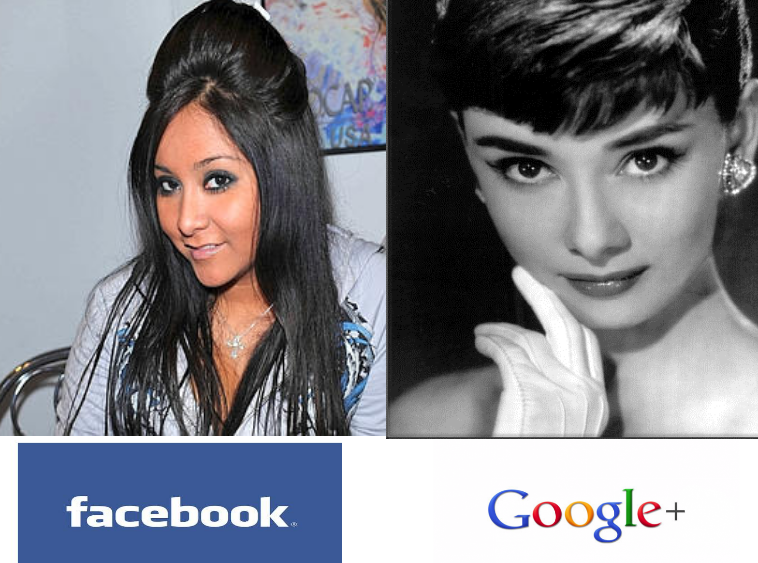
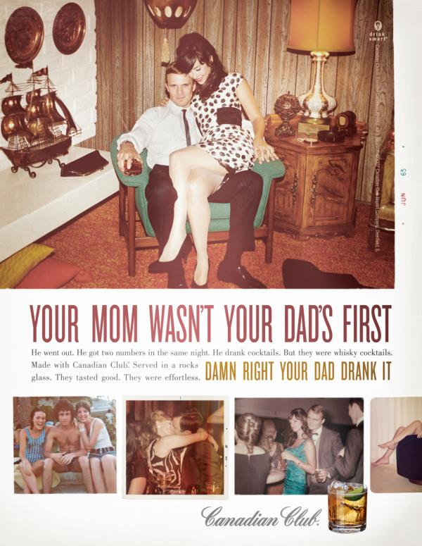

For the last two days the internets have been absolutely abuzz about the new social network Google has launched. Aptly named Google+.  Everyone has their geeky panties twisted in a bunch over the amazing technical features, the marvelously awesome interface that's really a thing to behold, and pretty much everyone is almost frothing at the mouth about how this is that awesome saviour of social networks everyone always needed. My god! Didn't you know, social networking is a poor industry that needs to be saved. Saved I say! And this is it! Google+ is going to do it! _tl;dr --> it's just awesome enough that everything that's wrong makes me rage_ Well, now that the initial excitement is over and everyone's had their chance to use it. I think it's time for us naysayers to come out of the woodwork and share a few words. Here's the thing, Google+ is a marvelous feat of web engineering, it's certainly the best \[ab]use of web standards I've ever seen and I could only wish I had the chops to pull off something that worked as smoothly and as awesomely. The interface feels almost more native than my computer's actual native interface. But ... I don't like it. There isn't a single thing, outside the shiny interface, that I like about the whole service. As soon as I first tried to try it out it started rubbing me the wrong way by saying I'm not awesome enough to use it. Come on, really? Just because the default google account I'm signed in with isn't gmail.com but swizec.com I have to be greeted with a pretty ugly page telling me I suck and not even giving me the option of switching?

<!--more-->

Ok, granted, small thing to fix and they'll get around to it eventually. Multiple login is pretty new anyway.

## My hard earned social graph. Gone!

The biggest thing that rubs me the wrong way is the complete and utter ignorance of my social graph. There's a sort of lame feature of saying "hey, here are some random people from your email ... try them". And they were really really random, people I almost never exchange emails with, while at the same time people I actually do exchange emails with are nowhere to be found. What happened to all my friends on twitter? The close-ish friends I have on facebook? And really facebook is the best guess for me, I keep it somewhat tidy with exactly 42 friends, no more, no less. It's a special place. Sure, there are some third party tools available to export my facebook graph and import it into Google+ ... I think. But what I would have expected from Google is something I've grown accustomed to with _every single social startup ever_. Give me an option to login with facebook and twitter, perhaps even foursquare and others. Then just copy paste my friends. I want you to do this for me. I don't want to do it myself. Look, Google, I know you're this big company and are incredibly awesome. I even understand that you're simply going to force everyone to use your social network. You've indicated as much. But here's the thing, I've spent years, _years_ building relationships with the people I have on different social networks. Starting from scratch is the last thing I want to do. The very fucking last. I'm just too lazy for that. Oh, but I can import from Yahoo ... that's a joke right?

## Circles. Fuck circles

And then there's circles. While a very awesome idea at first glance. You get to arrange your friends into discrete-ish groups of people you would want to share different things with. This makes a lot of sense, most people don't want to share photos of their drunken debauchery with, say, their grandmother. And nobody really cares about that boring new year's party at work other than other people at work ... sort of.  But how many of you really have sooooo many friends that your social groups are discrete? What happens when you go for some drunken debauchery with your boss? Ok, now he's both a friend and a coworker ... but then, there's still a different level of friends and ... gah, it just gets so confusing. I'm far too lazy to deal with taxonomies of friends and figuring out just which exact group of people they fall into. [People are people](http://www.youtube.com/watch?v=59LXx_eyIVQ "RuPaul People Are People") and I treat most of them pretty much the same ... give me a person and I have no idea how to label them. I don't even _want_ to label them. Labeling people is lame. What ... am I supposed to put people into circles labeled "nigger", "chink", "whitey"? Of course not. So why according to number and type of interactions per month? Put them in a certain circle and you've doomed the relationship. Furthermore, how pathetic do you and your friends have to be that you can't handle actually knowing each other? Maybe I'm too European, or just too liberal, but I really don't understand why my grandmother should have a problem with understanding that I'm 23 years old and that, yes, sometimes I get drunk. Hell, I bet she could probably show me a thing or two about partying properly if I asked. I'm sure my gramps could ... hell, even my dad was probably cool once upon a time and knew how to down a drink or two. But maybe that's just me, I have the style of: "This is me. Deal with it or please kindly fuck off". Not really used to holding things back too much ... and the things I don't want everyone seeing ... I just don't put online. Shocker! Imagine that. Refraining from publishing embarrassing things on the most public of public places! :O What a concept!

## Hangouts? Buy me beer instead!

Also Google+ has this hangouts thing. From what I infer it's a place you can have group webcam chats with people. Sure, this might seem fun and all, but I have a policy. If you want to kick the shit with me, buy me alcohol or at least caffeine. Do not even attempt to waste my time with social phone calls, social webcam chats or anything that requires me to focus solely on you. If I can't do other things while talking to you, I expect drinks to be involved. I know this might come as a shock to people. Especially coming from a colossal geek such as myself. But alcohol is the lube, ducttape and wd-40 of social networks. Not TCP/IP. The reason I use social networking at all is because it's event based and lets me focus on other things while still keeping in touch with people. Everything a phone call or a webcam chat doesn't do. Everything. All in all ... the thing I hate most about Google+ is that it's just awesome enough that every huge major thing it doesn't do perfectly really bothers me.

###### Related articles

-   [Hangouts, Sparks, Circles and Huddles - we make sense of Google+](http://www.omgubuntu.co.uk/2011/06/googleplus/) (omgubuntu.co.uk)
-   [What you should Know about Google's new social network](http://theinformativereport.com/2011/07/01/what-you-should-know-about-googles-new-social-network/) (theinformativereport.com)
-   [Social Media Insider: Your Google Plus FAQ](http://blog.360i.com/social-media/google-plus-faq) (360i.com)
-   [Sparks, Circles And Hangouts](http://thedigitalconsultant.wordpress.com/2011/06/29/sparks-circles-and-hangouts/) (thedigitalconsultant.wordpress.com)
-   [Why yo momma won't use Google+ (and why that thrills me to no end)](http://scobleizer.com/2011/07/01/why-yo-momma-wont-use-google-and-why-that-thrills-me-to-no-end/) (scobleizer.com)

