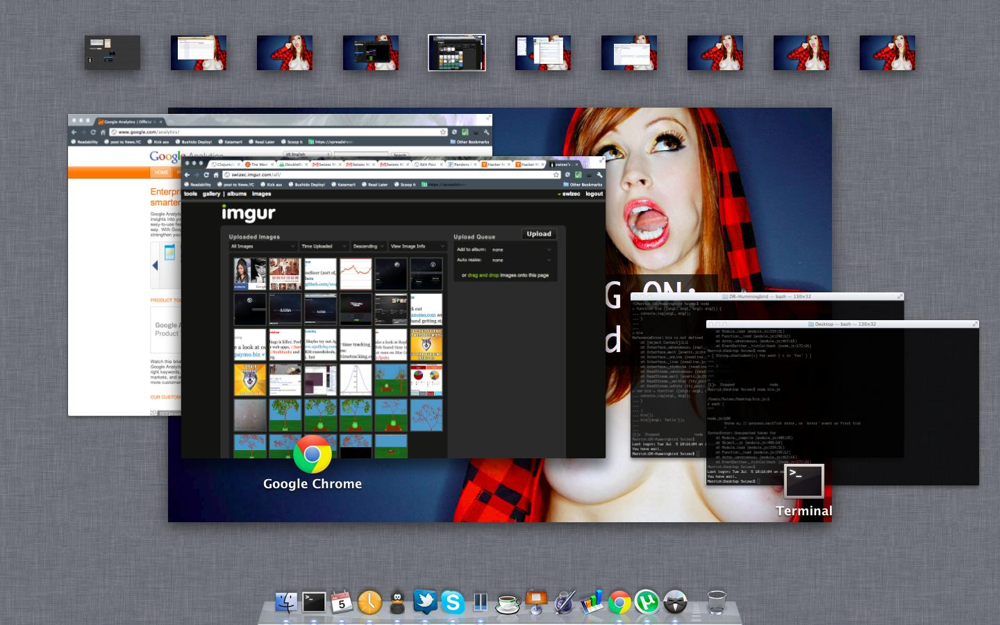
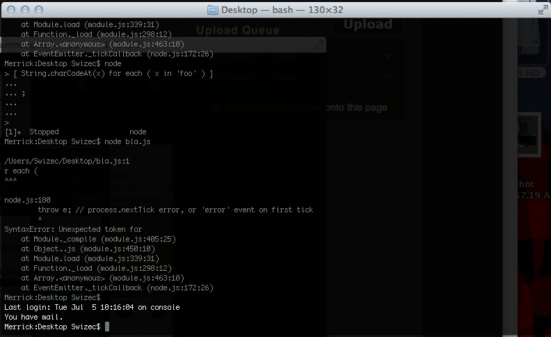
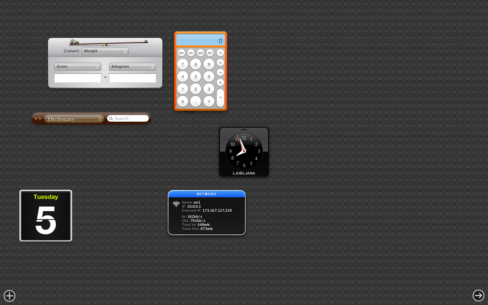

A couple of days ago [Apple](http://www.apple.com "Apple") released the GM version of [OS X Lion](http://www.apple.com/macosx/lion "Mac OS X Lion") to developers. Yesterday I finally got around to installing it and trying it out. It often happens that this is the final version of a new OS that ends up on consumer's hard drives, but I don't think that's going to be the case this time 'round. In some ways the thing is almost as buggy as your average beta [Ubuntu](http://www.ubuntu.com/ "Ubuntu (operating system)") release.  Just a couple of things noticed since yesterday:

- @mihar couldn't login after update until he did a fresh install
- my sound died last night and was gone until I rebooted
- sometimes parts of the [GUI](http://en.wikipedia.org/wiki/Graphical_user_interface "Graphical user interface") don't refresh and there are left over glitches

Actually that's not too bad, I really felt like I noticed more things than that ... guess I've grown a little bit spoiled. If this was Ubuntu I'd probably call it beyond ready for release and super awesome bug free and so on. But on a Mac it makes me want to bitch and moan. Oh us [spoiled brats](http://en.wikipedia.org/wiki/Spoiled_child "Spoiled child"). All in all, I have to say I really love the new features. Probably haven't discovered all of them and I don't want to look for spoilers in the keynote. It's much more fun just using the OS and being nicely delighted on every step of the way.

<!--more-->

The general theme is: Make everything more [iPad](http://www.apple.com/ipad/ "iPad")-y. Actually, I'm going to make the rest of this post in screenshots and captions. \[caption id="" align="aligncenter" width="738" caption="This is simply the sexiest login screen ever"]\[/caption] \[caption id="" align="aligncenter" width="738" caption="New Spaces will need some taking used to, but they sure look great. Better view of windows."]\[/caption] \[caption id="" align="aligncenter" width="738" caption="Apps now have history"]\[/caption] \[caption id="" align="aligncenter" width="738" caption="I guess the new dashboard makes sense ... never used it much"]\[/caption] \[caption id="" align="aligncenter" width="738" caption="The launchpad is a great feature for everyone not using Quicksilver"]\[/caption] \[caption id="" align="aligncenter" width="738" caption="Airdrop looks pretty cool. So does the new sidebrowser in Finder"]\[/caption] Another thing that I really really love are the new scrollbars, but I couldn't quite manage to make screenshots of it. Also the new mouse gestures are pretty fucking awesome. Too many of them to really list, but the one I think I'm going to appreciate the most is the three finger drag. No more awkward thumb action! Now all I need is a mac with an SSD because, to be honest, sometimes things feel a bit slow with all the state saving and things ... not to mention the whole "Keep windows open when reboot" that feature painfully needs an SSD.

###### Related articles

- [Apple to allow license-free virtualization with OS X Lion, developers roar with delight](http://drayspencer.wordpress.com/2011/07/05/apple-to-allow-license-free-virtualization-with-os-x-lion-developers-roar-with-delight/) (drayspencer.wordpress.com)
- [OS X Lion](http://tidb.wordpress.com/2011/07/01/os-x-lion/) (tidb.wordpress.com)
- [What to do before upgrading your Mac to OS X Lion](http://writerway.com/2011/06/30/what-to-do-before-upgrading-your-mac-to-os-x-lion/) (writerway.com)
- [OS X Lion Golden Master seeded to developers ahead of July launch](http://9to5mac.com/2011/07/01/os-x-lion-golden-master-seeded-to-developers/) (9to5mac.com)
- [OS X Lion GM Now Available](http://www.macstories.net/news/os-x-lion-gm-now-available/) (macstories.net)

