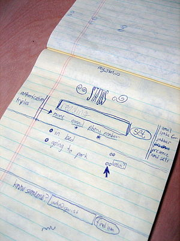

Two weeks ago I moved to a different continent and I have to say, the biggest culture shock was my very own twitter stream. It's still the same stream, but with a 9 hours different timezone everything is so new and shiny and weird and strange and it feels like I don't know anybody! And I have to _follow people_.

\[caption id="" align="alignright" width="300" caption="Image via Wikipedia"]\[/caption]

_New people._ Back home I already have a pretty busy stream and I don't really feel the need to follow people unless they're really anyone interesting. I also don't actually get to accidentally meet new people because I apparently already follow the majority of those who are active. _tl;dr --> if you hate buzzy lame twitter bios, [send me an email](<mailto:swizec@swizec.com?subject=long bios suck!>)_ But here in the US the situation is different. I feel like a newbie user. Stumbling upon cool people. Stumbling upon obnoxious marketers I haven't learned to ignore yet. Stumbling upon ... stuff.

<!--more-->

It's almost like discovering the service anew. Except it's different. Very different. Now that I could claim that I'm not a newbie anymore (because I've been here all summer, for those who get the joke :P) ... I can actually see how horrible twitter is for discovering _cool_and _interesting_people.

## Your bio sucks

The problem is that everyone's bio looks something like this:

> 'The king of cabaret noir' - The Metro. Gin addled vaudevillian musical reprobate. Smut peddler. Full time audience antagonist. Tweets about stuff. Social Business/Creative Technologist, Open & Social, Ex-MySpace (07-09), Dropping pooh sticks in the stream of consciousness. All opinions my own SQL Server MVP and C# developer. Creator of SSMS Tools Pack add-in for SSMS.

And so on. It sucks. It suck donkey balls! These things don't tell me anything. Usually they're just a bunch of buzzwords that sound impressive to a drunk monkey on a Monday night. What I want on [Twitter](http://twitter.com "Twitter") are _people_. Actual, down to earth, people. People I can talk to, people I can make a real connection with. The bios aren't helping. To borrow the bio of @vanfranco -> "Writing a bio is like giving someone the best highlights of your career packed into a tiny space." It's not ... at least it shouldn't be! Why do you want to do that? The only reason you could possibly want to do that is because you don't know who you are. Don't have a good identity. And are probably boring to boot.

## The true gems of bios

Let me share some of the best bios I've seen:

> I am a VC Superhero. World explorer. grinds Toni Braxton in Vegas a chihuahua with a split personality. bid on ebay.

Short. To the point. Makes me want to follow these people immediately. They look like they know where they're going, the [SEP field](http://en.wikipedia.org/wiki/Somebody_Else%27s_Problem "Somebody Else's Problem") doesn't work on them ... these are the people I want to talk to. The kind of people I want to hang out with! And I'm sure many of you are the same. We like people who aren't afraid of who they really are.

\[caption id="" align="alignright" width="300" caption="Image via Wikipedia"]\[/caption]

## The solution?

Here's my idea for solving this problem. On one hand you want to have a short and simple bio. Something that tells exactly one thing about you. On the other, there's more to yourself than a single identifying thing. And you want to list all of them. What if there was a service that let you enter several short facts about yourself. It would then pick a random short fact every couple of days and change your bio. This way every time some new person looks at your profile, you look like you know what you're doing, but at the same time you get to keep all the variety and information. I'm proposing to build this service. All I need to know now is if anyone else besides me would want to use it :) Send me an email to [swizec@swizec.com](<mailto:swizec@swizec.com?subject=long bios suck!>) if you think this is a good idea. Thanks!

###### Related articles

- [12 Most Compelling Reasons I Do Not Follow Everyone Back](http://babyfruit.typepad.com/mediagirl/2011/07/12-most-compelling-reasons-i-do-not-follow-everyone-back.html) (babyfruit.typepad.com)
- [8 words to never put in your Twitter bio](http://holykaw.alltop.com/8-words-to-never-put-in-your-twitter-bio) (holykaw.alltop.com)
- [How To Write a Twitter Bio That Gains You More Followers](http://blazingminds.co.uk/write-twitter-bio-gains-followers/) (blazingminds.co.uk)
- [3 Steps to Creating an Effective Twitter Bio](http://jtdabbagian.com/2011/05/3-steps-to-creating-an-effective-twitter-bio/) (jtdabbagian.com)

