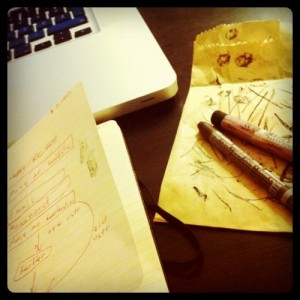
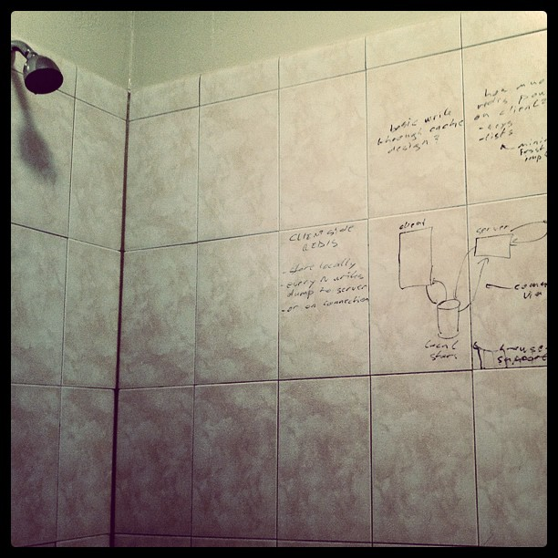
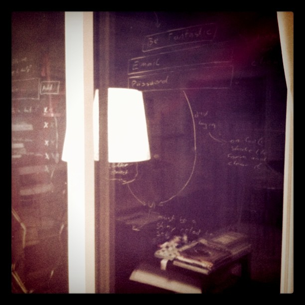
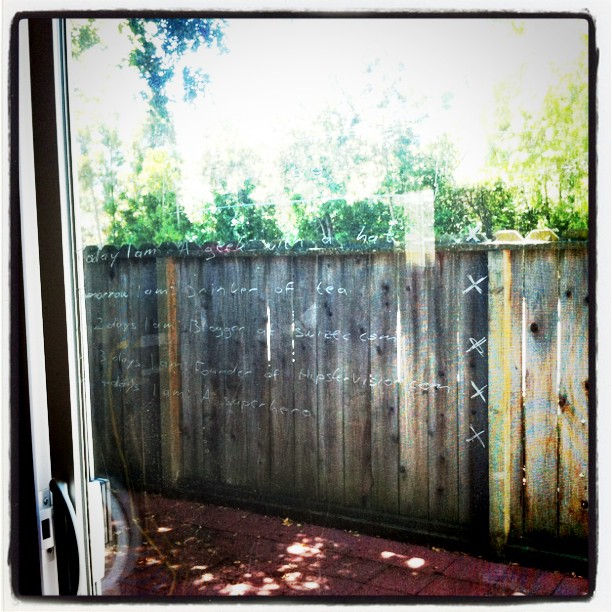

Two days ago I complained about not being able to [brainstorm under the shower](http://swizec.com/blog/i-learned-two-things-today/swizec/1956 "I learned two things today") because there is nowhere to jot down my thoughts ... I tend to think a lot better when I can scribble somewhere. \[caption id="attachment_1986" align="alignright" width="300" caption="Crayon+moleskin+mac"]\[/caption] Quite a few of you suggested I use something called a "[wax pencil](http://en.wikipedia.org/wiki/Grease_pencil "Grease pencil")". Yesterday I visited a nearby [art supply](http://en.wikipedia.org/wiki/List_of_artistic_media "List of artistic media") store, [Accent Arts](http://maps.google.com/maps/place?q=Accent+Arts,+South+California+Avenue,+Palo+Alto,+CA&hl=en&cid=5872990577141797841). Don't think I've ever seen an art store stocked so well! They didn't know what a wax pencil was. After explaining that my purpose in life is the magical ability to write on a wet [glazed tile](http://en.wikipedia.org/wiki/Glazed_tile "Glazed tile") and be able to easily erase everything after I'm done, they suggested I try two things. A [water soluble](http://en.wikipedia.org/wiki/Solubility "Solubility") [wax](http://en.wikipedia.org/wiki/Wax "Wax") [pastel](http://en.wikipedia.org/wiki/Pastel "Pastel") and a water soluble oil pastel. They had another suggestion, but it was made of wood so it didn't look like a very natural fit. I got home with a _crayon_ and an oil pastel. Yes, the wax pencil slash wax pastel calls itself a crayon. One of those things I last saw in kindergarten and forgot even existed. The oil pastel didn't work out too well. It's too hard and doesn't write on smooth surfaces, then when you do manage to leave a mark it's damn near impossible to erase. True story. But the crayon! I. Am. In. Love! Seriously, I'm never leaving home without a crayon somewhere on my person ever again. It's pretty much the single most perfect tool for impromptu thinking. Soft enough to write on pretty much any smooth surface. Erasable with ease. Yes, it even works under the shower despite a few problems with washing off soon after writing ... but that just makes you focus more. It doesn't wash off enough to vanish, but isn't a perfect replacement for your memory either. Just the perfect balance. I also have a feeling this would work perfectly for, say, writing on tables at coffee shops, windows on a train ... everywhere. Glass is seriously everywhere! It actually works --> \[caption id="attachment_1984" align="aligncenter" width="612" caption="Under the shower"]\[/caption] \[caption id="attachment_1985" align="aligncenter" width="612" caption="Writing on a glass door, night"]\[/caption] \[caption id="attachment_1983" align="aligncenter" width="612" caption="Glass door, day"]\[/caption]

###### Related articles

- [Crayon & Pencil Rolls](http://andsewitgoes.org/2011/06/29/crayon-pencil-rolls/) (andsewitgoes.org)
- [Made of crayons](http://itsasmallweb.wordpress.com/2011/06/20/made-of-crayons/) (itsasmallweb.wordpress.com)
- [My Not-So-Secret Habit](http://annstephensromance.com/2011/07/19/my-not-so-secret-habit/) (annstephensromance.com)

