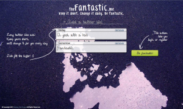
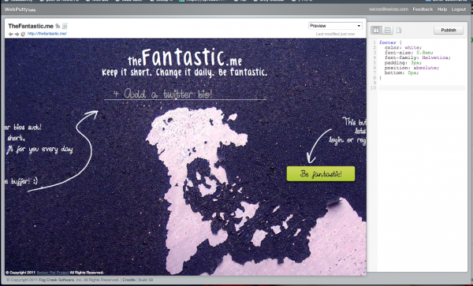

First thing's first: I _hate_ IDE's. \[caption id="attachment_2018" align="alignright" width="300" caption="Bestest design I've ever done"]\[/caption] Second thing's second: I absolutely _suck_ at design. You can see proof of the first by ... well hmm ... I'm not sure I can find a blog post where I cry about the aches and pains an IDE forces upon me right now, but I'm sure if you've ever talked to me about code editors and such you'd soon see my deep deep hatred of the bloat that is an IDE. Proof that I'm not even a passable designer can easily be found in the last pet project I've pushed out into the open, [GithubFriends](http://githubfriends.swizec.com). It's just a horrible mess, I tried to make it awesome, honestly, I tried! _tl;dr --> WebPutty will make your [CSS](http://en.wikipedia.org/wiki/Cascading_Style_Sheets "Cascading Style Sheets") cry virgin unicorn tears of awesome_ Thing is, despite my pretty solid knowledge of CSS and browsers (I used to make a living as an implementor of designers' crazy wishes) and a good eye for design ... by good eye I mean that I can recognise a good design when I see it. This came mostly from spending a lot of time hanging out with designers. \[caption id="attachment_2011" align="alignleft" width="300" caption="GithubFriends, the eyesore"]\[/caption] I've even gotten so bad as to care about _fonts._ Fonts man! Fonts. Clearly, the knowledge of how to implement a design and being able to recognise a good design when you see it isn't enough to make you a good designer. The real designers, the one that actually call themselves such, have something extra. That magical voodoo ability to pull a good design out of thin air. Similarly to how a developer sees an algorithm before it is implemented, so too does a good designer see his design before the first line is put down in [InDesign](http://www.adobe.com/products/indesign/main.html "Adobe InDesign"). So how can a schmuck like me create a website that doesn't offend the eye then?

<!--more-->

## Enter WebPutty, stage left

Barely a week ago [Fog Creek Software](http://www.fogcreek.com "Fog Creek Software") released their newest tool for us poor schmucks. It's a website. That is also an IDE. Made for editing CSS. The idea is pretty simple. You can write the CSS and you can see when something looks good. So why not edit the CSS and immediately see whether it looks good or not? Right? Right. Brilliant! Here's what it looks like when I work on my latest pet project, which I will not link to because it is not yet ready for the public (and I'm too lazy to implement beta locks and whatnot, if you know the url, have at it, leave me feedback ;) \[caption id="attachment_2009" align="aligncenter" width="600" caption="WebPutty + thefantastic.me"]\[/caption] The whole idea is pretty simple. On the left you see the website you're working on and on the right is the CSS you're editing. Everything you do immediately reflects in the page. What makes this arrangement so much better than the traditional InDesign approach is that you can intereact with the site and make sure everything works. Things hidden behind javascript actions can be easily styled and so on. It's pretty brilliant. Plus, if your site only works on localhost, WebPutty doesn't care! It still works :D In conclusion, I think my CSS editing workflow has been changed forever.

###### Related articles

-   [WebPutty: Browser Based CSS Editing Made Easy](http://www.readwriteweb.com/hack/2011/07/webputty-browser-based-css-editor.php) (readwriteweb.com)
-   [WebPutty: CSS editing goes "boink"](http://blog.fogcreek.com/webputty-css-editing-goes-boink/) (fogcreek.com)
-   [Fog Creek releases WebPutty](http://www.webputty.net/) (webputty.net)

