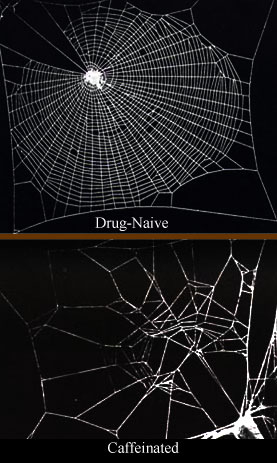

\[caption id="" align="alignright" width="277" caption="Image via Wikipedia"]\[/caption]

This marks the first in what I hope to make a quick daily note on this blog.

As an exercise in learning something every day and considering that people tend to remember things much better when writing them down, I will take a few minutes every evening to write the two things I have learned that day.

The first thing that I learned today was that I am a huge huge caffeine addict. Decided to go on a caffeine diet for a couple of days and today was possibly the most miserable I have been in quite a while. Zombied through the day.

Another thing that I learned is that taking two hours off in the middle of the afternoon to watch some shows when you're feeling like your head is about to roll off your shoulders and into a gutter full of poo ... the world doesn't come crawling to a halt. The work waits for you. And nobody but yourself thinks any worse of you. Taking a break _works_ bitchz.

###### Related articles

- [Is caffeine against the word of wisdom](http://wiki.answers.com/Q/Is_caffeine_against_the_word_of_wisdom) (wiki.answers.com)
- [Five Benefits of Giving up Caffeine](http://www.losethattyre.co.uk/five-benefits-of-giving-up-caffeine/) (losethattyre.co.uk)

