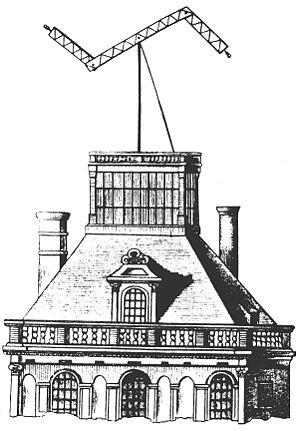

\[caption id="" align="alignright" width="300" caption="Image via Wikipedia"]\[/caption]

Today I came upon an interesting article on hackernews about the first ever text message from some time in the 19th century. It was referring to the telegraph. -> [From 1890: The First Text Messages](http://sundaymagazine.org/2010/08/from-1890-the-first-text-messages/). Actually both of the things I learned stem from that article. The first that I learned is that such a thing as [optical telegraphs](http://en.wikipedia.org/wiki/Semaphore_line) actually existed at one time. I had thought this was something Terry Pratchet invented out of thin air, but apparently in the late 18th and early 19th century they actually existed. Even though they were hypothesised about in the late 17th century, the first practical implementation was by [Chappe](http://en.wikipedia.org/wiki/Claude_Chappe "Claude Chappe") in France. It's really quite fascinating, people _actually_ communicated by turning rods into shapes up on high towers. The mechanical complexity is just mindboggling. Another thing that I learned is that telegraph operators back in the day had wars. Apparently sometimes two of them wanted to relay a message and instead of using some sort of protocol to arrange who would go first ... they'd just both go at the same time until one of them finally gave up control. Seems rather inefficient, especially as neither of them could really tell what the other was saying. Fascinating stuff that. Luckily internet doesn't work that way ...

###### Related articles

-   [I learned two things today 29.7.](http://swizec.com/blog/i-learned-two-things-today-29-7/swizec/2022) (swizec.com)
-   [From 1890: The First Text Messages](http://sundaymagazine.org/2010/08/from-1890-the-first-text-messages/) (sundaymagazine.org)
-   [WTF and other rural text messages](http://ruralcommunication.wordpress.com/2011/07/30/wtf-and-other-rural-text-messages/) (ruralcommunication.wordpress.com)
-   [Short text messages show surprising storytelling power in Norway tragedy](http://www.textually.org/textually/archives/2011/07/029102.htm) (textually.org)

