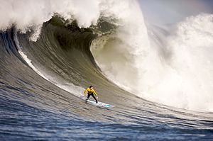

\[caption id="" align="alignright" width="300" caption="Image via Wikipedia"]\[/caption]

Today I got a small glimpse into what makes [surfers](http://en.wikipedia.org/wiki/Surfing "Surfing") do all the crazy things that they do. You know, like the getting up at 3am, just to drive for a couple of hours to go sit still in freezing water for an hour or two and get a compound two minutes of fun time out of it and perhaps ten seconds of perfect fun time.

Crazy bastards.

I did something similar. Swam in the ocean and the feeling you get when the waves are churning you around is just divine. Even though the water is freezing and I didn't even have a wetsuit ... totally worth it. Now I want to go try sitting around in the water on a floating plank.

Another thing that I learned is that surfing originates from Hawaii and there are records of it being standard practice as early as the 16th century. It started gaining popularity outside Hawaii (defined as inside US in the surfing museum) in the early 20th century. The boards they used back then were right scary. Big fat wooden things that seem to weight a ton.

I wouldn't even dream of trying to surf with those.

###### Related articles

- [I learned two things today 30.7.](http://swizec.com/blog/2037/swizec/2037) (swizec.com)
- [I learned two things today 29.7.](http://swizec.com/blog/i-learned-two-things-today-29-7/swizec/2022) (swizec.com)

