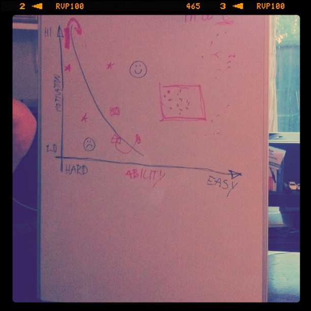

Today I might have accidentally learned more than two things, for which I am deeply sorry and I do apologize.

\[caption id="" align="alignright" width="367" caption="Captivity graph"]\[/caption]

The most mind blowing thing I learned today was a simple lesson in [product design](http://en.wikipedia.org/wiki/Product_design "Product design"). [@tantadruj](https://twitter.com/#!/tantadruj) was at some very expensive seminar by [BJ Fogg](http://www.bjfogg.com/ "BJ Fogg") last week and he explained the basic concept of making products that captivate people and make them come back later.

Distilled to its very core the key takeaway is that you should keep reminding your users that they are using your product. If you don't remind them, they will forget no matter how much they might need it or how highly motivated they are to doing something.

People forget shit. They do.

Once you start thinking about it, it becomes pretty obvious that people tend not to do the things they forget to do. And more \\importantly, every single service alive and doing well today is full of triggers. Sending you notifications one way or another ... even [Buffer](http://bufferapp.com/), the product/startup I've been watching most closely lately because they look really cool, has one basic feature that kept me coming back initially until I got the hang of using them -> every once in a while I'd get an email basically saying, "Hey, you haven't used the service in a bit, you totally should".

Anyway, onward to the second thing that I learned.

The other thing that I learned isn't as useful. It's just that I really really love tea and am a complete and total addict. Yes, there you have it ... Hello, I am Swizec and I am addicted to tea.

Tried going without a drop the last three days and it was hell on earth. At times I questioned my sanity and whether I even want to continue living under these brutal conditions. But I persevered and my reward was ... that's right, a big ol' [cup of tea](http://en.wikipedia.org/wiki/Tea "Tea") right for breakfast. If anyone tries to convince me I might be too addicted ever again, I'm biting their nose off.

You have been warned.

###### Related articles

- [I learned two things today 31.7](http://swizec.com/blog/i-learned-two-things-today-31-7/swizec/2040) (swizec.com)
- [I learned two things today 29.7.](http://swizec.com/blog/i-learned-two-things-today-29-7/swizec/2022) (swizec.com)
- [How do I stop being so damn lazy?](http://www.businessinsider.com/how-do-i-stop-being-so-damn-lazy-2011-7) (businessinsider.com)
- [Case Study: How Jennifer tripled her rate (working 1/3 the hours) by mastering the art of networking](http://www.businessinsider.com/case-study-how-jennifer-tripled-her-rate-working-13-the-hours-by-mastering-the-art-of-networking-2011-6) (businessinsider.com)

