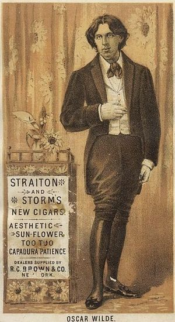

\[caption id="" align="alignright" width="300" caption="Image via Wikipedia"]\[/caption]

> “Ambition is the last refuge of the failure.” ~ [Oscar Wilde](http://en.wikipedia.org/wiki/Oscar_Wilde "Oscar Wilde")

People exist in a limbo of three states: the person they used to be, the person they are and the person they want to become. This roughly translates to the concept of a past, a present and a [future](http://en.wikipedia.org/wiki/Future "Future"). But with one caveat, what you _want_ to become is a world of difference away from what you actually _will_ become. [Worrying](http://en.wikipedia.org/wiki/Worry "Worry") about the person you used to be, while a popular sport, is quite irrelevant. Past performance has very little correlation to future actions and those thinking otherwise are using a very simple thinking shortcut. It’s easy to think that if a person has made something wonderful in the past, all of their next projects are going to end wonderfully as well. But the correlation just isn’t there. Unless you’re doing the exact same thing your past self has been doing, there’s no point in worrying about your past. Outside some mental list of lessons learned you might as well forget all about your past and just enjoy the moment because it doesn’t matter anyway. At worst one’s past might have an impact on how others perceive them, but I find that until you start fucking up, people don’t really bother to think about your past self all that much. It just doesn't matter beyond the role of a scape goat. So then, with very little reason to worry about one’s past self, why do people worry so much about their future self? Because you can still change it? Almost everything you do today has some sort of impact on who you can become tomorrow, which brings us exactly to the point. Everything you _do_ has an impact on who you will be tomorrow. A lot of people make long wish lists of features they want their future self to have. Be it hot girls and expensive automobiles or something much simpler like the solution to the halting problem. Inevitably these wishes coming true hinges on a single thing: Who they are today. Right now! And you can barely influence the person you used to be. Sure, you can spin your story this way or that, but it doesn’t change the facts, your past actions are there, cemented in stone. What you can affect is the future. The future hasn’t happened yet. It’s yours for the taking. The problem here is that no matter what you do, you’re never actually _in_ the future. Every moment that happens, every moment right after that, is the present. Simple concept. Great implications. This means that no matter how hard we try, we will never change the future because our whole sphere of influence lies wholly in the present. You can always choose to do this thing or that and whichever way you choose, has great impact on the man that you are. A person much smarter than myself once said that “A man can only tell his true self by how others perceive him”, which I might be paraphrasing or completely making up, I can’t really tell right now and a quick google search doesn’t reveal a source for the quote. The point is, your true worth really is defined by how much worth you are to the people around you. If you’re the only person in the world that can see how awesome you are … then, truth be told, you might just be a little bit arrogant and a bit of a prick. But if others find you awesome and even derive some use out of your existence, then, Bravo!, you are suddenly a productive member of society! Good on you! Notice I’m talking in the [present tense](http://en.wikipedia.org/wiki/Present_tense "Present tense")? It doesn’t really matter if you one day plan on solving world hunger, curing cancer and bringing humans into space ... if you’re killing babies right now. It just doesn’t. Sure, sometimes the ends do excuse the means, but until your ends are touchable, actionable results, you’re just an idiot doing Bad Things ™, but with good intentions, honestly. I’m sorry, the world has enough of those already. Please kindly fuck off. The whole thing is really quite simple, if you want to be someone, go be him. NOW! Stop wasting your time being someone you don’t want to be. You are recognized as the person you are _right fucking now_. As Oscar Wilde said in Phrases and Philosophies for the use of the Young, the fact that you’re striving for something just means you haven’t reached it yet. Most people probably don’t even know you’re trying to reach it … some likely don’t even care. So ask yourself, if I get hit by a bus tomorrow, is _this_ really what I want to be remembered for? Or is there something more important you should be doing? Especially ask yourself this if you’re a \[young-ish] Silicon Valley entrepreneur … are you working on the next cool widget, or are you saving the world? Which do you think better to be remembered for?

###### Related articles

-   [Deceptive Picture: How Oscar Wilde painted over "Dorian Gray."](http://www.3quarksdaily.com/3quarksdaily/2011/08/deceptive-picture-how-oscar-wilde-painted-over-dorian-gray.html) (3quarksdaily.com)
-   [Lesson #11: Make Peace with Your Past So It Doesn't Screw Up the Present](http://divorcingmrwrong.wordpress.com/2011/07/23/lesson-11-make-peace-with-your-past-so-it-doesn%25e2%2580%2599t-screw-up-the-present/) (divorcingmrwrong.wordpress.com)
-   [Counting My Blessings](http://gibsongirl247.wordpress.com/2011/06/13/counting-my-blessings/) (gibsongirl247.wordpress.com)
-   [The Here and Now](http://whatisfortytwo.wordpress.com/2011/07/21/the-here-and-now/) (whatisfortytwo.wordpress.com)

