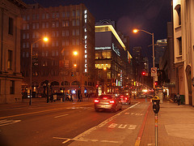

\[caption id="" align="alignright" width="240" caption="Image by Franco Folini via Flickr"]\[/caption]

Let me break your [suspension of disbelief](http://en.wikipedia.org/wiki/Suspension_of_disbelief "Suspension of disbelief") and admit that I am not writing this "today" ... well it is still today by my standards because "tomorrow" starts at 6am and it's only 5am right now ... but [Wordpress](http://wordpress.org "WordPress") is going to disagree with my definition and claim I have posted this tomorrow. But despite this small glitch in how the calendar is arbitrarily constructed, I did manage to learn two things today. The first and most \\important is that trying to book somewhere to stay for a single night on the same day you plan on showing up just doesn't work. Now I don't have enough data points to know exactly and for certain that it doesn't work, but finding such a place in [San Francisco](<http://maps.google.com/maps?ll=37.7793,-122.4192&spn=0.1,0.1&q=37.7793,-122.4192 (San%20Francisco)&t=h> "San Francisco") at what I'm told is the height of the tourist season ... well it doesn't work. I tried to find hostels, but all online things said nobody had any vacancies. I also tried [Airbnb](http://www.airbnb.com/ "Airbnb") and didn't even get a response ... tried [couch surfing](http://www.couchsurfing.org/ "CouchSurfing") and also didn't get a response. Hell, I even tried to beg the twitters for a couch to crash on for the night and there were no takers. Nobody wants to host for a guest that's coming at 4am and staying until about 8am ... possibly drunk out of his mind ... What was the other thing that I learned ... I know it was something useful, but I can't think of it for the life of me. So I'm going to go with having learnt that there is a [Starbucks](http://Starbucks.com "Starbucks") open all night in San Francisco and this means I have somewhere to "stay" until the trains start running again at 8am.

###### Related articles

- [I learned two things today 2.8.](http://swizec.com/blog/i-learned-two-things-today-2-8/swizec/2059) (swizec.com)
- [Tourists return to San Francisco](http://www.sfgate.com/cgi-bin/article.cgi?f=/c/a/2011/08/06/EDJM1KIINF.DTL) (sfgate.com)

