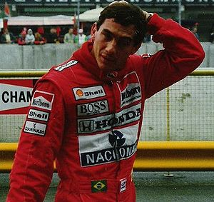

\[caption id="" align="alignright" width="300" caption="Image via Wikipedia"]\[/caption]

Today I learned that the strangest thing can make your blog behave erratically, strange and crash whenever you apply even a hint of load to it. Apparently the reason my blog has been behaving so bad lately is the foursquare plugin used to show off my latest location in the footer. Seems like it kept wanting to talk with the foursquare API every time somebody reloaded the page. This tended to take a while and thus made the whole page slow ... then when enough people did this, usually as a result of being frontpages on HackerNews ... ... well the obvious happened. A bunch of open connections to the database, everyone cheerfully waiting for the foursquare plugin, until the database told the blog to fuck off because you're only allowed about 200 connections by design to keep the server somewhat safe. And eventually I started running out of all sorts of resources assigned to me. The issue seems to be fixed now ... time to figure out how to get the 100 euro back from the host I wanted to move to out of pure frustration last night when my blog was down yet again. Another thing that I learned was that Senna was a fucking awesome driver. Just simply the coolest guy ever. Awesome as a driver _and_ awesome as a human. That's rare, a lot of people who are professionally awesome tend to suck horribly as people. If you haven't yet, you should totally see the [documentary about Senna](http://www.imdb.com/title/tt1424432/) called ... Senna.

###### Related articles

-   [Film: Movie Review: Senna](http://www.avclub.com/articles/senna,60240/) (avclub.com)
-   [The Story of Senna, Formula 1's Humble Hero](http://www.wired.com/geekdad/2011/08/senna/) (wired.com)
-   [Day 257 - When Kate watched the Senna film!](http://yeeeeed.wordpress.com/2011/07/11/day-257-when-kate-watched-the-senna-film/) (yeeeeed.wordpress.com)
-   [Ayrton Senna's singular, relentless magic \[Video\]](http://jalopnik.com/5823354/ayrton-sennas-singular-relentless-magic) (jalopnik.com)

