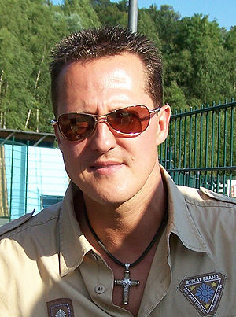

\[caption id="" align="alignright" width="174" caption="Image by Luiz Fernando / Sonia Maria via Flickr"]\[/caption]

Last night [I watched a documentary about Senna](http://swizec.com/blog/i-learned-two-things-today-10-8/swizec/2124 "I learned two things today 10.8.") and if you are into [motor sports](http://en.wikipedia.org/wiki/Motorsport "Motorsport") at all, or just like watching movies about inspirational people, you should totally watch it. If you can't swing the time, at least go have a look at last year's [Top Gear Senna tribute](http://www.youtube.com/results?search_query=top+gear+senna&page=&utm_source=opensearch).

There is a quote from the movie that really stands out for me:

> By being a [racing driver](http://en.wikipedia.org/wiki/Auto_racing "Auto racing") you are under risk all the time. By being a racing driver means you are racing with other people. **And if you no longer go for a gap that exists, you are no longer a racing driver** because we are competing, competing to win. And the main motivation to all of us is to compete for victory, it's not to come 3rd, 4th, 5th or 6th. I race to win as long as I feel it's possible. Sometimes you get it wrong? Sure, it's impossible to get it right all the time. But I race designed to win, as long as I feel I'm doing it right.

I believe Senna said this to explain why he crashed out [Alain Prost](http://en.wikipedia.org/wiki/Alain_Prost "Alain Prost") in the first corner of some championship deciding race (I forget which). An event that was possibly the saddest way to become a world championship ever, but nevertheless.

But the circumstances don't really matter.

The \\important bit is that _if you no longer go for a gap that exists, you are no longer a racing driver._

<!--more-->

Think about it.

Try to really take it in.

Say it out loud. Let that phrase roll off your tongue with feeling. Go on, say it.

Do you hear it?

It is the sound, nay, the philosophy, of a man who is considered the greatest expert in his field. Not the greatest living expert. Not the greatest expert from some era. _THE_ greatest expert.

Ask anyone. Even [Schumacher](http://en.wikipedia.org/wiki/Michael_Schumacher "Michael Schumacher") who has the most recors says that Senna was better. Top Gear has it on video, they asked the greatest living experts of the field and they all unanimously agreed that Senna was _the_ best F1 driver ever.

Can we learn from this philosophy?

\[caption id="" align="alignleft" width="240" caption="Image via Wikipedia"]\[/caption]

Let's bastardize it a little bit -> "if you no longer go for &lt;opportunity> you are no longer &lt;that which you are>". Just insert the appropriate words for your situation.

The point is, once you start taking shortcuts, the first time you say "Eh, I'll let it slide this time, I'll try harder next time" ... fuck that shit. You've already lost. The first time you say to yourself _I could code this better, but they're not paying enough_you are no longer a programmer. The first time you go _Oh that's a cool opportunity, but I'm busy with this other thing and I wanted to watch that cool movie_you are no longer an entrepreneur.

But I guess not all of us can be as great in our respective fields as Senna was in his. Maybe we get to flake out a few times. It just matters how often you do it. And sometimes it is probably better to let an opportunity slide if it opens up resources to chase a bigger and better opportunity (you could argue that then the "gap" did not exist, I'm sure [Ayrton](http://en.wikipedia.org/wiki/Ayrton_Senna "Ayrton Senna") skipped many gaps that weren't good enough).

Just keep the quote in mind.

We already let slide enough opportunities for being awesome subconsciously for this or that reason, there's no need to make excuses. If you don't beat yourself up at least a little bit every time, then you will let slide too many.

And here's a bonus quote by [Jeremy Clarkson](http://www.myspace.com/everything/jeremy-clarkson "Jeremy Clarkson") about Senna that speaks a lot about what more of us perhaps should try striving to:

> Villeneuve (or any of the other greats for that matter...Prost, Hill, [Mansell](http://en.wikipedia.org/wiki/Nigel_Mansell "Nigel Mansell"), etc) were spectacular a number of times. Senna was spectacular every single time.

Do you want to be spectacular a number of times or _every_ time?

###### Related articles

- [When Fangio met Senna and Schumacher \[Video\]](http://jalopnik.com/5826851/when-fangio-met-senna-and-schumacher) (jalopnik.com)
- ['Senna': The Fast-Paced Life Of A Champion Racer](http://www.npr.org/2011/08/11/139084426/senna-the-fast-paced-life-of-a-champion-racer?ft=1&f=1008) (npr.org)
- [Ayrton Senna's singular, relentless magic \[Video\]](http://jalopnik.com/5823354/ayrton-sennas-singular-relentless-magic) (jalopnik.com)
- [Film: Movie Review: Senna](http://www.avclub.com/articles/senna,60240/) (avclub.com)

