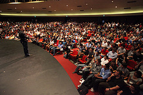

\[caption id="" align="alignright" width="240" caption="Image by Robert Scoble via Flickr"]\[/caption]

Today I learned that yesterday there was some confusion about the dates of when I learned the two things because I was writing just past midnight. Well, ok, I just learned that right this very instance. This is the real 16.8. post, the other one is actually 15.8. and I don't want to go gallivanting around and changing titles all willy nilly. That's just not kosher.

The actually \\important thing that I learned today has to do with [Airbnb](http://www.airbnb.com/ "Airbnb") and my visit of a [YC](http://www.ycombinator.com "Y Combinator") dinner as a guest. Was a pretty fun experience and I really got the feeling that [Brian Chesky](http://www.crunchbase.com/person/brian-chesky "Brian Chesky") is a much cooler guy than I originally thought ... especially from having seen him at [Startup School](http://startupschool.org/ "Startup School") yesteryear.

Now I'm not sure this is the general experience people get from these dinners, but it seems that the off-the-record and encouragement from Graham to really speak their mind brings the best out in people. Or it might just be that when people talk to others who are supposedly like-minded and the whole situation is less formal, people tend to be more ... human?

Oh and apparently Macs have some sort of safe boot mode. It's really quite annoying when you want to have a broken keyboard connected because otherwise the power button doesn't work.

###### Related articles

- [Airbnb: From Y Combinator To $112M Funding In Three Years](http://blogs.wsj.com/venturecapital/2011/07/25/airbnb-from-y-combinator-to-112m-funding-in-three-years/) (blogs.wsj.com)
- [Y Combinator's 7th Annual Startup School Set For October](http://techcrunch.com/2011/08/11/y-combinators-7th-annual-startup-school-set-for-october/) (techcrunch.com)

