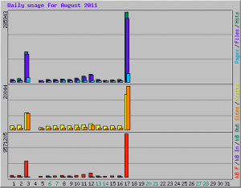

\[caption id="attachment_2247" align="alignright" width="300" caption="Check out the 20k spike :D"]\[/caption] Today I learned that apparently people really love going on the internet to read about some dumb guy who has decided to severely limit his internet usage almost to the point of considering it being completely offline when compared to his previous habits. There was a great deal of tweeting my yesterday's blogpost about how [my ideas are shit and I'm going on an internet diet](http://swizec.com/blog/my-ideas-are-shitty-so-im-going-on-an-internet-diet/swizec/2239 "My ideas are shitty so I’m going on an internet diet"). There were also 127 upvotes on hackernews and 80+ comments. The only time something like that has happened on my blog before was when [I pissed all over Apple's Ping](http://swizec.com/blog/apples-ping-is-a-big-pile-of-steaming-dung/swizec/1444 "Apple’s Ping is a big pile of steaming dung"). I also learned that apparently through some fluke or stupidity neither google analytics nor mixpanel were loading on the blog all day. Therefore I have no proper way of telling how many people read that post and what's most unfortunate, my mixpanel tracking of how far people scroll down my page ... But! My cool sysadmin has a stats thing and from what I can tell, there were 20,000 people or thereabouts reading the blog yesterday. This is particularly epic since my goal for this year is to build the blog up so much I have 20k monthly visitors. :D
