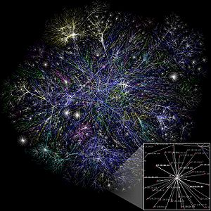

\[caption id="" align="alignright" width="300" caption="Image via Wikipedia"]\[/caption]

Lately we have seen a plague of Next Better Widget (tm) startups and bright minds all over the world solving frivolous problems that ultimately contribute nothing to the betterment of humanity as a whole. There are a bunch of people out there right now solving [#firstworldproblems](https://twitter.com/#!/search?q=%23FirstWorldProblems).

A waste of talent!

By being in the same boat I feel like I am betraying my ten year old self who had much bigger plans for me. His ideas on what sort of problems I should be solving was much worthier than what I have actually turned out to be working on.

The main difference between my ten year old self and me is [the internet](http://en.wikipedia.org/wiki/Internet "Internet").

Back then I didn't have it, or rather what I did have was at a friend's house on a dial-up line if I asked really nicely. Sometimes even at the library!

The ideas I had back then might not have been world changing, or they might have been, it's hard to say, but the ideas I have right now certainly don't seem as grand.

This leads me to believe that the ideas we have reflect the kind of world we live in.

Spending a lot of time on the internet makes us see the problems that exist there. And they look like big \\important problems. But really, when you take a step or two back, they're pretty lame ideas that are almost a waste of time to have anyone working on.

Thus I have decided to go offline for a month, starting tomorrow.

But because going completely dark would devastate my life, probably make it stop dead (how unlike an addict eh?), I am going to set some ground rules that won't ban the internet completely; just make it a bit ... less.

- as a coding reference, the internet is ok
- wikipedia is alright, but keep it down
- I will continue writing my blog
- using [750words.com](http://750words.com) every morning is good
- there will be at most an hour every evening of HN/fb/twitter/email
- if something absolutely spectacular happens you are allowed to tweet, no reading outside the hour!
- checking in to foursquare is questionable ... perhaps ban it?
- skype is ok

To mak sure my slight addiction doesn't get in the way I will likely use an [/etc/hosts](http://en.wikipedia.org/wiki/Hosts_%28file%29 "Hosts (file)") hack and make sure facebook.com and similar don't load outside the allotted hour a day and I will turn off push notifications on everything on my phone. But I _will_ try to rough it at first.

Right now I have no idea how this experiment will pan out. Most likely I'll keep finding some sort of excuse for not doing it or I will break down in tears and cry in a fetal position in the corner. I might even start reading proper books again! That would be awesome.

Hopefully by the end of the 30 days I will have a less polluted perspective in the world.

Wish me luck!

###### Related articles

- [Dont Fear The Internet Dot Com](http://aldorf.wordpress.com/2011/08/11/dont-fear-the-internet-dot-com/) (aldorf.wordpress.com)
- [The Economic Value of a Business Startup](http://dilbert.com/blog/entry/the_economic_value_of_a_business_startup/) (dilbert.com)
- ["If our ideas seem smaller nowadays, it's not because we are dumber than our forebears but because we..."](http://kellysutton.tumblr.com/post/8930005518/if-our-ideas-seem-smaller-nowadays-its-not) (kellysutton.tumblr.com)
- [The Post-Idea World](http://news.slashdot.org/story/11/08/16/0142226/The-Post-Idea-World) (news.slashdot.org)

