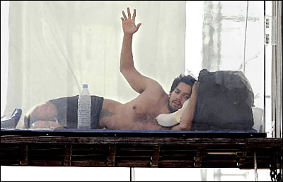

Two days ago [I went on an internet diet](http://swizec.com/blog/my-ideas-are-shitty-so-im-going-on-an-internet-diet/swizec/2239 "My ideas are shitty so I’m going on an internet diet") and a whole lot of [people heard about it](http://swizec.com/blog/i-learned-two-things-today-17-8/swizec/2244 "I learned two things today 17.8."). Flaking out is simply not an option.

\[caption id="" align="alignright" width="400" caption="Man in box"]\[/caption]

I may have turned into one of those curiosities, like a guy who puts himself in a glass box in the middle of a square and claims he will live in there for a week ... people are intrigued by idiots doing idiotic stuff.

While a few people applauded my effort, a lot of readers came out to tell me I'm Doing It Wrong (tm). That my list of rules is too permissive and won't let me achieve whatever I set out to achieve (I don't even know, I'm just seeing what happens, honest).

Because the hour a day is too short to respond to everyone, let me try explaining the reasons behind every item on the list :)

## as a coding reference, the internet is ok

Here's the thing, I'm a programmer, in an average day I work in four-ish different languages across at least three distinct pieces of technology. Some of which is changing so rapidly any offline resources I could find would be woefully out of date before even reaching the printer. Sometimes I need to pick up a new piece of technology quickly, it would be impossible to download docs in advance.

I can't let experiments like these affect what I do for a living. No go.

## wikipedia is alright, but keep it down

I am about to enter exam season. Wikipedia has proven to be the single best source for studying large swaths of computer science and mathematics. Normal reading material just isn't enough. I'm not talking about mindlessly browsing here, I'm just trying to avoid wastingtime whenever I want to make sure I understand something.

## I will continue writing my blog

A few months ago I set a goal to myself to reach 20k monthly readers of this blog by the end of the year. If I don't keep writing it this goal has no hope of being reached. I am doing my best to fit blogging into the hour of internet I have a day.

I love writing and it's something I have to do regularly ... might as well publish it somewhere, see how people like it, get feedback, improve.

## using [750words.com](http://750words.com) every morning is good

This barely counts as internet. It's just somewhere I write what's on my mind every morning for nobody to ever read. But it keeps score and I don't want to break a 110 day streak.

## there will be at most an hour every evening of HN/fb/twitter/email

For a guy who is online 24/7 going to just an hour of internet is ... huge. I need to keep up with email because I have clients and stuff, twitter/fb are because I need a way of keeping in touch with people, especially because the exam season means I won't be able to meet them in person much. Similar to email, I have to respond to people talking to me on Twitter.

And HN ... well I don't absolutely need need that, but I want to at least skim the titles on the frontpage to keep a grip on reality a bit.

Oh and those complaining I'm on twitter outside the hour. I use [Buffer](http://bufferapp.com) to schedule tweets ;)

## if something absolutely spectacular happens you are allowed to tweet, no reading outside the hour!

Some news just shouldn't be kept to myself. What if I see aliens? Or [meet a celebrity](http://swizec.com/blog/i-learned-two-things-today-14-8/swizec/2207 "I learned two things today 14.8.")? This is again part of that whole "keeping in touch" thing.

## checking in to foursquare is questionable ... perhaps ban it?

Foursquare is arguably useless, but I want to check-in to places. If I go missing or something weird happens to me, at least people know where to start looking. And I like having a history of uninteresting places I have visited.

## skype is ok

I don't use a phone.

Skype is honestly my only means of communication with anyone. Especially now that I've banned twitter for most of the day ... twitter used to be the only reliable means of reaching me in a hurry.

## Fin

So there you have it. I hope that clears up some of the issues everyone had with my little experiment. And hey, if you think you can do better, you're welcome to try. We can compare notes :)