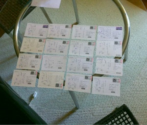

\[caption id="attachment_2276" align="alignright" width="300" caption="Many postcards!"]\[/caption]

Today I learned that people really really love postcards. Bought one too many yesterday (it later turned out I didn't buy too many, I just forgot my grandmother might like getting one) and offered on Facebook on Twitter to send the first person who gives me their address a postcard.

Five people asked for one. So now that I was going to buy postcards anyway I asked for random people who might like a postcard and ended up having to buy fourteen of them. Well ok, three of those are for some cool professors [@zidarsk8](http://twitter.com/zidarsk8) reminded me of.

Point is, people love postcards still.

Another thing I learned is that in the US they have automated stamp dispensing machine. You just swipe a credit card, press a few buttons and ugly stamps come out. Quite an amazing system if you need stamps on a Sunday afternoon.

PS: bonus thing I learned; wearing a bunny hat in Cheesecake Factory does not phase the waiters at all.