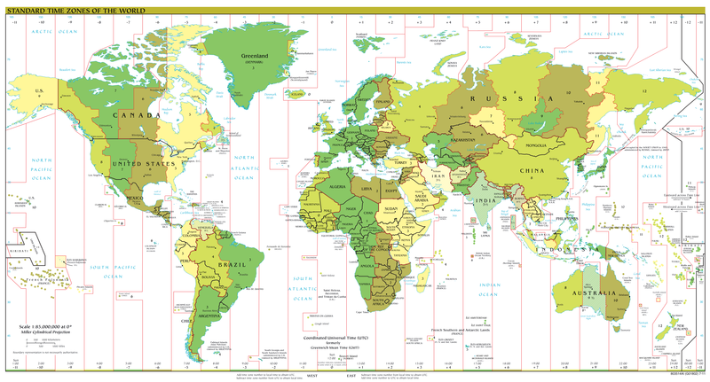

Everyone who sometimes changes their timezone has probably had this problem before.

You're planning a trip to a 9 hour distant timezone. Let's say it is a business trip. To be more productive you schedule some meetings in advance and put them in your calendar. Whichever calendar will do, they all have this problem.

\[caption id="" align="alignright" width="480" caption="Timezones"]\[/caption]

Then you hop on a plane. Land. Dutifully tell your computer what timezone you are in. Maybe it magically figures this out on its own.

Voila!

The meeting you so carefully planned for tomorrow at 2pm is now marked in your calendar as tomorrow morning at 5am.

Crap. It only took you ten pingpong emails to arrange this. Sure, 5am is probably not when you scheduled it, but what was the time again? Searching through emails for "meeting at 2pm" won't help much either.

You simply can't remember when you scheduled the meeting. You schedule too many every week to keep track in your head. You wouldn't even need a calendar if this wasn't the case anyway!

Now what?

It might not even have moved to 5am but something reasonable. Now you'll unknowingly show up at the wrong time and blow that fucking awesome deal.

Your calendar is correct though ... in a way.

The meetings are still exactly when you scheduled them. They are still attached to the exact perfect absolute time you planned them for. But this isn't what you meant is it? You wanted the meeting to be at "2pm whenever 2pm is for me on the day this meeting is happening".

To date I have yet to find a single application on a computer that would understand the idea that I \_don't care about timezones\_. Yes, timezones are a useful concept. To me personally they are meaningless 90% of the time. When I say I expect something to happen on a particular time ... I expect it to fucking happen then! Not at some absolute nebulous concept of time that holds no meaning for me.

It is understandable that programmers the world over would get this wrong. Before I did any traveling I found timezones to be perfectly reasonable the way everyone implements them.

You translate everything to UTC time when it is stored in the database, then offset it back to the appropriate timezone for whichever user is looking at it. It's something the View cares about. Core logic doesn't need to know or care. It's only a matter of display.

This is an unsolvable problem. Logically.

The concept of time as an absolute, with timezones as mere offsets the display cares about, makes perfect sense. And in many cases is the only correct answer! Think of timestamps on tweets, or forum posts, of course I want those to display relative to me - as an absolute time.

But when scheduling stuff it seems my (our?) instinctive understanding of time is a bit different. Suddenly I no longer care about absolute time and making certain everyone in the world sees the correct time. I only care that when I fly to a different timezone, \_the event stays in its fucking place!\_

It seems we have reached an impass.

How are computers supposed to handle timezones well, when their users (the arbiters of truth and properness) have such different conceptions of time in different contexts?

But even some messages, the only place it seems where absolute time is of any use, lose a great deal of information when the time is translated into "my" timezone. There will often be "good morning" tweets when I'm just about to go to bed. Things like that would make a lot more sense if the time on a tweet at least made any mention of when, relative to the poster, it was made.

So maybe we need to start implementing our software so it displays both absolute time and the originator's local time? And in the case of schedulable events only care about relative time?

The latter especially has big connotations for displaying the same event to people in different timezones. For this I don't have a good solution right now ... very open to suggestions by the way.

Or maybe I'm just imagining this problem and people simply aren't switching timezones often enough to make solving this problem worthwhile.