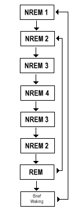

\[caption id="" align="alignright" width="125" caption="Image via Wikipedia"]\[/caption]

Today I learned that [jet lag](http://en.wikipedia.org/wiki/Jet_lag "Jet lag") is a much uglier beast than I ever anticipated. I don't remember having this much trouble last time I came back from the US; perhaps because I wasn't there for as long and the different timezone didn't seep into my [sleep cycle](http://en.wikipedia.org/wiki/Circadian_rhythm "Circadian rhythm") as much? All week I've been getting up in the middle of the day and then being unable to fall asleep until insane morning hours (think 6 or 7am). This seems to throw my whole day into a tailspin, especially because the wakeup isn't exactly nice and the sleep doesn't leave me rested at all. As a result this whole week I've barely managed to stitch 30 productive hours together. Most of which came as the cram session for the Thursday exam. Sure hope this thing passes soon. Another thing I learned is that with the new OAuth2 [Foursquare](http://www.foursquare.com/ "Foursquare") API and teh awesomeness of [jQuery](http://jquery.com/ "JQuery") it is very _very_ simple to make a purely browser-side Foursquare client in javascript. This comes as a great breakthrough in the way everyone can develop web apps and I think is wroth some more exploration. The first thing I'm going to try is making the footer on my blog work again since it's been turned off because it couldn't handle the load. Anyone know of a ready-made library existing already? Of course making soem sort of distributed cache with minimal involvement from the server will be the real issue ... but definitely worth exploring.

###### Related articles

-   [Checking In: Which App Should I Use](http://www.mycricket.com/community/cell-phone-info/checking-which-app-should-i-use) (mycricket.com)
-   [Sleep statistics for 26 - 27 Aug (Fri)](http://shivasleeps.wordpress.com/2011/08/27/sleep-statistics-for-26-27-aug-fri/) (shivasleeps.wordpress.com)
-   [Jet Lag](http://buddhavani.wordpress.com/2011/07/23/jet-lag/) (buddhavani.wordpress.com)

