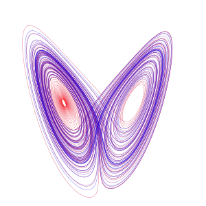

\[caption id="" align="alignright" width="300" caption="Image via Wikipedia"]\[/caption]

Today I learned that [mathematics](http://en.wikipedia.org/wiki/Mathematics "Mathematics") is a very _very_ dense language. Been studying theoretical basis of computer science for an exam from a [textbook](http://en.wikipedia.org/wiki/Textbook "Textbook") of some sort. Well actually it's the draft of a textbook that was going to come into existence at some point but hasn't been updated since 2008. There's still references like "I need to put so and so here". It's pretty funny. Funny references aside, it takes a surprisingly long time to read that stuff when you actually read out in your mind what the mathematics is saying instead of just looking at it. I mean it's basically a sentence right, if you want it to stick in your mind at least a little bit you have to read it as a sentence; not just as a random string of characters. Another thing I learned is that you can somewhat almost easily transform a context unaware grammar into such a context unaware grammar as to not contain any needless generations (such that run in loops without ending in a character from the final alphabet) and even such that don't produce any epsilon strings. Apparently this is very useful for minimizing state automata processing such grammars because the language pertaining to that grammar remains the same in all practical aspects.

###### Related articles

- [The mathematics generation gap](http://worthwhile.typepad.com/worthwhile_canadian_initi/2011/05/bridging-the-mathematics-generation-gap.html) (worthwhile.typepad.com)
- [You don't understand something until you think it's obvious.](http://mebassett.blogspot.com/2011/06/you-dont-understand-something-until-you.html) (mebassett.blogspot.com)
- [The Genius in My Basement: the Biography of a Happy Man by Alexander Masters - review](http://r.zemanta.com/?u=http%3A//www.guardian.co.uk/books/2011/aug/28/genius-basement-alexander-masters-review&a=53261337&rid=4e3b1538-4619-4c97-8258-e9106def5e33&e=883116130eaead154a82a3dffbf7505b) (guardian.co.uk)
- [Why do textbooks present information as if it were certain](http://wiki.answers.com/Q/Why_do_textbooks_present_information_as_if_it_were_certain) (wiki.answers.com)
- [Mathematical learning (and math as a hobby)](http://www.3quarksdaily.com/3quarksdaily/2011/08/mathematical-learning-and-math-as-a-hobby.html) (3quarksdaily.com)
- [2-year-old children understand complex grammar](http://esciencenews.com/articles/2011/08/23/2.year.old.children.understand.complex.grammar) (esciencenews.com)

