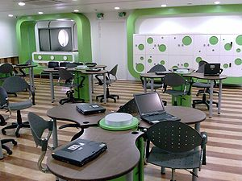

\[caption id="" align="alignright" width="300" caption="Image via Wikipedia"]\[/caption]

Today I learned that studying from textbooks of other majors than your own can be quite an interesting experience. Serendipity and stuff! Namely I was going through an architect's book for their statics class. While certainly an entertaining read, I was absolutely abhorred by their raping of basic physics. Now I'm no physics buff myself, took me ages to pass that exam, but even as a lowly programmer it was painful reading such primary school explanations of things like balance and vectors and stuff like that. You're supposed to be a university level textbook for fuck's sake! For a profession that is historically and in the public's mind seen as very noble and educated! How dare they confuse balance and lack of acceleration upon an object? (sum of torques being zero versus sum of forces acting upon an object being zero) And I was absolutely mortified when I read that forces cannot be moved around the system. You know, because a vector totally changes if you move it somewhere while taking care not to change any angles or lengths ... But enough, it was still quite interesting. Another thing that I learned is that _taking powernaps at 5am does not fucking work_. This is a lesson that never sticks to me, I always end up doing it, and then upon exam time I always bash myself over the head for falling asleep and not having gone through the last couple of pages of material. And it was such an easy and awesome exam too! You never know though, perhaps the four hours of sleep had a much better effect than four more hours of studying would have. I should test this ... but how?

###### Related articles

- [The Kno app turns textbooks into a 3D experience](http://www.geek.com/articles/apple/the-kno-app-turns-textbooks-into-a-3d-experience-20110822/) (geek.com)
- [Can Digital Textbooks Truly Replace the Print Kind?](http://techland.time.com/2011/08/29/can-digital-textbooks-truly-replace-the-print-kind/) (techland.time.com)
- [A textbook case](http://www.theage.com.au/national/education/a-textbook-case-for-digital-learning-20110815-1iujw.html) (theage.com.au)
- [Kno adds Kahn Academy resources to etextbooks](http://www.teleread.com/uncategorized/kno-adds-kahn-academy-resources-to-etextbooks/) (teleread.com)

