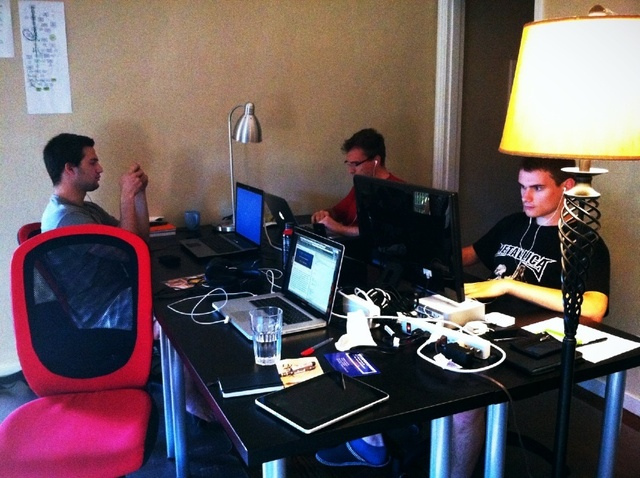
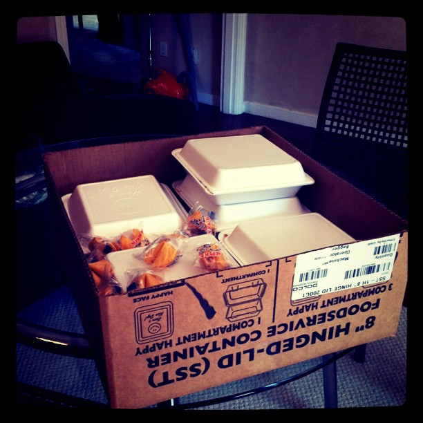

_Second time I'm writing this post after the official [Moleskine](http://www.moleskine.com/ "Moleskine") app for [the iPad](http://www.apple.com/ipad/ "iPad") ate the first version some 80% through. Don't use it. It doesn't behave as a notebook should ..._

\[caption id="" align="alignright" width="384" caption="Coding and then some"]\[/caption]

Today was the first day I woke up before noon since coming back to Slovenia a week ago. I was so happy to have gotten over the jet lag that I took it as a sign the impressions have settled in and fermented properly and it's time to write a post.

I spent the summer working as an intern for DoubleRecall through their [YCombinator](http://www.ycombinator.com "Y Combinator") experience. Then I came back home to get some exams done before the next year of school; I would love to have stayed longer!

_tl;dr --> super awesome times, you seriously want to do something like this_

Despite everything people said last night on the #startups [IRC channel](http://en.wikipedia.org/wiki/Internet_Relay_Chat "Internet Relay Chat"), even a startup such as DoubleRecall - a startup that will obviously make a gazillion dollars - isn't a good reason to drop out of school when you're not a founder.

I can only hope when the founders are dumping truckloads of hundred dollar bills into their swimming pools rather than water - they'll keep me and my antics in good memory :)

Which brings me right to the first lesson I picked up:

<!--more-->

## 1. Be controversial - it works bitch'z

Now I'm not certain how much of this I'm allowed to say in public, but someone will surely rise up and slap me over the wrist if I say too much. Then I will edit this section. Perhaps even delete it.

You might have heard of Fukime, it was a small and simple service that "launched" sometime mid-August. I was in charge of making sure as many of you heard of it as possible.

At the same time [Parse](https://www.parse.com/) was launching and because the two things are remotely similar I decided to piggyback on their publicity ... granted, very poor judgement on my part and I should have known better.

The whole thing went up the nose of some people high up in YC because something like this has not happened in the whole history of the programme.

It even went so far I had to go defend my actions to the YC offices; even got personally picked up at the train station!

Good or bad, how many interns got on YC's radar this summer do you think? I'm pretty sure my next application will at least get a good read.

## 2. Location matters in unexpected ways

As a developer in [Silicon Valley](<http://maps.google.com/maps?ll=37.37,-122.04&spn=1.0,1.0&q=37.37,-122.04 (Silicon%20Valley)&t=h> "Silicon Valley") I can't say I felt any productive boost from the location itself outside the climate (summers in [Califronia](<http://maps.google.com/maps?ll=37.0,-120.0&spn=10.0,10.0&q=37.0,-120.0 (California)&t=h> "California") are fucking divine), the change of surroundings and such.

Especially being couped up in a house with a bunch of guys who are always working - no commuting - no girlfriends - nothing but us and a mission to make something happen.

You don't need to move halfway across the world to get that, you could just as easily put a bunch of developers into a house anywhere in the world and the magic would happen.

Everyone feeding off each other, ideas flowing. Shit getting done.

Seems like it was much different for the business guys though. They were on fire!

Having meetings like a boss. With people that just aren't available anywhere else in the world. "Be where your customers are", as wise people have said.

It actually works.

## 3. Work hard, party harder

\[caption id="" align="alignleft" width="367" caption="You can even work in the shower"]\[/caption]

Being in an environment where everyone is working pretty much from waking to sleeping can make even the strongest of men a workoholic.

The encouragement is there. The culture is there. All the conditions are perfect. You're there with a single purpose.

And so you code.

All day.

But no matter how much of a robot you are, eventually it will wear on you and you will start pumping out garbage by the truckload. You are much more useful when you are only pumping out code by the cartload - code so beautiful it would put the sixtine chapel to shame.

It's \\important to unwind and just be.

You might not be able to party in the Valley itself since ... well there's just nowhere to party, everyone is a always working.

San Francisco is right there though. A train ride away. And it is a fucking spectacular place to party even if all the clubs do close up at 3am.

## 4. Cool people don't live inside your computer

Similar to the note about partying to unwind and get a fresh set of brains to look at problems, you will likely find that being in the Valley suddenly means that most of the cool people aren't in the computer anymore.

They're out there. At the starbuckses and peetses of the world!

Going out to meet them is fun.

Most of the time they don't bite and the stories they tell are pretty interesting - not to mention how often does it happen that talking shop with a stranger produces another stranger who just starts talking shop with the two of you because they overheard something interesting?

Plus it's another opportunity to slightly unwind and let your subconscious work on Real Problems (tm).

## 5. Side projects are \\important

Just as you need some time to unwind, so does the team as a whole.

This is of course anecdotal evidence, but I think the whole team dropping everything to do with the core project and working on something lighthearted and fun for a week really helped.

Fuck teambuilding exercises and whatever crap corporates throw at employees in the movies. Side projects are where it's at! The whole team has a bit of fun and at the end of the week, everyone is fresh to look at the \\important problems again.

Better still, you might have used the side project to approach That Really Annoying Hard Problem (tm) from a new perspective and it suddenly became very obvious.

## 6. Runways are a pretty big deal

\[caption id="" align="alignright" width="367" caption="Chinese, lots of it"]\[/caption]

This lesson is a bit personal due to the experiences with the first and latest real startup I've founded.

Turns out the whole team works a lot better when everybody knows where the next meal is coming from. I know it's not kosher to say that startups need money and investments because people need to put food on the table (investments are for "runways" and "moar everything" and "marketing" and "servers" etc), but fuck it.

Money matters. People use it to survive.

## 7. For an employee - startups are pure fucking fun

On that note: it is much easier to work at a startup than it is to be a founder.

Nothing but pure fun!

All the perks of a startup environment, without any of the aches and pains of actually having to make sure stuff works and the startup functions as a well oiled machine.

That said, it isn't even half as satisfying. No matter how much you believe in the idea. Outside of a year long (at most) sabbatical I'll take the pain and the blood and the tears any day of the week.

What I don't understand is why anyone would work at something other than a startup ... but that's fodder for a different post.

\[caption id="" align="alignleft" width="367" caption="Energy drinkz"]\[/caption]

## 8. YC dinners take plenty of energy

As a hired gun I only ever got to attend a single YC dinner annd the main impression was one of immensenes.

I'd only gotten two hours of sleep that day and then there were just so many people to talk to. Everyone looked awesome, everyone looked like they could share cool stories long into the night.

I was too tired for all of it.

[Brian Chesky](http://www.crunchbase.com/person/brian-chesky "Brian Chesky") of [Airbnb](http://www.airbnb.com/ "Airbnb") fame was the speaker at "my" dinner. His story was amazing, striked quite close to home for me, but I think I slept through at least half of the Q&A session ... paying attention for four hours is simply too much.

Hopefully this wasn't the last dinner I'll ever attend because there was so much more I could have gotten out of it ...

## 9. Your pitch needs more work

The last few days of my stay were marked by the whole team focusing on making sure any member of the core team had the perfect pitch to tell on demo day.

The best guy would end up doing it.

I had to leave on demo day and even if I didn't, I wouldn't be allowed to listen in, but from what I hear the guys totally owned it and everything went swimmingly.

[Steve Jobs](http://www.crunchbase.com/person/steve-jobs "Steve Jobs") once said it takes an hour of preparation for every minute of a presentation.

Try four days for a two minute pitch.

## 10. You want to do this

As a founder or as an anything, you want to get locked up in a house with a cool team and make something awesome.

Conclusion

The whole summer was one huge experience I will always look back on fondly. Since I'm of a very forgetful nature I probably won't remember much more than the general feeling and by the time I'm grampa age I will be telling war stories of this summer like a boss.

And I won't even have to fabricate anything. The real story is good enough.

Shoot me a line pretty much anywhere if there's anything you want to ask. I learned more than fits in a post.

###### Related articles

- [I couldn't get into YC so I joined a startup that did](http://swizec.com/blog/i-couldnt-get-into-yc-so-i-joined-a-startup-that-did/swizec/1855) (swizec.com)
- [Applying to YC as a Single Founder](http://blog.jazzychad.net/2011/08/31/applying-to-yc-as-a-single-founder.html) (jazzychad.net)
- [Does Paul Graham Get What He Asks For? \[infographic\]](http://www.giftrocket.com/blog/does-paul-graham-get-what-he-asks-for) (giftrocket.com)
- [YC's Patent Pledge Asks Tech Companies To Grant Startups Patent Immunity](http://techcrunch.com/2011/08/31/ycs-patent-pledge-asks-tech-companies-to-grant-startups-patent-immunity/) (techcrunch.com)
- [For the love of God, YC companies-to-be stop posting ambiguous job description](http://news.ycombinator.com/item?id=2879055) (news.ycombinator.com)
- [Y Combinator Shattered My Robot Loving Dreams](http://launchpadtoys.com/blog/2011/08/y-combinator-shattered-my-robot-loving-dreams/) (launchpadtoys.com)

