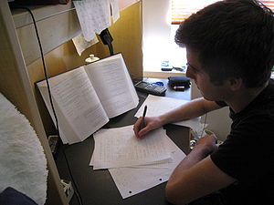

\[caption id="" align="alignright" width="300" caption="Image via Wikipedia"]\[/caption]

Apparently I have neglected to learn anything the past two days. Most likely because I've been a bit swamped with a particular [probability and statistics](http://en.wikipedia.org/wiki/Probability_and_statistics "Probability and statistics") theory exam that I started [studying](http://en.wikipedia.org/wiki/Study_skills "Study skills") for much too late and ended up having only a day and a half time to learn 300 pages of ... stuff ... by heart. I guess the main lesson of the past couple of days has been that I _suck_ at studying and should really make an attempt to plan these things better. But the thing is that slow studying where people study for a couple of hours a day and do this for two weeks ... it just doesn't work for me. I get distracted and lose the appropriate mindset for a specific topic. Specifically today I learned that some textbooks are superbly lame for studying from. You know that [statics textbook](http://swizec.com/blog/i-learned-two-things-today-30-8/swizec/2308 "I learned two things today 30.8.") I laughed at a couple of days ago? It's a brilliant piece of study material. Just gorgeous compared to what a certain professor managed to come up with for [information theory](http://en.wikipedia.org/wiki/Information_theory "Information theory"). The whole thing is barely twice as long as [Shannon's](http://en.wikipedia.org/wiki/Claude_Shannon "Claude Shannon") original article on the topic ... most of the difference is due to different text setting and that a couple of formulae have rigorous proofs written down. Most of the textbook is just pages upon pages of formulae and proofs, without any real context given. Yay for good study materials!

###### Related articles

- [Classroom or Beach? Best Study Locations Identified](http://www.prweb.com/releases/prweb2011/8/prweb8749837.htm) (prweb.com)
- [Think Stats: Probability and Statistics for Programmers](http://greenteapress.com/thinkstats/html/index.html) (greenteapress.com)
- [Homeschooling Methods](http://socyberty.com/education/homeschooling-methods-2/) (socyberty.com)

