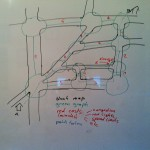
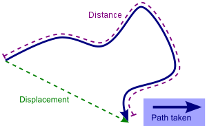
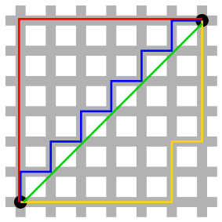
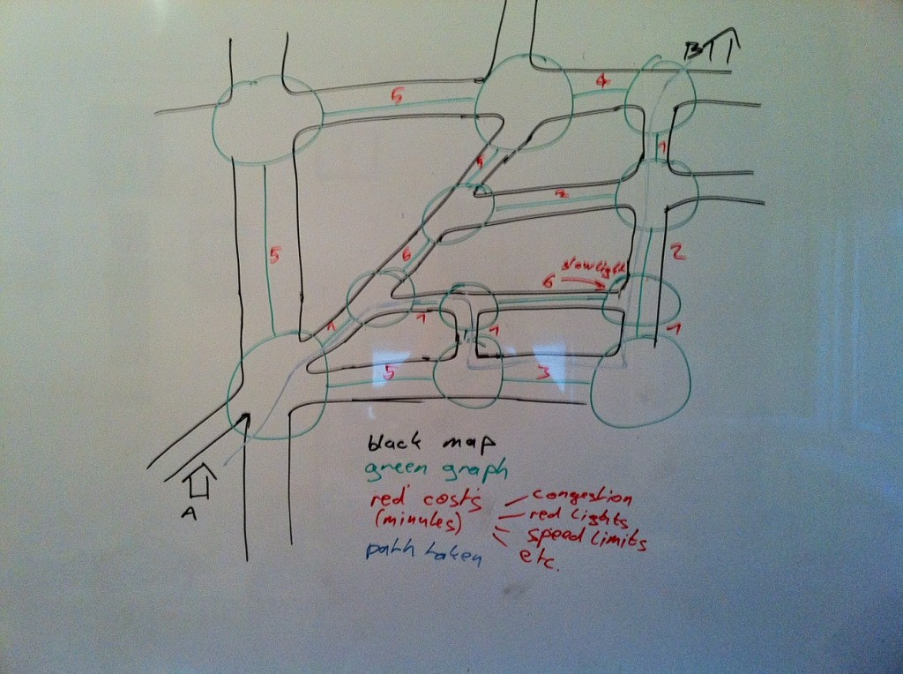

\[caption id="attachment_2384" align="alignright" width="150" caption="A picture!"]\[/caption] This is a debate I keep getting into with all sorts of people. No matter how well I try explaining it people simply do not want to believe me they're thinking about [distance](http://en.wikipedia.org/wiki/Distance "Distance") all wrong. After last weekend's trek around a very sunny city where I was forced to keep walking in the blistering noon sun, just because "It's closer!" and my sister is a naggy teenager and gets her way, I've decided to write this post wherein I explain once and for all the difference between intuitive distance and real-world distance.

## Intuitive distance

First let's talk a little bit about how all of us think of optimizing our paths for distance. You've probably noticed bits of grass so destroyed around the corners of walkways in parks that eventually the walkways are just expanded with rounded corners. Some architects are even so smart as to design them this way in the first place! This is due to how [right triangles](http://en.wikipedia.org/wiki/Right_triangle "Right triangle") work. The rule is basically that for any right triangle the length of the hypotenuse will necessarily be shorter than the sum of its catheti.

\[caption id="" align="alignleft" width="300" caption="Image via Wikipedia"]\[/caption]

You can quickly check this is true with the first [pythagorean triplet](http://en.wikipedia.org/wiki/Pythagorean_triple "Pythagorean triple") (3,4,5). Obviosly 5 is less than 3+4. Far from a rigorous proof, but the idea isn't stupid. This is something that comes very intuitively to us. See a right triangle and choose to walk diagonally, it's simply shorter that way. It's even more obvious when you think about it in terms of distance traveled versus displacement. The [shortest path](http://en.wikipedia.org/wiki/Shortest_path_problem "Shortest path problem") to take between two points will always be one that best fits displacement.

<!--more-->

\[caption id="" align="alignright" width="283" caption="Taxicab geometry in a nuttshell"]\[/caption]

## [Taxicab Geometry](http://en.wikipedia.org/wiki/Taxicab_geometry "Taxicab geometry")

All of this comes crashing to a halt in large american cities. Those tend to be laid out in a grid, and prevent us from traveling over proper [diagonals](http://en.wikipedia.org/wiki/Diagonal "Diagonal"). Instead we follow diagonals to our best abilities alongside a grid. [Herman Minkowski](http://en.wikipedia.org/wiki/Hermann_Minkowski "Hermann Minkowski") stipulated in the 19th century that because of this constraint, the distance traveled diagonally is no different than the distance traveled on any other gridded path with the same displacement. By looking at the sketch, I think we can all agree with Minkowski.

## Distance as a parameter of cost

But taxicab geometry only works in [the US](<http://maps.google.com/maps?ll=38.8833333333,-77.0166666667&spn=10.0,10.0&q=38.8833333333,-77.0166666667 (United%20States)&t=h> "United States") and other cities laid out in a grid, I haven't really seen many of them. So maybe in Europe our intuition still works? Everything becomes much more interesting once we start thinking of distance as a parameter of the function of cost. Imagine you have to travel across a city. You can take a very short path through the streets. This path runs on smaller roads, which have a lot of crossroads, many red lights, people waiting to turn left and so on. Another path, a much longer one, runs mostly on larger roads where you have fewer stop lights and everyone waiting to turn left is ushered into their own lane. Which path do you take? It's probably obvious, but I've been in plenty of fights for taking the longer route. The whole problem boils down to something computer scientists and probably most mathematicians call graph traversal and finding the shortest path through a graph. Basically it goes like this: You have a set of nodes connected with edges. Each edge has a number assigned to it. Find the path from node A to node B with the smallest total sum of traversed edges. That number is completely abstract, it can mean distance or can be a function of many parameters telling you how costly it is to travel alongside that edge; it essentially doesn't matter, whatever you want to optimize for, that's how you define the function. When walking I like to account for amount of sunlight ... especially in the summer. There are many ways to approach solving this problem, but the algorithm [Dijkstra](http://en.wikipedia.org/wiki/Dijkstra%27s_algorithm "Dijkstra's algorithm") came up with seems to work the best in most cases. To illustrate my point, look at the pretty picture I've drawn on my whiteboard. Imagine this is a map of a few streets - [geometric distance](http://en.wikipedia.org/wiki/Euclidean_distance "Euclidean distance") accounts for our [intuitive understanding](http://en.wikipedia.org/wiki/Intuition_%28knowledge%29 "Intuition (knowledge)") of distance. The cost I've chosen to optimize for is time. \[caption id="attachment_2384" align="aligncenter" width="614" caption="My attempt at drawing an example of distance vs. cost (click for a better view)"]\[/caption] Point proven? Or at least shown? Can I just send this link every time I get into this discussion? But the most interesting bit, I think, is how a lot of people think like this in a car. Why not on foot? Or on a bike? What makes those ways of traveling so much different that suddenly physical distance traveled is the only factor we think about? No matter how many things I have to climb over, I will fucking walk the shortest path! Really? PS: another interesting example is the [Mythbusters Waterslide Wipeout](http://en.wikipedia.org/wiki/MythBusters_(2010_season)#Episode_145_.E2.80.93_Waterslide_Wipeout) episode, where they show a mail truck doing only right turns (in the US) saves fuel despite traveling a much greater physical distance.

###### Related articles

-   [Fast Pathfinding via Symmetry Breaking](http://harablog.wordpress.com/2011/08/26/fast-pathfinding-via-symmetry-breaking/) (harablog.wordpress.com)
-   [Do complex numbers really exist?](http://math.stackexchange.com/questions/154/do-complex-numbers-really-exist) (math.stackexchange.com)
-   [Our brain fails to map high distances](http://news.bioscholar.com/2011/08/our-brain-fails-to-map-high-distances.html) (news.bioscholar.com)
-   [Innate Euclidean geometry.](http://mindblog.dericbownds.net/2011/06/innate-euclidean-geometry.html) (mindblog.dericbownds.net)

