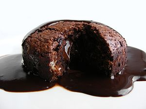

\[caption id="" align="alignright" width="300" caption="Image via Wikipedia"][](http://commons.wikipedia.org/wiki/File:Chocolate_Fondant.jpg)\[/caption]


Today I learned an \\important lesson about energy levels. Apparently I have gotten too old to withstand a week of focused studying and then having the energy to go out on Friday. Seriously, my body and mind just don't want to do it.


Or maybe I'm just a nerd and the whole friday night thing takes too much of my energy anyway and isn't actually as relaxing as some people find it.


Another thing I learned is that some people consider sex to be a very strange thing. Got into a discussion about marriage and stuff with a religious guy (one of those that actually decides to _become_ religious in their late teens, yeah) ... technically this was last night ... at one point we came to the agreement that marriage only matters if you intend to have kids, but he added that if you don't intend to have kids then you don't need to have sex anyway and the whole discussion is moot.


This figuratively kept me up all night and today I jotted down my thoughts on the matter:

> ```
> Happiness is getting the last cookie from the box, 
> it's that kiss from a hot girl before she even knows your name, 
> it's a box of chocolates from a stranger, 
> a hug from the person you secretly adore, 
> the awkward smile on the bartendress when you pay her a random compliment, 
> happiness is a bunch of small little things,
> do something small for a change,
> let the big things in life take care of themselves,
> they always do.
> ```

###### Related articles

- [Why Men are not eager to get Married Today](http://www.vanguardngr.com/2011/09/why-men-are-not-eager-to-get-married-today/) (vanguardngr.com)
- [Keys to Leading a Happy and Fullfilled Life](http://www.dumblittleman.com/2011/09/keys-to-leading-happy-and-fullfilled.html) (dumblittleman.com)
- [A Reader Recipe: Banana-Carob Protein Bars](http://www.fitsugar.com/Banana-Carob-Protein-Bar-Recipe-18559665) (fitsugar.com)

[](http://www.zemanta.com/ "Enhanced by Zemanta")