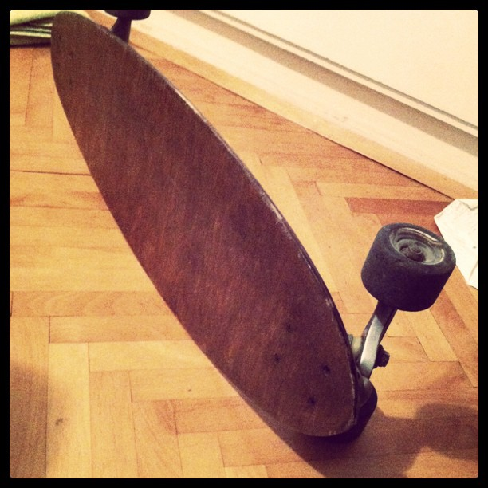

Coming back from the US I was left completely without [means of transport](http://en.wikipedia.org/wiki/Mode_of_transport "Mode of transport"). My [rollerblades](http://rollerblade.com "Rollerblade")' last allowed wheel died over there so I was left with a cumulative three working wheels for the whole set. You need at least four. \[caption id="" align="alignright" width="367" caption="The longboard"]\[/caption] Right before I left for the US my [driver's licence](http://en.wikipedia.org/wiki/Driver%27s_license "Driver's license") expired and I need to go see the doctor before I can get a new one - because of exams I simply couldn't be bothered with that yet. And I haven't had a bike ever since I retired the last one after twice its value went into repairs (I'm kind of hard on bikes). So today I borrowed a [longboard](http://en.wikipedia.org/wiki/Surfboard "Surfboard") from @zidarsk8 ... well I say _a_ longboard, but it's really _the_ longboard because he doesn't really have any other. Really cool of him to let me borrow it for a week, two, three! Today I survived my first ride from college to home and I have to say despite nearly getting mowed down by a car a couple of times and some bruised pedestrians it went pretty well. Those things are super fun and if I can get a hang of it I might buy one of my own instead of a set of rollerblades, because it means I wouldn't have to keep lugging my shoes around ... we'll see, rollerblading is kind of super fun though ... Oh and today I discovered that I flunked one too many exams, this likely means I won't be able to get into the next year of my course and instead of being just before graduating from a masters equivalent in a year, I will be graduating from a bachelors in computer science. But this isn't over yet, school system! I won't go down without a fight!

###### Related articles

- [Army of skateboarders takes over downtown streets](http://www.thestar.com/news/article/1052107--army-of-skateboarders-takes-over-downtown-streets) (thestar.com)
- [Longboarder hit by car, seriously injured](http://www.thestar.com/news/article/1025357--longboarder-hit-by-car-seriously-injured) (thestar.com)
- [Longboarding Takes Off -- While B.C. Mourns 28-Year-Old Competitor Killed Last Week](http://trueslant.com/caitlinkelly/2010/07/21/longboarding-takes-off-while-b-c-mourns-28-year-old-competitor-killed-last-week/) (trueslant.com)
- [What makes a good longboard](http://wiki.answers.com/Q/What_makes_a_good_longboard) (wiki.answers.com)

