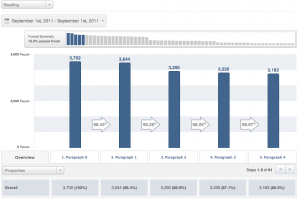

Knowing how many readers a blog gets is pretty \\important for any blog writer. We like to pretend it doesn't even matter, put on a face of "Oh well, I'm just [writing](http://en.wikipedia.org/wiki/Writing "Writing") this for myself, you know, to get the word out, I don't really care if anyone reads it"

What a bunch of hipsters!

\[caption id="attachment_2455" align="alignright" width="300" caption="Paragraph funnel"]\[/caption]

_tl;dr --> Only ~30% of readers actually read a whole [blog post](http://en.wikipedia.org/wiki/Blog "Blog")! 16% if it's particularly long, but 95%+ make it from one paragraph to the next on average._

Yeah right dear blogger, that's why you keep posting links to your blog in your twitter stream, that's why you submit it to various link sharing sites and that is surely why you are writing all of your stuff in public as well. Writing for yourself just wouldn't feel the same if it was done privately in a random notebook would it?

Sometimes I manage to get a couple of thousand people to come upon a blogpost I have written and ... then what?

<!--more-->

Problem is that the usual analytics tools only count hits. That is, how many people came onto your blog. Recently [Google Analytics](http://www.google.com/analytics "Google Analytics") started changing that a little bit by also counting how many users perform some sort of social action. This is a pretty good measure of how good people think your post was, or even simply how interesting it seemed.

However, that's only a small part of what I care about. I want to learn how good a writer I am, how well do I captivate a reader and keep them reading? Surely the most \\important mark of a good post is how many people _actually read it!_

## Enter [Mixpanel](http://www.mixpanel.com "Mixpanel"), stage left.

With this in mind [I set up a simple javascript](https://gist.github.com/1222278) that sends an event to Mixpanel every time somebody scrolls past a paragraph of text. To this day I have never actually taken the time to look at this data, but at the beginning of this month I wrote a _very_ lengthy blogpost.

1700-ish words, 58 [paragraphs](http://en.wikipedia.org/wiki/Paragraph "Paragraph") _long_.

That post received 3445 hits, 5 G+, 38 [tweets](http://twitter.com "Twitter") and 3 facebook likes.

EDIT: The post was "[I went through YC as an intern, here's what I learned](http://swizec.com/blog/i-went-through-yc-as-an-intern-heres-what-i-learned/swizec/2345)"

Right, not a total throwaway post. People actually liked it! Yay!

But here's where it gets interesting. Out of all those people only 574 made it to the end. Somewhere in all that text I lost over 80% of my readers!

Wow, that can't mean anything good for my writing skills. 1700 words is about five pages in a standard book format. Now imagine if I was writing an actual book ... _nobody_ would make it to the end!

## Bleeding readers like a boss

Looking at the data in more detail it looks like only 80% of the users read the first ten paragraphs, and 70% read the first 20 paragraphs. Not too bad at all.

Then something strange happened in this particular post, only 41% of the readers made it to the 22nd paragraph. This happens to be right next to the photo of some drawings on a shower wall and the title of this section is "Work hard, party harder" ... I guess people don't like partying and showers?

After that it settles down, takes another 20 paragraphs to lose another 10% of readers. And another jump, plomps down to just 23% readers making it to the 40th paragraph. This is around the spot where I say that being only an employee in a startup is much easier than being a founder. I guess people don't like hearing that either?

There are no more significant jumps after that, but just over 15% of the readers made it all the way to the end and for that, I thank you awesome 574 people who decided my blog was worth reading through to completion.

Although interestingly enough, outside those jumps (yes I checked, other posts ending at those paragraphs doesn't account for the jumps) on most paragraphs more than 96% of users make it from one paragraph to the next.

Had another hit on the 3rd of August. The data there is much more level, with 33% of readers making it to the end of a 30 paragraph post. But interestingly enough, only 61% made it from first to second paragraph!

I think I need to start experimenting with this in a more organized manner. Got my baseline, about a third of my readers make it to the end of a normal length post. Now it's time to figure out how to increase that.

PS: if you're interested in the JavaScript that makes this magic happen, just check out [the source](https://gist.github.com/1222278).

###### Related articles

- [Keeping the Content Focused... Or Not](http://blazingminds.co.uk/keeping-content-focused/) (blazingminds.co.uk)
- [The long and the short of it: does size really matter?](http://michcommunication.wordpress.com/2011/09/15/the-long-and-the-short-of-it-does-size-really-matter/) (michcommunication.wordpress.com)
- [Optimizing Blog Posts for social media](http://www.convonix.com/blog/social-media-marketing/social-media-blog) (convonix.com)
- [My Secret Formula for Creating Super-engaging Blog Content](http://www.problogger.net/archives/2011/09/13/my-secret-formula-for-creating-super-engaging-blog-content/) (problogger.net)
- [How to Make Your Writing Sleek and Smooth](http://jenswritingdesk.com/2011/09/12/how-to-make-your-writing-sleek-and-smooth/) (jenswritingdesk.com)
- [Seven Tips for Better Writing](http://blog.prnewswire.com/2011/07/13/seven-tips-for-better-writing/) (prnewswire.com)

