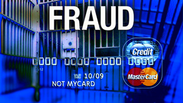

\[caption id="" align="alignright" width="300" caption="Image via Wikipedia"]\[/caption]

Today [Spotify](http://www.spotify.com/ "Spotify") finally realized I am not just traveling around Europe, but intend to stay here a while. Their 14 day travel grace period lasted a month and a half and I think that's awesome! While I was using Spotify I got so used to the service I decided to actually pay for a premium account just so I could continue using it despite living in a country that officially isn't supported. The fact I got around their copyright restrictions might make me a criminal in some sense of the word. Fraud? EULA breaking? Who cares ... Here are the hoops I had to jump through to get a Spotify Premium account:

<!--more-->

1.  The whole process started two weeks ago by getting a [moneybookers.com](http://www.moneybookers.com/ "Moneybookers") account
2.  Then I had to send MoneyBookers photos of my passport and a recent bank statement to verify my address and identity
3.  After waiting a few days for my identity to be processed, I applied to get a MoneyBookers Mastercard
4.  Then I waited about two weeks
5.  When the card arrived I became the proud owner of a legal UK credit card that I can now use whenever I need a UK payment method
6.  On Spotify I changed my location to United Kingdom
7.  After that I clicked a few buttons and entered the details of my UK credit card to begin the payment process
8.  It didn't work
9.  Then I remembered I first had to upload funds from my VISA to the MoneyBookers account
10. On MoneyBookers I clicked the big shiny "Upload Funds" button and selected my [VISA card](http://www.corporate.visa.com "Visa Inc.")
11. I was redirected to a [Verified By VISA](http://en.wikipedia.org/wiki/3-D_Secure "3-D Secure") page
12. Because they have a weird [password policy](http://en.wikipedia.org/wiki/Password_policy "Password policy") of allowing a maximum of 12 characters none of my usual secure passwords worked and I was redirected back to MoneyBookers with a big fat FAIL and told to contact my bank because I'm obviously doing something stupid
13. Tried it again and this time 'round just claimed I had forgotten my Verified By VISA password and was asked for my tax number
14. Got a new password for that thing ... I won't remember it next time, so it's effectively my tax number ... I guess. Basically anyone who has ever done business with me knows all the data needed to abuse my main credit card. Awesome.
15. Great, now there was enough money on my MoneyBookers account to fund the purchase with the UK [MasterCard](http://www.mastercard.com/ "MasterCard")
16. Now I just clicked "Yes Please" on Spotify and voila, the premium account was mine! All mine!

Sixteen steps to make a relatively simple purchase! Something I'm sure the Spotify guys have spent a lot of time polishing and making as frictionless as possible. Their part was truly frictionless. Well except for the silly thing where as a person from Slovenia I'm not supposed to be able to even use the service despite wanting to pay for it. But screw that, I'm sure the copyright holders of their music have some sort of reason for that ... Point is, each of these steps when looked at individually makes sense, it increases security, makes it harder for people to, basically, break the law. But when looked at it as a system it is completely and utterly bollocks! A useless piece of crap one might say. I wish it was as easy spending money online as it is in the real world. Not like the internet is inherently any less secure and we need all these hoops to jump through ...

###### Related articles

-   [Registering VISA Credit Cards: What is Verified By Visa (VBV)?](http://gunnalag.wordpress.com/2011/09/15/registering-visa-credit-cards-what-is-verified-by-visa-vbv/) (gunnalag.wordpress.com)
-   [Spotify Dropping Invite Requirement, Offering Six Months Free](http://pocketnow.com/smartphone-news/spotify-dropping-invite-requirement-offering-six-months-free) (pocketnow.com)
-   [The Musical Magic of Spotify](http://valeriewire.wordpress.com/2011/09/23/the-musical-magic-of-spotify/) (valeriewire.wordpress.com)
-   [Everyone Can Now Sign Up for Spotify \[Spotify\]](http://gizmodo.com/5843063/everyone-can-now-sign-up-for-spotify) (gizmodo.com)
-   [Indie labels say there is 'no upside' to Spotify](http://www.digitaltrends.com/music/indie-labels-say-there-is-no-upside-to-spotify/) (digitaltrends.com)
-   [Google Wallet pockets Visa](http://go.theregister.com/feed/www.theregister.co.uk/2011/09/20/google_wallet_visa/) (go.theregister.com)
-   [Spotify Review](http://alecnewcomb.com/2011/09/23/spotify-review/) (alecnewcomb.com)

