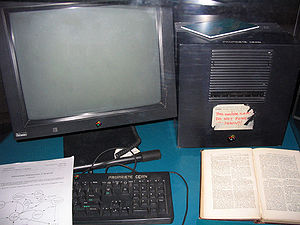

\[caption id="" align="alignright" width="300" caption="Image via Wikipedia"]\[/caption]

Just over [a month ago I went on an internet diet](http://swizec.com/blog/my-ideas-are-shitty-so-im-going-on-an-internet-diet/swizec/2239 "My ideas are shitty so I’m going on an internet diet") that would practically cut me off the world as I know it. The deal was no internet except for an hour every evening, or when it was absolutely necessary for reasons of work or school.

A week ago that diet ended.

It is no coincidence that it's taken me a week to put myself together enough to write this post. Partially an insane month of exams is to blame, partially just that I could once more frolick on the wide internets like a madman and in part it's simply due to the fact I had to remember what life online was like so I could make a comparison at all.

A month is a long long time.

## How it went

The most surprising discovery was that going almost without the internet for a month was surprisingly easy. At first I was really draconian to myself, but towards the end I have to admit everything started slipping a bit, mostly when I discovered I needed the IRC channel with my classmates to study effectively.

Sure, at first not being able to mindlessly wander the wastelands whenever I had a moment of free time felt like I was missing an arm, a leg and half an eyeball. Eventually though the compulsive need to open a browser with a useless website I didn't really care about went away and I discovered something surprising.

The internet is a really boring place.

Once you're not online all the freaking time there's really not much to do. I would let myself do anything I wanted for an hour every evening and most of the time I was done in half an hour. There was simply nothing more to look at.

There wasn't enough time to give every news item a thorough read, and there was no news item interesting enough to sacrifice a part of my precious hour to. Just wasn't. So after I was done with reading my comics, responding to email, twitter and facebook, checking out my favourite forum ... I was at a loss about doing anything more.

So I just didn't. Sometimes my hour online would end in 20 minutes. It very rarely managed to captivate my attention for a whole hour.

The annoying part was how as soon as [I was back home from the US](http://swizec.com/blog/i-went-through-yc-as-an-intern-heres-what-i-learned/swizec/2345 "I went through YC as an intern, here’s what I learned"), all my little pomodoro breaks that I used to fill with the internet, started getting filled with television. Which is arguably even worse than my old habit of mindlessly wasting time. This leads me to believe that my brain needs a certain level of mindless entertainment ... for what purpose, I don't know.

A really big issue was the lack of my ability to communicate with anyone since I haven't had a phone for almost a year. I know for a fact I was seriously annoying to some people because they couldn't share lulzy stuff with me anymore (because they blatantly told me so). Taking a day to respond to certain things was simply too much and I did eventually start making exceptions on twitter for when I was meeting someone for coffee or whatever and arrangements had to be made.

## The "good habits"

Of course as soon as the diet ended it didn't take long for me to start mindless refreshing email clients, facebook, twitter, hackernews ... it's a really stupid habit and apparently very easy to get into.

But it's ultimately useless. The amount of time I spend mindlessly refreshing to hopefully catch a peek of something interesting in relation to how much time I actually spend reading anything or clicking links is insane. I probably spend ten times as long looking for that one thing to pique my interest than I do acting on content (sharing, reading, replying etc.).

In that regard the internet is seriously annoying. Pulls you in like a drug, wastes all your time and doesn't give anything back in return. The internet _does not_ love me as much as I do her.

Therefore I think it's time to establish some new ground rules for my life online. It's not a diet, but hopefully a set of rules I can live by in the long term.

1. 20 minutes to half an hour of The Internet in the morning to start my day
2. An hour of The Internet around lunchtime
3. An hour of The Internet in the evening

Everything else goes the same as in my diet month. This should give me enough daily timeslots to actually give some stuff a read instead of just looking for that one perfect news item I would dare spend time on. And it should also be enough timeslots to respond to any email or twitter communications in need of my attention.

Then again, some say even this new set of rules is too annoying for them, so maybe the point is just to avoid snacking the internet and go online whenever I have at least half an hour of free time. Make it a proper meal so to say.

###### Related articles

- [Why an Internet diet and not cold turkey](http://swizec.com/blog/why-an-internet-diet-and-not-cold-turkey/swizec/2254) (swizec.com)
- [Why Long-Term "Dieting" Doesn't Work](http://thymelines.wordpress.com/2011/09/23/why-long-term-dieting-doesnt-work/) (thymelines.wordpress.com)
- [My ideas are shitty so I'm going on an Internet diet](http://swizec.com/blog/my-ideas-are-shitty-so-im-going-on-an-internet-diet/swizec/2239) (swizec.com)
- [Surfing the Web Slows Down Dementia](http://www.fitsugar.com/5772968) (fitsugar.com)

