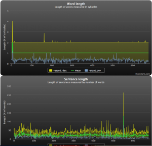
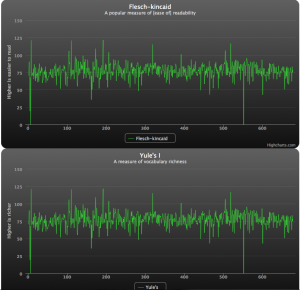

Please send exports of your wordpress blogs to swizec@swizec.com! For science!

\[caption id="attachment_2543" align="alignright" width="300" caption="Word and sentence length"]\[/caption]

But a little background :)

Lately I've been noticing a certain lack of the artsy side of life around me. It would seem that somehow despite being a great fan of theatre and real books and things of such nature I have slipped into a very techy existence where the closest I come to appreciating good art are the books laying around my desk waiting to be read since two years ago.

<!--more-->

Being a man of a scientific bent I couldn't just make such claims without at least attempting to verify them. Plus it's a cool thing to do and I had a bit of time.

Luckily for me, there's this brilliant dataset, a cool inside into my mind ... this blog. I started writing back when I was smack dab in the middle of my last year of high school - what I consider to be the height of my habit of regularly reading real books. With years this has slowly declined. The natural thing to do, therefore, was to see if this reflects in the way I write, which coincidentally reflects the way I think.

It's the perfect experiment!

A general decline of _being well read_ should reflect in my writing style. I tracked six parameters:

1. Length of words - more syllables mean heavier, awesomer words
2. Sentence length - longer sentences are a sign of not speaking like a marketer or the internet
3. [Flesch-kincaid](http://en.wikipedia.org/wiki/Flesch%E2%80%93Kincaid_readability_test "Flesch–Kincaid readability test") - this is a measure of readability, or how educated one must be to understand your text
4. [Yule's I](http://swizec.com/blog/measuring-vocabulary-richness-with-python/swizec/2528 "Measuring vocabulary richness with python") - this is a measure of vocabulary richness, where I'm assuming a broader [active vocabulary](http://en.wikipedia.org/wiki/Vocabulary "Vocabulary") is a positive thing
5. Length - simple, how many words and how many sentences there are in a post

The graphs are somewhat slow to load, [click here to see shiny graphs in full javascript glory](http://swizec.com/blog-analysis-charts/blog.html).

For everyone else, here are some screenshots:

\[caption id="attachment_2543" align="alignleft" width="300" caption="Word and sentence length"]\[/caption]

\[caption id="attachment_2544" align="alignleft" width="300" caption="Readability"]\[/caption]

As you can see, the data is very squiggly, but there is no trend showing. The problem with this is that I just don't know how to draw a conclusion from these graphs. They seem to suggest that in five years of blogging I haven't progressed as a writer in the least bit.

On the other hand they seem to suggest that despite four years of university education, my writing has stayed at a high school level, which seems to lend a credence of support to the original hypothesis.

In order to better judge what's going on I need to compare data with other blogs. See if trends are cropping up anywhere at all. So please, if you have a wordpress blog, send me an export of your posts to swizec@swizec.com. It's for science!

And you get to show off some shiny graphs _and_ find out about how you stack up as a writer.

###### Related articles

- [software development](http://www.itransition.com)
- [Literary EKG](http://shawndotbailey.wordpress.com/2011/09/09/literary-ekg/) (shawndotbailey.wordpress.com)
- [How to Check the Readability of Your Writing With Microsoft Word](http://imittcopy.com/Thewhitepaperblog/how-to-check-the-readability-of-your-writing-with-microsoft-word/) (imittcopy.com)
- [Can You Read Me Now? How to Make Your Copy More Accessible](http://comprehension.prsa.org/?p=3335) (comprehension.prsa.org)
- [The Gunning FOG Index - What It Means For Your Writing](http://smartwrite1.wordpress.com/2010/11/16/the-gunning-fog-index-what-it-means-for-your-writing/) (smartwrite1.wordpress.com)

