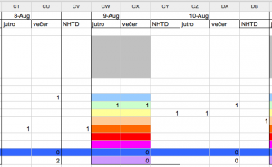

\[caption id="attachment_2558" align="alignright" width="300" caption="Chunk of the spreadsheet"]\[/caption] For the past couple of months I've been involved with an experiment that primarily involves taking a few moments every day to write down some numbers. I haven't gotten the clearance yet to quite say what exactly the data we are logging represents, but I can tell you about why I'm never again using [spreadsheets](http://en.wikipedia.org/wiki/Spreadsheet "Spreadsheet") to do this sort of stuff. Over the weekend I started working on producing some graphs and useful understandable data out of two months of spreadsheets. The summer ones. Turns out exporting to [CSV](http://en.wikipedia.org/wiki/Comma-separated_values "Comma-separated values") then trying to import into a processable python data structure is less than easy when your tables were designed so that they look good as tables, are easy for humans to use and make sense when you look at them. The problem with python's handling of CSV is that it doesn't have any idea what my data actually looks like so it just produces a list of lists with values of all the cells.

<!--more-->

My problem was that we were collecting three values for every day ... but until about a month in, we were only collecting two values. On top of that six rows translate into what is actually a single row of data with a certain range of values. In a table it's easier for people to use as six rows, but trying to draw a graph from that ... well you'd want a single row. \[caption id="attachment_2558" align="aligncenter" width="585" caption="Top 6 rows are actually a single value, notice the bottom two rows being single value per 3 columns"]\[/caption] After quite a bit of muscling around and playing with more list comprehensions than fit comfortably in my head, that same data looks like this and is much more manageable.

    {'A': [[2, 3, -1], [3, 1, -1], [2, 2, -1], [2, 0, -1], [1, 0, -1], ...], 
    'B': [0, 0, 0, 0, 0, 0, 0, 0, 0, 0, 0, 0, 0, 0, 0, 0, 2, 0, ...]
    'C': [0, 0, 1, 0, 0, 0, 1, 0, 1, 0, 0, 0, 1, ...], }

It pains me to admit it, but it took much too long to write a lens between the spreadsheet data and the data structure I can now actually use. Don't do this to yourselves and just make sure that whenever you are collecting data for a long lasting experiment, write some sort of easy interface that pops values right into the database. It will make your life easier.

###### Related articles

-   [pandas: powerful Python data analysis toolkit - pandas v0.4.0dev documentation](http://pandas.sourceforge.net/index.html) (pandas.sourceforge.net)
-   [It shouldn't take 64 lines of code to do something really simple](http://onlinelabor.blogspot.com/2011/10/all-public-government-data-should-be.html) (onlinelabor.blogspot.com)
-   [Did you know... (The Tables Feature)](http://www.policymap.com/blog/2011/09/did-you-know%25e2%2580%25a6-the-tables-feature/) (policymap.com)

