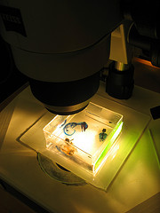

\[caption id="" align="alignright" width="180" caption="Image by Wolfram Burner via Flickr"]\[/caption]

There is probably a trend where I make a post about education every year around October, January and June. It corresponds nicely with the [school year](http://en.wikipedia.org/wiki/Academic_term "Academic term") and how [exams](http://en.wikipedia.org/wiki/Test_%28assessment%29 "Test (assessment)") are laid out.

But this time the post is going to be different:

- this is not a rant
- this does not propose a solution
- this is just a set of observations

To give a bit of background: last year I advanced into the next year (set of two semesters) of my course through a little bit of dumb luck because the terms of advancing were lowered somewhat so enough of us could get through to fill up the year. This meant that I had a lot of exams left over and through naught other than poor planning, too many difficult exams stacked up to September and I subsequently failed catastrophically and was forced to transfer to a three year bachelor's course within a new education system.

Wow ... that was a mouthful. I hope anyone understood even a fragment of that.

And now the observations:

<!--more-->

1. I have always been very interested in learning new things. Spending frustrating amounts of time to figure out how something works has never been a problem and I have probably spent more time learning things on my own than in a [formal education](http://en.wikipedia.org/wiki/Education "Education") setting.
2. I have never been very good at passing exams of any kind. If you ask me to display a certain skill at a particular moment in time ... I will fail. The last time this wasn't a problem was in 5th grade of primary school. Why, I don't know.
3. I have always had trouble following a forced pace of learning. It tends to be too generally applicative and usually ends up being too slow for me. Because it doesn't tax me enough, I tend to drift away and start learning things on my own. Then I get pulled away by learning shiny cool things and forget to follow along with the formal education. (like when you're reading a book and your mind drifts)
4. Invariably because I don't follow along a formal class eventually surpasses my ability to quickly get back on track and I fall behind.
5. I can usually learn a whole semester worth of a formal class in about two weeks of concentrated studying, but exams are always set up in such a way as to make it impossible to concentrate on a single class for two weeks ... you're supposed to follow along for the whole 3 months.
6. I get genuinely excited about most theoretical and practical things they want to teach/show us at school
7. The productive output of most of my classmates is abysmal
8. The forced productive output of most of my classmates makes me want to scream when I look at it
9. Most of my classmates get genuinely frustrated when asked to produce something significant-ish or learn a completely new concept
10. A lot of my classmates passed their exams and advanced into the next year. Even the ones I have personally worked with on coursework and shouldn't be more than freshmen if it were up to me
11. A favourite professor of mine can't hold class this year because the [peer review process](http://en.wikipedia.org/wiki/Peer_review "Peer review") in his field is slow and he didn't meet some arbitrarily defined quota for published articles

You can draw your own conclusions. Mine is that the education system as I know it is designed to prefer a different set of skills than I posses and for whatever reason I have so far been unable to hack the system to my advantage.

But I shan't let this discourage me. I'm going to graduate with a bachelor's in computer science by next October if it kills me ... even if I originally signed up for a master's equivalent.

###### Related articles

- [What did we learn during a 'semester of learning' on #openbadges over at P2PU.org?](http://dougbelshaw.com/blog/2011/10/02/what-did-we-learn-during-a-semester-of-learning-on-openbadges-over-at-p2pu-org/) (dougbelshaw.com)
- [Ofqual: pupils to sit end-of-course exams in GCSE overhaul](http://r.zemanta.com/?u=http%3A//www.telegraph.co.uk/education/educationnews/8790219/Ofqual-pupils-to-sit-end-of-course-exams-in-GCSE-overhaul.html&a=56349834&rid=12e58db3-0284-45bd-89fb-8ec7d196d2a6&e=5a9b97ac01528ab2a58db3ce37412cb8) (telegraph.co.uk)
- [A World With No Exams!](http://beautifoolmind.wordpress.com/2011/09/29/a-world-with-no-exams/) (beautifoolmind.wordpress.com)
- [Invisible Learning, Aprendizaje Invisible](http://www.downes.ca/post/56328/rd) (downes.ca)
- [Today's Gripe: The End of Excellence](http://jameslcarey.com/2011/10/03/todays-gripe-the-end-of-excellence/) (jameslcarey.com)
- [friday quote: self-education](http://www.bripblap.com/friday-quote-self-education/) (bripblap.com)
- [Education, a poem.](http://bloomsight.wordpress.com/2011/10/02/education-a-poem/) (bloomsight.wordpress.com)

