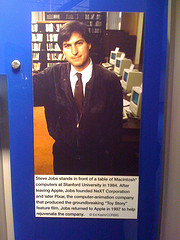

\[caption id="" align="alignright" width="180" caption="Image by The Seg via Flickr"]\[/caption]

A man died today. I never knew him personally and yet I feel like writing a post about his death before even getting out of bed this morning. When I went to bed last night, he wasn't dead yet, this morning, he was. Interesting how much can change in the world when you fall asleep for six hours. And people say sleep isn't a waste of time ... Sure, it was readily apparent that Steve Jobs would eventually die, not only is he just a man despite what many would like to believe, he also suffered from cancer and was visibly growing weaker over the past few years. A lot of people will remember him for being a great entrepreneur, many will think that it's really cool he could build two epic startups, create Pixar and then fix up his first startup into one of the most legendary technology companies currently in existence. But none of that really matters, his biggest impact on the world is simply being _very fucking inspirational._ I will remember him most for the speech he held at Stanford in 2005.  There are other important quotes by him and I'm sure the internet will be full of them for the next few days so I'm not going to post any. Just remember: stay foolish.

###### Related articles

-   [STEVE JOBS: "Don't settle."](http://www.marketingheadhunter.com/2011/10/steve-jobs-dont-settle.html) (marketingheadhunter.com)
-   [Remembering Steve Jobs](http://shawketali.wordpress.com/2011/10/06/remembering-steve-jobs/) (shawketali.wordpress.com)
-   ["60 Minutes": The Steve Jobs interviews](http://www.cbsnews.com/8301-504803_162-20116402-10391709.html) (cbsnews.com)

