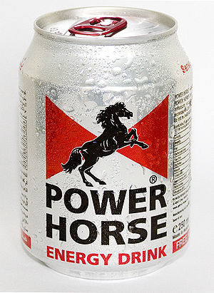

\[caption id="" align="alignright" width="240" caption="Image via Wikipedia"]\[/caption]

Lately I've been looking for work of the python and javascript programming variety - turns out getting caffeine, [energy drinks](http://en.wikipedia.org/wiki/Energy_drink "Energy drink") and food is difficult without money. And since it doesn't seem people are looking for programming [freelancers](http://en.wikipedia.org/wiki/Freelancer "Freelancer") these days, or I suck at finding such offers, I end up being interviewed a lot. A good interview with a team you know is pretty cool can actually be quite enjoyable. But a particular question really sticks out as a sore point for me. It shows up in interviews without fail, hell, I've asked it almost every single time I ever interviewed someone. _What are you proud of?_ It looks like an innocent question. A friendly opportunity to let you talk about something cool I used to _love_ answering this question. It could get me talking for hours ... well, 30 minutes at least ... there was always something I could tout my own horn with. But then, projects started piling up, I no longer had a single thing I was proud of. Nothing I did seemed like a colossal success anymore. Not like when I was just starting out working on my own projects, back then I was proud of every little turd I squeezed out of my arse. Nowadays it doesn't feel like any project I've done really sticks out as something to be horribly proud of. Certainly not enough to pop to mind off the cup in the heat of the moment. I have to weigh my answer, pick one of perhaps ten or even twenty projects ... or god knows how many more I should be proud of but have gone out of my [immediate memory](http://en.wikipedia.org/wiki/Working_memory "Working memory"). Furthermore, the question feels a bit lazy. I always send my github profile together with every first contact mail for coding work. And my blog. If you spent even ten minutes preparing to talk to me, you could ask about a specific project that seemed interesting to you. They're all out there somewhere anyway. Hell, you could just order my github profile by follower/fork count and ask me about whatever comes up on top. Chances are it's a project I will enjoy talking about since it's popular and it grounds the discussion. My option space is much narrower and thus easier to define. More importantly, when you ask me about a specific project, you've shown an interest in one of many fields of my work. I know what _you_ will find interesting. Otherwise I might as well start explaining how proud I am of that one [jQuery library](http://jquery.com/ "JQuery") for buttons I made a couple of years ago, where you're actually more interested in me because you know I once got Readibility to run on a server and scraped about a million web articles in horribly little time. But what do I know, maybe it's just that ever since I've heard of the [Dunning-Krueger effect](http://en.wikipedia.org/wiki/Dunning%E2%80%93Kruger_effect "Dunning–Kruger effect") everything I've ever created feels a bit bland and unexciting since I can't decide if it actually _is_ technically exciting or not. Or maybe I've just gotten to know too many awesome people and I feel a bit uninteresting in comparison. Anyway here are ten things I'm proud of in no particular order to help me answering such questions in the future:

1.  My [jQuery buttons plugin](http://swizec.com/code/styledButton/) is 5th hit on google for "jquery buttons" 2 years after being made
2.  I nearly got a startup in cahoots with VC's
3.  At one point I made the first instagram node.js library
4.  Ran Readability on a server to scrape articles back before it was cool
5.  [My best academic year was also my best entreprenurial year](http://swizec.com/blog/doing-a-startup-taught-me-the-value-of-staying-in-school/swizec/1819 "Doing a startup taught me the value of staying in school")
6.  I have a blog that gets about 15k visitors a month
7.  [Fred Wilson](http://www.avc.com/ "Fred Wilson")[once referenced me by name in his blog](http://www.avc.com/a_vc/2010/09/ping.html)
8.  I'm 23 and I have more than 6 years of professional dev experience
9.  I have never screwed up college so hard I'd have to cheat to get all the legal student perks
10. I used to spend 2+ hours a day doing stupid stuff with a bike and never broke a bone ... I did almost kill my balls though

Is it just me? Do others find it easier to talk about what they're proud of?

###### Related articles

-   [I LOVE ME , Proud of ME, Proud of US!!!](http://diablotintelevision.wordpress.com/2011/09/06/i-love-me-proud-of-me-proud-of-us/) (diablotintelevision.wordpress.com)
-   [Breathe Life into Web-pages with Packt's New jQuery Book and eBook](http://www.prweb.com/releases/2011/10/prweb8856078.htm) (prweb.com)
-   [Five questions to ask during a job interview](http://www.ksl.com?nid=148&sid=16958094&s_cid=rss-148) ()
-   [What you learnt on job, that you didn't learn in school](http://www.reddit.com/r/coding/comments/ksq7m/first_programming_job_what_did_you_learn_on_the/) (reddit.com)
-   [Seven Premium Style jQuery Plugins And Tutorials To Display Images On Websites](http://www.mt-soft.com.ar/2011/10/12/seven-premium-style-jquery-plugins-and-tutorials-to-display-images-on-websites/) (mt-soft.com.ar)

