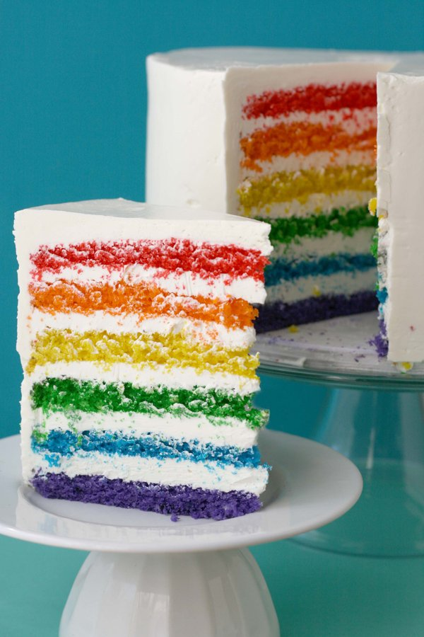
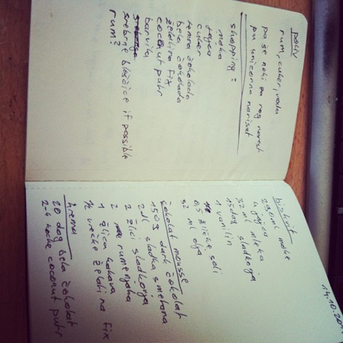
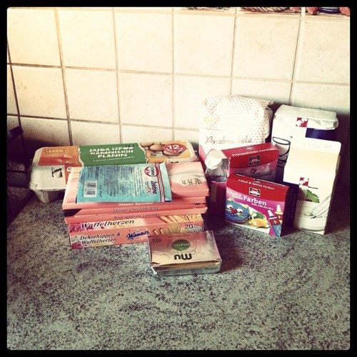
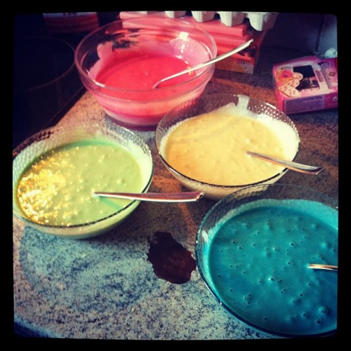
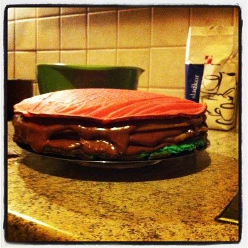
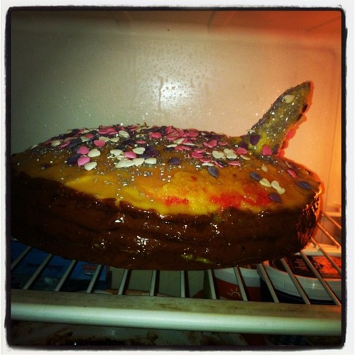
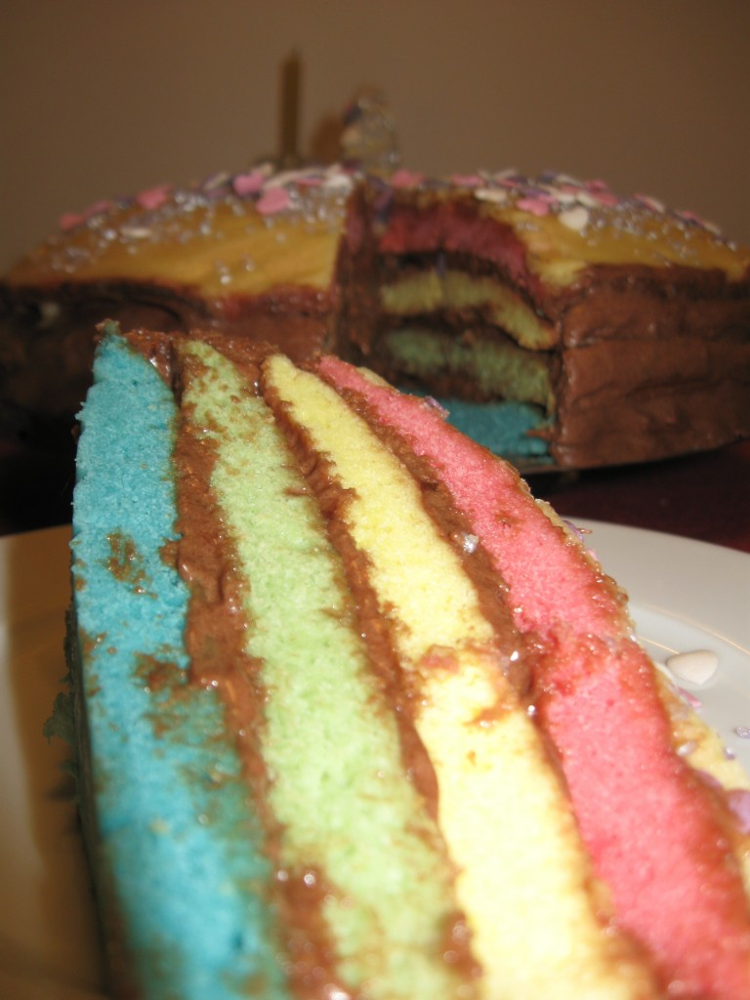

Very early in the morning today (11am) I set out to make a rainbow [unicorn](http://en.wikipedia.org/wiki/Unicorn "Unicorn") cake for [@ponywithhiccups](http://twitter.com/ponywithhiccups). Because rainbows are cool and you can't have a proper rainbow without a unicorn thrown into the mix.

This is the model cake I was going to make ... perhaps even awesomer.

\[caption id="" align="alignnone" width="360" caption="Proto cake"]\[/caption]

<!--more-->

Sure, I hit the very first snag as I was buying ingredients. Got home and the [food colourings](http://en.wikipedia.org/wiki/Food_coloring "Food coloring") I thought I had bought were in fact very brightly coloured aromas. The cake would smell magnificently, but sure wouldn't be very colourful ...

Like any good person with an [iPhone](http://www.apple.com/iphone "iPhone") and an Instagram account I took a bunch of photos.

\[caption id="" align="alignnone" width="500" caption="Shopping list"]\[/caption]

\[caption id="" align="alignnone" width="500" caption="Stuff"]\[/caption]

\[caption id="" align="alignnone" width="500" caption="Dyed batter"]\[/caption]

\[caption id="" align="alignnone" width="500" caption="Moussed up caek"]\[/caption]

\[caption id="" align="alignnone" width="500" caption="Final ... thing"]\[/caption]

\[caption id="attachment_2632" align="alignnone" width="538" caption="Slice of rainbow"]\[/caption]

As you can see from the photos this was a [beta version](http://en.wikipedia.org/wiki/Software_release_life_cycle "Software release life cycle") of this cake and its got a bunch of bugs.

Namely the recipe I used for the batter was freakishly tiny and I made it bigger by feel. Apparently that made it more pancakey than biscuity and fluffy and the cake pan thing I was using turned out to be larger than anticipated which gave me barely enough batter to properly cover the pan wall-to-wall, which in turn made the individual layers of cake look a whole lot like pancakes.

Hard, unfluffy, heavy, pancakes.

I also ended up screwing up the first batch of mousse and had to run off to the store again for ingredients to make a new one. This sort of turned out alright, but should have been a bit harder and less liquid. That might work a bit better in a cake situation and be less runny.

The next fail was with using the wrong recipe to make snowy white frosting. Turned out to be more yellowy white and way way not enough of it.

Luckily I had just enough mousse left over to improvise and make the cake two colours on the outside.

The unicorn's corn ... well I have _no_ idea what that looks like ...

All in all, a solid 8 hours of work for a cake that sort of almost looks okay and kind of tastes alright if you're hungry enough.

Where's git reset --hard when you need it?

###### Related articles

- [Project #1 - Rainbow Cake.](http://verbalinsanity.wordpress.com/2011/08/10/project-1-rainbow-cake/) (verbalinsanity.wordpress.com)
- [Best Cake in the 'Verse? \[Pics\]](http://www.geeksaresexy.net/2011/10/09/best-cake-in-the-verse-pics/) (geeksaresexy.net)
- [How To: Rainbow Baking](http://kellsbells1008.wordpress.com/2011/09/12/how-to-rainbow-baking/) (kellsbells1008.wordpress.com)
- [The Cake Files, Part I](http://lifewithgusto.wordpress.com/2011/10/13/the-cake-files-part-i/) (lifewithgusto.wordpress.com)
- [The Most Dangerous Cake in the World](http://salutadventures.com/2011/10/11/the-most-dangerous-cake-in-the-world/) (salutadventures.com)

