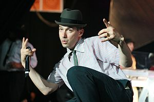

\[caption id="" align="alignright" width="300" caption="Image via Wikipedia"]\[/caption]

Today is worldwide Occupy Whatever Is Near You day - a spinoff of the Occupy [Wall Street](<http://maps.google.com/maps?ll=40.7063888889,-74.0094444444&spn=0.01,0.01&q=40.7063888889,-74.0094444444 (Wall%20Street)&t=h> "Wall Street") movement that's currently popular with [the hoi polloi](http://en.wikipedia.org/wiki/Hoi_polloi "Hoi polloi"). Remember how a few years ago we had to kill all the muslims?

I went to see the protesters today and I have to say the whole thing seems rather strange.

First of all, they were marching behind a very popular song [Fight For Your Right](http://en.wikipedia.org/wiki/%28You_Gotta%29_Fight_for_Your_Right_%28To_Party%21%29 "(You Gotta) Fight for Your Right (To Party!)") by the [Beastie Boys](http://www.beastieboys.com "Beastie Boys"), which undoubtedly brought millions if not billions of pure profits to the license holders ... most likely a huge record label.

Most of the protesters were also taking photos with their iphones, wearing clothes made affordable by cheap production in [sweat shops](http://en.wikipedia.org/wiki/Sweatshop "Sweatshop") of China and using twitter and facebook to communicate ... you know two very capitalistically inclined startups.

How much is facebook worth again?

Oh and they were using roads made possible by a long history of "exploitation". The whole thing reminds me a lot of this particular [Monty Python](http://www.pythonline.com/ "Monty Python") skit:

Actually, there's another relevant video you should watch. It's about how The Noob Effect has ruined videogames. Mostly it speaks how pandering to the [lowest common denominator](http://en.wikipedia.org/wiki/Lowest_common_denominator "Lowest common denominator") will eventually ruin everything.

I think this is what the ribble rabble are trying to do right now. They want the economy as a whole to pander to the lowest common denominator - a social sciences graduate with no skills beyond serving tables at the local coffee shop.

The Noob Effect has already happened to our videogames, movies, music, blogs, literature ... hell, even food and education. How about we not let the same happen to, you know, _the fucking core of our freaking society?_

Just play the damn game and stop trying to ruin it for everybody else!

