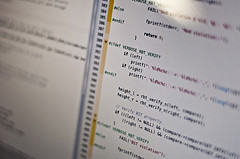

\[caption id="" align="alignright" width="300" caption="Image via Wikipedia"]\[/caption]

With the possible exception of philosophers, [programmers](http://en.wikipedia.org/wiki/Programmer "Programmer") are the laziest bunch of people I know. It seems like everyone else I speak to has some sort of [labor intensive](http://en.wikipedia.org/wiki/Labor_intensity "Labor intensity") profession.

Think about it, biologists do all those experiments ... giving a drug to hundreds of mice is can't be automated. Doctors have to physically inspect their patients, professors have to give the same lectures year after year, architects draw their plans in all perspectives manually and until recently did hatching by hand.

Looking at more run of the mill professions it gets even worse, marketers give the same pitch over and over, hairdressers do practically the same thing day after day, store clerks handle the same groceries for customers in the same manner all the time ... people in factories ...

You get the picture, the world is full of people doing practically the same thing day after day, hour after hour, for years on end, sometimes their whole lives.

## Enter programmers, stage left.

Whenever we do the same thing twice in a row - we try to think of a way to automate the process. Whenever you write code doing the same thing, you start looking for a library. Whenever you start projects on a similar foot, you go look for a boilerplate.

\[caption id="" align="alignright" width="240" caption="Image by Riebart via Flickr"]\[/caption]

Programmers' lives are _devoted_ to eliminating repetivity.

Removing menial tasks from our workflows, making lives easier for everyone. It's a common joke that a programmer would rather spend a week making a bash script than [copy paste](http://en.wikipedia.org/wiki/Cut%2C_copy%2C_and_paste "Cut, copy, and paste") the same file twice and be done with it in two minutes.

Hell, we even have the DRY ([Don't Repeat Yourself](http://en.wikipedia.org/wiki/Don%27t_repeat_yourself "Don't repeat yourself")) principle, which basically states that it's better to create a convoluted abstraction than to write different-but-very-similar code twice.

This of course leads to a lot of problems.

The average software project is so full of [abstractions](http://en.wikipedia.org/wiki/Abstraction "Abstraction") built on top of abstractions which are created on top of abstractions that it's become virtually impossible to know what's going on or even what your code is doing at all. _[Dizzying but invisible depth](https://plus.google.com/112218872649456413744/posts/dfydM2Cnepe),_ touches upon this subject and is a really good short read.

On the other hand, laziness has proven itself as the driving force behind many of the most \\important scientific and engineering advances in history. It's much easier to use a wheel than to carry things around, it's a lot easier to use boats than it is to swim, hell, even dropping a single motherfucker of a bomb is a lot easier than dropping a thousand small bombs if you want to ruin a city for a few decades ...

So maybe it's not that _programmers_ are lazy. Perhaps it's really _engineers_ who are lazy and it just so happens that in this point in history programmers are the most obvious sort of engineer working the most madly towards a better and brighter future. Most other fields have already sort of stabilised and/or take longer to adapt to new tools.

An \\important question to ask here is: Are programmers naturally lazy? Are smart [lazy people](http://en.wikipedia.org/wiki/Laziness "Laziness") drawn to programming or is this a social effect? Does laziness stem from the best programming practices? Or do the best programming practices stem from laziness?

## A comparison

Recently I had a nice opportunity to compare how an architecture major goes about her day and how a computer science major such as me goes about his day.

Most of the architect's life is filled with doing this or that labor intensive task as part of her homework. At any given time she is likely to be glueing some pieces of a model together, drawing the same object from fifty perspectives in autocad, or redrawing the same thing yet again in a [3D modeling software](http://en.wikipedia.org/wiki/3D_computer_graphics_software "3D computer graphics software") ... which then gets \\imported into photoshop to become really pretty.

\[caption id="" align="alignleft" width="240" caption="Image by Jon Olav via Flickr"]\[/caption]

It's a constant barrage. By my estimates she probably spends twice as much time on coursework than she does actually attending class. \[\*\* she said it's actually 5-times more] And to make matters worse, getting better at this stuff doesn't really speed up the process, it just means you know a few more keyboard shortcuts and make less mistakes when drawing.

Proficiency doesn't optimize the critical section _at all_.

Contrast that with me. When I'm not attending class I'm usually working on my own projects. Because I can, because there's plenty of time. When homework comes around, if it does, it can usually be dealt with in a matter of hours ... even the most critically insane projects they give us rarely take more than a week of concentrated work, two weeks at most.

Proficiency in coding doesn't mean typing faster (the equivalent of proficiency in architecture). It means thinking up solutions that are easier to implement, using tools that do half the work you're supposed to be doing and so on. Eventually, as judged by internet dick measuring contests, [implementation](http://en.wikipedia.org/wiki/Implementation "Implementation") is the irrelevant part because everyone can do it. If you've got a day, you implement something, if you've got more time you also make it pretty and modular and reusable and so on.

Basically you're done implementing the thing so quickly, most of your work is devoted to making the implementation prettier. But this isn't really \\important to the task at hand, you do it because you _can_.

It almost seems like when programmers get bored of even making their implementations prettier, they turn to creating tools to make the implementation pretty right off the bat.

And the cycle repeats itself.

The next guy will use that new tool to implement something even quicker, then begin polishing it until he eventually gets fed up and creates a new even better tool.

## So ... hard work?

But to cycle back on my original point, how much does _working hard_ even factor into programmers' productivity? What does this mean for all those startups working 13 hours a day to gain an edge on the competition? Is this even an edge worth considering?

\[caption id="" align="alignleft" width="240" caption="Image by Frodrig via Flickr"]\[/caption]

Hard work might even have a negative effect on [programmer productivity](http://en.wikipedia.org/wiki/Programming_productivity "Programming productivity"). It obscures optimizations behind "Oh, I can do this by hand, it will only take ten minutes" (it takes 20). And the next time a similar task rolls around you have to do it manually again and so on.

Most \\importantly, hard work makes you stupid. Being tired leads to bad decisions, even making too many decisions leads to bad decisions ([decision fatigue](http://en.wikipedia.org/wiki/Decision_fatigue)) as many studies have shown. In fact, that might be the best use of all the abstractions we like producing - let someone else to most of the decisions so I can focus on only the critical ones.

But I still don't know if lazy people are drawn to programming, or does programming make them lazy ...

###### Related articles

- [Avoiding Laziness](http://socyberty.com/philosophy/avoiding-laziness/) (socyberty.com)
- [Know it alls have the darkest future. 10.18.11](http://wisdomformysons.wordpress.com/2011/10/18/know-it-alls-have-the-darkest-future-10-18-11/) (wisdomformysons.wordpress.com)
- ["Laziness"](http://njpoems.wordpress.com/2011/10/07/laziness/) (njpoems.wordpress.com)
- [Why your new programming language won't work](http://colinm.org/language_checklist.html) (colinm.org)
- [What most C++ programmers do](http://www.johndcook.com/blog/2011/08/31/what-most-c-programmers-do/) (johndcook.com)
- [How to be Productive When You Are Truly Lazy](http://myrichlifeuk.wordpress.com/2011/10/16/how-to-be-productive-when-you-are-truly-lazy/) (myrichlifeuk.wordpress.com)

