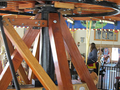

\[caption id="" align="alignright" width="240" caption="Image by Phliar via Flickr"][](http://www.flickr.com/photos/56861611@N00/6260572607)\[/caption]


For loops are kind of a big deal.


So big in fact that it's virtually impossible to code any sizeable chunk of code without running into some sort of [for loop](http://en.wikipedia.org/wiki/For_loop "For loop") ... sure, there's such awesome things as pure [functional languages](http://en.wikipedia.org/wiki/Functional_programming "Functional programming") where for loops don't look like for loops. But I'm fairly certain most of those eventually turn into some sort of for loop deep down in the bowels of assembler and machine code.


It is therefore fairly easy to assert that everyone needs to know for loops like the back of their hand. But how well do you really know them?


A few days ago I ran into a silly thing with a couple of friends. We somehow got reminded that C counts the head of a for loop as part of the loop's scope, which means variables defined therein don't really affect anyone outside the loop. But at the same time, it seems like many (most?) other languages don't behave like this.


It seemed only reasonable to go write a for loop in many languages and see what happens.

<!--more-->

## C


```
#include

int main() {
  int i = 5;

  for (int i=0; i<2; i++) {
    printf("%d\n", i); // prints 0, 1
  }

  printf("%d\n", i); // prints 5
}
```


## PHP


```
$i = 5;

for ($i=0; $i<2; $i++) {
  echo "for:$i\n"; // prints 0, 1
}

echo "after:$i\n"; // prints 2

$i = 5;

for ($j=0; $j<2; $j++) {
  $i = $j+1;
  echo "for:$i\n"; // prints 1, 2
}

echo "after:$i\n"; // prints 2

?>
```


## Java


```
// does not compile

public class For {
    public static void main(String[] args) {
        int i = 5;

        for (int i; i<2; i++) {
            System.out.println("for:"+i);
        }

        System.out.println("after:"+i);
    }
}
```


## Scala


```

object forVarReuse extends App {
       var i=5;

       for (i<-1 to 2) {
           println("for:"+i); // prints 1, 2
       }

       println("after:"+i); // prints 5
}
```


## Perl


```
$i = 5;

for (local $i=0; $i<2; $i++) {
  print "for:$i\n"; # prints 0, 1
}

print "after:$i\n"; # prints 2

$i = 5;

for ($j=0; $j<2; $j++) {
  local $i = $j+1;
  print "for2:$i\n"; # prints 1, 2
}

print "after:$i\n"; # prints 5
```


## Ruby


```
i = 5

for $i in 1..2
  print "for:", $i, "\n" # prints 1, 2
end

print "after:", i, "\n" # prints 5
```


## JavaScript

```
var i = 5;

for (var i=0; i<2; i++) {
    console.log("for:"+i); // prints 0, 1
}

console.log("after:"+i); // prints 2

i = 5;

for (var j=0; j<2; j++) {
    var i = j+1;
    console.log("for2:"+i); // prints 1, 2
}

console.log("after:"+i); // prints 2
```


## CoffeeScript


```
i = 5

console.log i for i in [0,1] # prints 0, 1

console.log i # prints 1

i = 5

count = (i for i in [0,1])

console.log count # prints [ 0, 1 ]

console.log i # prints 1
```


## Python


```
i = 5

for i in range(2):
    print "for:", i

print "after:", i

i = 5

print [i for i in range(2)] # prints [0, 1]

print "after:", i
```


## Conclusion

The interesting part is how differently languages of the curly-braces family behave. Some consider the for loop its own scope, many don't. It's interesting to compare JavaScript and Perl. They both have a way to tell a variable to be defined in the local scope, but JavaScript simply doesn't let you do that with fors, apparently only functions have scope of their own.


Ruby is similar to Perl in this regard. That little dollar sign can change the scope and that's what let us pull off the trick since loops are \\important enough to warrant scope at all.


The biggest disappointment is Python. I was honestly expecting the [list comprehension](http://en.wikipedia.org/wiki/List_comprehension "List comprehension") to have its own scope, but alas.

###### Related articles

- [Eli Bendersky: Perl's "guess if file is text or binary" implemented in Python](http://eli.thegreenplace.net/2011/10/19/perls-guess-if-file-is-text-or-binary-implemented-in-python/) (eli.thegreenplace.net)
- [Turn your nose up at Dart and instead smell the CoffeeScript](http://r.zemanta.com/?u=http%3A//www.infoworld.com/t/javascript/turn-your-nose-dart-and-instead-smell-the-coffeescript-176361&a=58844108&rid=eb2fce30-bdf3-42c1-b2c4-99be7c2b2888&e=592da843a0319c02f51fddfdf273c138) (infoworld.com)
- [This is CoffeeScript](http://robots.thoughtbot.com/post/9251081564/coffeescript-spartan-javascript) (robots.thoughtbot.com)
- [Feature: JavaScript has problems. Do we need Dart to solve them?](http://arstechnica.com/business/news/2011/10/javascript-has-problems-can-googles-dart-solve-them.ars) (arstechnica.com)
- [Dart Bashing](http://dartinside.com/2011/dart-bashing/) (dartinside.com)
- [Hyperpolyglot: PHP, Perl, Python, Ruby](http://hyperpolyglot.org/scripting) (hyperpolyglot.org)
- [JavaScript is Not Web Assembly](http://blog.izs.me/post/10213512387/javascript-is-not-web-assembly) (izs.me)

[](http://www.zemanta.com/ "Enhanced by Zemanta")