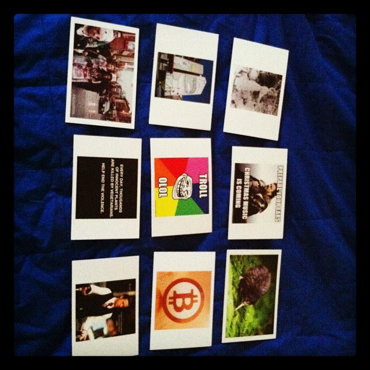

Last weekend I did an experiment in extreme [Lean](http://en.wikipedia.org/wiki/Lean_Startup). \[caption id="" align="alignright" width="367" caption="First batch"]\[/caption] It worked out! I launched a product in 3 days and when I woke up on Tuesday there were four _"Notification of payment received"_ emails in my inbox. The idea behind [postme.me](http://postme.me) is pretty simple - postcards are cool! Let's have a service to send cool postcards all over the world for cheap. Actually the idea didn't pop up 3 days before launch. It was brewing for a while ... the beginnings can be traced back to a silly evening at the DoubleRecall headquarters in [Palo Alto](<http://maps.google.com/maps?ll=37.4291666667,-122.138055556&spn=0.1,0.1&q=37.4291666667,-122.138055556 (Palo%20Alto%2C%20California)&t=h> "Palo Alto, California"). We were messing about and somebody said "Fuck man, you're not making it better!". Five minutes later I bought notmakingitbetter.com ... we raced even, I clicked the fastest. The following day I started thinking about what I could possibly do with this domain. Heading for a night of partying in [San Francisco](<http://maps.google.com/maps?ll=37.7793,-122.4192&spn=0.1,0.1&q=37.7793,-122.4192 (San%20Francisco)&t=h> "San Francisco") that evening, an idea to send "4chan cookies" to people popped up. Basically, you choose something from 4chan, we put it in a fortune cookie and send it anywhere. And that was that. My mind went and got occupied by other things. Until two weeks ago when I was going through a notebook and saw the idea jotted down - always carry a notebook guys ;) - surprisingly I still liked it. It got through the first test of worthiness! But [fortune cookies](http://en.wikipedia.org/wiki/Fortune_cookie "Fortune cookie")? That's not really viable, how the hell do you make those? Are there people who provide them? Would I bake them in my mum's kitchen? A few evenings later it clicked - POSTCARDS! Postcards are perfect for sending silly pictures to friends! I had no idea how postcards are made, but it seemed viable. Asked a designer friend if he can recommend a print shop - he recommended two. Sent out emails and one of the shops was kind enough to provide a price estimate without my knowing what the fuck it is that I even want. Next day I checked the local post office's prices and set the price of sending a postcard at $2. It's cheap enough for people to click without thinking much about it, and it covers my costs plus enough overhead to cover anything I didn't think of. That evening I forced myself to bed. Next morning I woke up and about 25 hours of coding and designing later, the website was born. Posted it to [HackerNews](http://news.ycombinator.com/ "Hacker News") and collapsed into bed. _"It's just an experiment. The site sucks. No point investing too much effort, if people won't click the magic button",_I kept telling myself. But really I was excited out of my mind. This was the first time in my life I wasn't giving a product away for free. This was edgy balls to the wall stuff for me - asking people for _money? On the internet!?_ Madness! Next morning the website was full of naked pictures. But I did make some sales! Sweet! A couple of days later I convinced the print shop to let me do ultra small runs of prints. As little as 9 at a time, at almost the same price per card as doing 200. The post office also didn't bat an eyelid at my interesting postcards and dutifully sent them on their way. Two weeks since the idea originally crystalized in my head, the site still hasn't made enough sales for a full print run. But it has made enough sales to cover the costs of that first print of 9 cards. Even though most were sent to random people from [my postcard escapade back in August](http://swizec.com/blog/i-learned-two-things-today-21-8/swizec/2275 "I learned two things today 21.8."). The great thing about this whole project is that I know exactly where to fish for people. I know perfectly which sites I need to advertise on to reach my target customers and I know that even though there are many postcard services around, none seems to be targeting this niche for some reason. The only problem I have is that I can't afford the advertising. But projects without problems are boring.

###### Related articles

- [Four-color postcards?](http://ask.metafilter.com/198794/Fourcolor-postcards) (ask.metafilter.com)
- [Create & Send A Real Postcard With Your Phone Using Postcard On The Run](http://www.makeuseof.com/tag/create-send-real-postcard-phone-postcard-run/) (makeuseof.com)
- [From Pixels to Postcards](http://www.pixiq.com/article/from-pixels-to-postcards) (pixiq.com)
- [Postagram has change my life! ...and my blog.](http://kenleydarling.wordpress.com/2011/10/18/postagram-has-change-my-life-and-my-blog/) (kenleydarling.wordpress.com)
- [Postcards: A Thing of the Past - Not Likely](http://printsunnysideup.wordpress.com/2011/10/13/postcards-a-thing-of-the-past-not-likely/) (printsunnysideup.wordpress.com)

